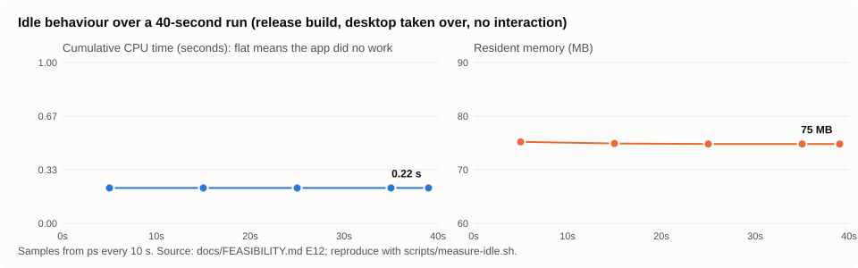

# QuietDesk

[](https://github.com/AlexToumayan/quietdesk/actions/workflows/ci.yml) [](https://github.com/AlexToumayan/quietdesk/releases) [](LICENSE)

A small, native macOS menu-bar utility that keeps your desktop icons in place (Finder's grid, or a
denser one if you prefer) and shows their names only when you hover over them (or select them). No
files are renamed, moved, hidden or changed.

**Status: v0.9.0, feature-complete, hands-on validation in progress.** The mechanism was proven and
measured on macOS 26.6.2; the full set of desktop interactions is implemented and code-reviewed; the
manual checklist in [docs/VALIDATION-CHECKLIST.md](docs/VALIDATION-CHECKLIST.md) is being worked
through. Read [docs/FEASIBILITY.md](docs/FEASIBILITY.md) for how it works and what it changes, and
[docs/CASE-STUDY.md](docs/CASE-STUDY.md) for how it was built.

## What it does

While enabled, QuietDesk asks macOS to hide Finder's desktop items (the same switch as System Settings
› Desktop & Dock › "Show Items › On Desktop") and draws the same items itself in a transparent layer
just above the desktop, in the positions Finder uses. Labels appear on hover, on selection and on
keyboard focus; or always; or never. Disable or quit and the native desktop comes back as it was.
Finder itself is untouched: Finder windows, Spotlight, the menu bar and every Finder feature keep
working; only the icons drawn on the wallpaper are QuietDesk's.

Menu (menu-bar icon: an open eye while QuietDesk is off, a slashed eye while it is on):

```
QuietDesk
Turn QuietDesk Off            (or: Turn QuietDesk On)
Desktop Items ▸   Visible ✓ / Hidden
Item Labels   ▸   Always Visible / On Hover ✓ / Hidden
Sort By       ▸   Finder's Setting ✓ / None (Finder Positions) / Name / Kind / Date … / Size / Tags
Stacks        ▸   Finder's Setting ✓ / Off / Group by Kind / Date … / Tags
Show View Options…
Launch at Login
Bring Finder Forward on Desktop Click  ✓
Open Desktop & Dock Settings…
Reload Desktop
About QuietDesk
Quit QuietDesk                ⌘Q
```

"Turn QuietDesk Off" restores the native desktop and keeps the menu-bar icon; "Quit" does the same
and exits. Right-clicking the wallpaper while QuietDesk is on shows the same menu Finder shows
there: New Folder, Get Info, Change Wallpaper, Use Stacks, Group Stacks By, Sort By, Item Labels,
Show View Options, Paste.

**View Options** (⌘J on the desktop, or from either menu) is QuietDesk's version of Finder's panel:
Stack By, Sort By, icon size, grid spacing, text size, label position (bottom or right), Show item
info, Show icon preview, Show iCloud status, Compact grid, Names on hover. Changes apply immediately
to QuietDesk's desktop and never modify Finder's own settings; "Use Finder's Settings" re-imports
Finder's current values (that is also the default until you change something). The grid geometry is
calibrated to Finder at three measured points on macOS 26.6 and interpolated in between.

**Compact grid** (on by default while names are On Hover or Hidden): the icons are packed as if
there were no names at all, so the desktop gets denser, and a name materialises over its neighbours
only when you point at its item (a 120 ms fade). Turn it off to keep Finder's grid, with room under
every icon; that is also what "Names on hover: neighbours" needs, and what manual (Sort By: None)
desktops always use, since those positions are Finder's.

"Desktop Items › Hidden" hides the overlay too (nothing on the desktop); the label choice is remembered.
"Enabled" off stops all observers and windows and restores the native desktop.

## Desktop features

Everything Finder's desktop does that people use, done by QuietDesk on its own layer:

| Area | Supported |
|---|---|
| Layout | Finder's sorted grid (Sort By Name, Kind, Date Added/Modified/Created/Last Opened, Size, Tags) with Finder's order and cell geometry; manually arranged desktops read positions from Finder and write them back when you drag icons (Snap to Grid respected); volumes and disk images; continues onto other displays |
| Stacks | Same grouping as Finder (by date buckets, kind, tags); single click expands a stack in place, click again collapses; stack piles show the newest items |
| Labels | On hover, on selection, on keyboard focus, always, or hidden; full name on hover; two-line middle truncation like Finder; readable on light and dark wallpapers; screen-edge aware; compact grid with no room reserved for names while they are hidden |
| Selection | Click, Cmd-click, Shift-click, rubber band (from the wallpaper or between icons), arrow keys, Cmd-A, Escape, type-to-select |
| Opening | Double-click, Cmd-O, Cmd-Down, Open With ▸ (all registered apps, default first), spring-loaded folders while dragging |
| Files | Rename (Return, or a slow second click on the name), Duplicate ⌘D, Make Alias ⌘L, Compress (Archive Utility), Copy ⌘C / Paste ⌘V / Move here ⌥⌘V, New Folder ⇧⌘N, Move to Trash ⌘⌫ (Put Back works), Eject ⌘E, Show Original ⌘R, Tags (Finder's seven colours plus your custom tags, colour dots on icons) |
| Undo | ⌘Z / ⇧⌘Z for rename, duplicate, alias, move, copy, trash, new folder, tags |
| Info | Get Info ⌘I opens Finder's own Info window; Quick Look (space or ⌘Y) with arrow keys; Share… |
| Drag and drop | Drag items to other apps, Finder windows and the Dock (with an item-count badge); drop files from Finder onto the desktop or onto a folder; drop from browsers, Mail and Photos (file promises) |
| Appearance | Finder-style icon previews (thumbnails) for documents, images, PDFs and movies when "Show icon preview" is on, never for cloud-only files; iCloud status glyphs; alias badges |
| Menu bar | Clicking the desktop brings Finder forward so the menu bar reads "Finder" (switchable); QuietDesk's panel keeps keyboard focus |
| Accessibility | Every item exposes its name to VoiceOver even when labels are hidden |

Not offered: "click the wallpaper to reveal desktop" (deliberately off while enabled, see
FEASIBILITY.md), Finder's own menu-bar menus acting on QuietDesk's selection (they act on Finder's,
which is empty while items are hidden), Finder's "Show View Options" panel (use QuietDesk's Sort By
and Stacks menus instead), and desktop widgets overlap testing (untested).

## How it was built

QuietDesk was built in one AI-assisted session from a written product brief, with the hard part
(can native labels be controlled at all?) settled by research and experiments before anything was
built, and the code adversarially reviewed before release. The whole trail is in the repository:

- [docs/CONCEPTS.md](docs/CONCEPTS.md): the ideas behind it, explained for humans.
- [docs/BRIEF.md](docs/BRIEF.md): the original brief.
- [docs/CASE-STUDY.md](docs/CASE-STUDY.md): the process, decisions and numbers.
- [docs/PROMPTS.md](docs/PROMPTS.md): every agent prompt as a structured card; scripts in [docs/workflows/](docs/workflows/).
- [docs/FEASIBILITY.md](docs/FEASIBILITY.md) and [experiments/](experiments/): what was tried and what happened.
- [docs/evidence/](docs/evidence/): research digest, module reports, review findings and resolutions.

## Requirements

- macOS 14 or later to build; tested only on macOS 26.6.2 (Apple Silicon).
- Xcode Command Line Tools (Swift 5.10+). Xcode is not required to build.

## Tests

- `swift test` runs the XCTest target (`Tests/QuietDeskTests`: layout geometry, manual layout,
  Stacks buckets, ordering, Finder-style naming, descendant guard, rename with undo). XCTest ships
  with Xcode and with GitHub's macOS runners, not with the bare Command Line Tools; on a
  Command-Line-Tools-only machine run the same checks with `.build/release/QuietDesk --self-test`.
- CI (`.github/workflows/ci.yml`) builds the release binary, runs the self-test and the unit tests,
  bundles the app and uploads it as an artifact on every push.
- `.build/release/QuietDesk --scenario-test --defaults-suite dev.quietdesk.scenario` drives the real
  overlay windows with synthesized clicks (Stack expand/collapse, member clicks, double-click open,
  wallpaper clicks) before and after every View Options change, with Finder brought forward between
  clicks as on the real desktop; 346 checks, exit status 0 when all pass. CI runs it against a
  fixture folder (`--desktop-dir`). It uses a private preferences suite and never hides the native
  desktop.
- `scripts/measure-idle.sh [seconds]` reproduces the idle measurement.

## Build and run

```bash
git clone https://github.com/AlexToumayan/quietdesk.git && cd quietdesk && ./scripts/build-app.sh
```

```bash
open build/QuietDesk.app
```

The script runs `swift build -c release`, assembles `build/QuietDesk.app` and applies an ad-hoc code
signature (required to run on Apple Silicon). Locally built apps carry no quarantine flag and open
normally.

Developer flags (run the bare executable, `.build/release/QuietDesk`):

| Flag | Effect |
|---|---|
| `--self-test` | Runs the pure-logic checks (layout geometry, manual layout, stack buckets, ordering, naming) and exits. |
| `--dump-layout` | Prints the computed grid (screen, column, row, icon centre, kind, name) without showing anything. |
| `--render out.png [--hover N] [--expand "Stack"] [-labelMode always\|hover\|hidden]` | Renders the main display's overlay to a PNG over a flat background. |
| `--test-seconds N` | Quit automatically after N seconds (restores the desktop). |
| `--no-hide` | Show the overlay without hiding Finder's items (alignment check: icons should coincide; always uses Finder's grid, never the compact one). |
| `--hit-test` | Prints which window the window server would deliver clicks to at several points. |
| `--scenario-test [--defaults-suite NAME] [--desktop-dir PATH]` | Replays click sequences through the real overlay windows across View Options states; see Tests. |
| `--debug-log` | Appends an event trace (clicks, relayouts, window order, View Options changes) to `~/Library/Logs/QuietDesk/debug.log`. Also `defaults write dev.quietdesk.QuietDesk debugLog -bool YES`. |

## Permissions

| Permission | Why | When asked |
|---|---|---|
| Files and Folders › Desktop Folder | To list the items on your Desktop (metadata only). | First enable. |
| Automation › Finder | Get Info (opens Finder's Info window), New Finder Window (⌘N), and reading/writing icon positions on manually arranged desktops. One Apple event per action; nothing at idle. | First time one of those is used. Denying only disables those three things. |

No Accessibility, Screen Recording, Full Disk Access, network, analytics, helpers or launch agents.
The process opts out of downloading cloud-only files (Apple's dataless-file I/O policy), and
thumbnails are requested only for files that are fully local.

## Known limitations

- Grid geometry is calibrated against Finder at text size 12 for icon 36 at two grid-spacing
  settings (the tightest and a mid value) and for icon 32 at the tightest, and interpolated
  elsewhere; other icon and text sizes may sit a few points off Finder's cells (the order is always
  right, and QuietDesk's own View Options let you adjust the spacing to taste).
- Manually arranged desktops (Sort By: None) were implemented from Finder's scripting dictionary and
  the module's calibration on this machine, but not yet validated on a desktop that actually uses
  manual positions.
- Finder's Info window and New Finder Window need the Finder Automation permission.
- Approximations: "Date Last Opened" uses the file's last-access time (Finder uses Launch Services'
  last-used date); the "Screenshots" kind group is detected by the "Screenshot" name prefix; Stack
  date buckets follow Finder's visible behaviour and were checked against one desktop.
- A change in the Desktop folder while a name is being edited cancels the edit.
- Quick Look and Open on a cloud-only (evicted) file download it, exactly as in Finder; drawing
  its icon never does.
- "Sort By › None (Finder Positions)" reads and writes Finder's positions only when Finder's own
  desktop is manually arranged. If Finder is sorting the desktop, QuietDesk keeps its own manual
  positions (seeded from the current grid, stored in its preferences) and never writes to Finder.
- Because each rebuild changes the ad-hoc signature, macOS may ask for permissions again after
  rebuilding. Distributing a downloadable build to other people needs Developer ID signing and
  notarization (paid Apple Developer Program) or the "Open Anyway" flow on their side.
- Untested so far: Show Desktop, Mission Control, Stage Manager, full-screen apps, sleep/wake,
  display connection changes, desktop widgets, and the "Bring Finder Forward" keyboard-focus
  behaviour. See the checklist.

## Disable, quit, recover, uninstall

- **Disable:** menu › Turn QuietDesk Off. Windows and observers go away; the native desktop is restored.
- **Quit:** menu › Quit QuietDesk. Same restoration.
- **Reporting a bug:** launch with the event trace on (`open QuietDesk.app --args --debug-log`),
  reproduce, and attach `~/Library/Logs/QuietDesk/debug.log`. It stays on your Mac; the app never
  sends anything anywhere.
- **Rebuilt it yourself?** Every ad-hoc build has a new code hash, so macOS asks again for Desktop
  folder access on the first launch; until you click Allow the app waits and the desktop stays native.
- **After a crash or force-quit:** launch QuietDesk once; it notices the unfinished change and restores
  the setting. Or restore by hand:

```bash
defaults delete com.apple.WindowManager StandardHideDesktopIcons
```

  (If you had deliberately hidden desktop items before using QuietDesk, set it back to `true` instead.
  System Settings › Desktop & Dock › "Show Items › On Desktop" is the same switch.)

- **Uninstall:** quit, delete `QuietDesk.app`, and optionally remove its settings:

```bash
defaults delete dev.quietdesk.QuietDesk
```

QuietDesk stores only its menu choices and the restore record in that preferences domain.

## Performance (measured, release build, macOS 26.6.2)



Overlay enabled and idle for 40 s with the full feature set: CPU time constant at 0.22 s (0.0 % in
every sample), resident memory about 75 MB, no timers at rest (one 120 ms timer runs while a hovered name fades in), no polling, no disk activity. Work happens only on hover, clicks, keys,
a change in the Desktop folder, a volume mount, a display change, an iCloud status change, or when a
thumbnail is first needed. Details and caveats in the feasibility document.

## Project layout

```
Package.swift            SwiftPM manifest (single executable target)
Sources/QuietDesk/
  main.swift             bootstrap; dataless-file I/O policy
  AppDelegate.swift      menu bar, enable/disable, restore and crash recovery, diagnostics
  OverlayController.swift  windows per screen, model, stacks, positions, observers
  OverlayWindow.swift    non-activating transparent panel at desktop-icon level + 1
  ShieldView.swift       bitmap-free full-screen click owner (rubber band, drops, menu)
  DesktopView.swift      the desktop surface: state, hover, selection
  DesktopView+*.swift    drawing, mouse, keyboard, menus, drag and drop, rename, Quick Look, accessibility
  DesktopSupport.swift   rename field, shared drop handling, empty-desktop menu
  DesktopModel.swift     Desktop folder + volumes scan, ordering, kinds, Stacks
  Layout.swift           Finder-like sorted grid and manual layout, calibrated metrics
  FileOperations.swift   undoable file actions (rename, duplicate, alias, compress, trash, copy, move, tags…)
  FinderAutomation.swift Apple Events to Finder: positions, Get Info, new window
  ThumbnailCache.swift   QuickLook previews, only for fully local files, bounded
  CloudStatusMonitor.swift  iCloud status from URL resource values, pushed by FSEvents, file presenters and Progress
  FinderDesktopPrefs.swift  read-only view of Finder's desktop view options
  DesktopIconsPreference.swift  the one system setting QuietDesk writes, with restore record
  DesktopWatcher.swift   event-driven watch of ~/Desktop
  IconCache.swift        bounded, pre-rendered icon cache
  LoginItem.swift        launch at login (SMAppService)
  Settings.swift         UserDefaults-backed menu choices
  SelfTest.swift         --self-test checks (mirrors Tests/)
  Diagnostics.swift      offline renders used by the developer flags
Tests/QuietDeskTests/    XCTest unit tests
Resources/               Info.plist (LSUIElement, usage descriptions), app icon
scripts/                 build-app.sh (bundle with Command Line Tools only), measure-idle.sh
experiments/             the reproducible experiments behind the feasibility findings
docs/                    brief, feasibility, case study, prompt library, evidence, validation checklist
.github/workflows/       CI (build, tests, artifact) and tagged releases
```

## License

MIT. See [LICENSE](LICENSE).
