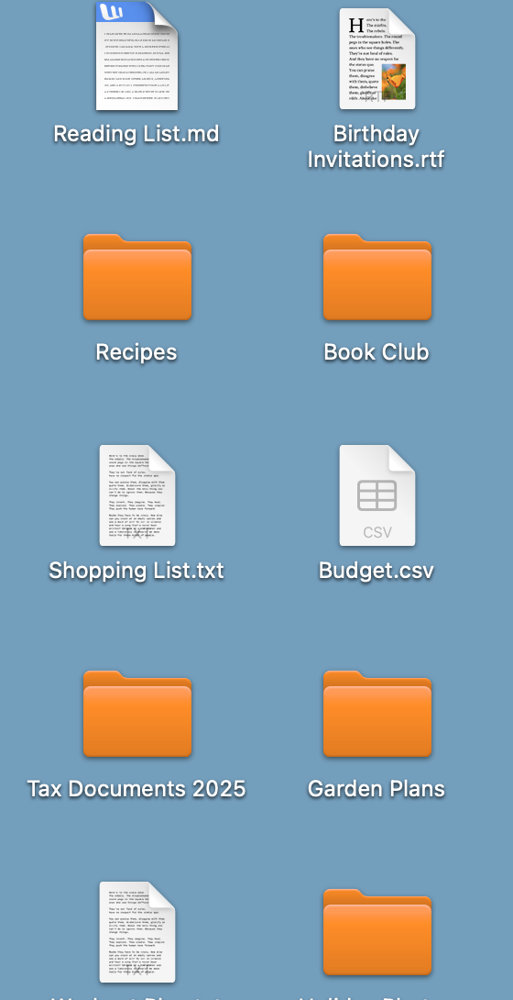
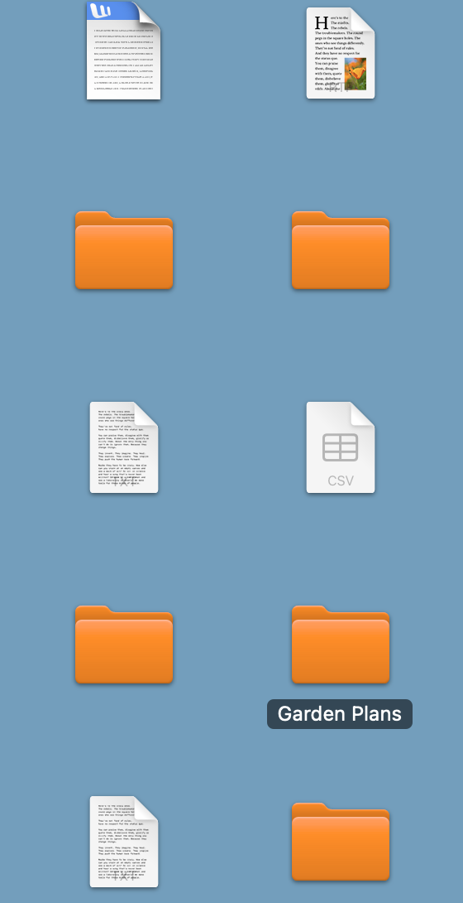
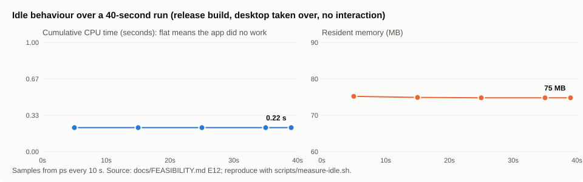

# QuietDesk

[](https://github.com/AlexToumayan/quietdesk/actions/workflows/ci.yml) [](https://github.com/AlexToumayan/quietdesk/releases) [](LICENSE)

I like having files on my desktop. I do not like the wall of text that comes with them. So I built
QuietDesk: it hides the names under your Mac's desktop icons and shows a name only when you point at
that icon (or select it). It is a small, native app that lives in the menu bar. Your icons stay
where Finder put them, or sit on a denser grid if you prefer. No file is renamed, moved, hidden or
changed.

| Before | After |
|---|---|
|  |  |

*The same desktop, before and after. On the right the names are gone, except the one that has faded
in for the item under the pointer.*

**Status: version 1.0.0. Every feature is built. Everything a program can check for itself is
covered by the automated tests, and I am still working through the checklist I run by hand, in
[docs/VALIDATION-CHECKLIST.md](docs/VALIDATION-CHECKLIST.md).** The mechanism was proven and
measured on macOS 26.6.2, the full set of desktop interactions is implemented and code-reviewed,
and the changes in each version are listed in [CHANGELOG.md](CHANGELOG.md).

**New here?** Start with [the ideas explained simply](docs/CONCEPTS.md). It takes about ten minutes and needs no programming.

**Here to see how it was built?** Read [the case study](docs/CASE-STUDY.md) first. Then look at [the prompts as cards](docs/PROMPTS.md), [the experiments](experiments/README.md) and [the evidence pages](docs/evidence/). Every write-up is a Markdown page in this repository, so there is nothing to download.

## What you see when it is on

Your desktop looks the same, minus the names. Point at an icon and its name fades in. Move away and
it is gone. That is the whole idea.

A few things change in small ways that are worth knowing before you try it:

- The menu-bar icon is an open eye while QuietDesk is off and a slashed eye while it is on.
- You can ask for names to be visible always, on hover, or never. On hover is the default.
- With names on hover, the icons pack a little closer together by default, because no space has to
  be reserved under each one for text. You can turn that off.
- Everything you normally do on the desktop still works: clicking, dragging, renaming, opening,
  trashing, Quick Look, Get Info, tags, undo. The table further down lists all of it.
- Finder itself is untouched. Finder windows, Spotlight, the menu bar and every Finder feature keep
  working. Only the icons drawn on the wallpaper are QuietDesk's.

## Getting it running

You build QuietDesk from the source, on your own Mac. Three steps.

**1. Have the Xcode Command Line Tools installed** (Swift 5.10 or later). Xcode itself is not
required. You also need macOS 14 or later to build; I have tested it only on macOS 26.6.2 on Apple
Silicon.

**2. Build it.**

```bash
git clone https://github.com/AlexToumayan/quietdesk.git && cd quietdesk && ./scripts/build-app.sh
```

**3. Open it.**

```bash
open build/QuietDesk.app
```

An eye appears in your menu bar. The first time you open QuietDesk it shows a short welcome note
and turns itself on. macOS then asks whether the app may see your Desktop folder. Until you click
Allow, QuietDesk waits and your desktop stays exactly as it was. After that, the first line of the
menu turns QuietDesk on or off whenever you like.

The build script runs `swift build -c release`, assembles `build/QuietDesk.app` and applies an
ad-hoc code signature, which is what lets it run on Apple Silicon. An app you built yourself carries
no quarantine flag, so it opens normally.

**Would you rather not build it?** Each [release on GitHub](https://github.com/AlexToumayan/quietdesk/releases)
has a zipped copy of the app. I sign it only on the build machine and Apple has not notarized it, so
macOS blocks it the first time. Unzip it, try to open it once, then go to System Settings › Privacy &
Security and choose Open Anyway. Building it yourself avoids that step.

## Using it

Everything lives in the menu-bar menu:

```
QuietDesk
Turn QuietDesk Off            (or: Turn QuietDesk On)
Desktop Items ▸   Visible ✓ / Hidden
Item Labels   ▸   Always Visible / On Hover ✓ / Hidden
Sort By       ▸   Finder's Setting ✓ / None (Finder Positions) / Name / Kind / Date … / Size / Tags
Stacks        ▸   Finder's Setting ✓ / Off / Group by Kind / Date … / Tags
Show View Options…
Launch at Login
Bring Finder Forward on Desktop Click  ✓
Click Wallpaper to Reveal Desktop
Open Desktop & Dock Settings…
Reload Desktop
About QuietDesk
Quit QuietDesk                ⌘Q
```

In plain words:

- **Item Labels** is the setting the whole app exists for: names always on, names on hover, or no
  names at all.
- **Desktop Items › Hidden** hides QuietDesk's icons too, so the desktop is completely empty. Your
  label choice is remembered for when you bring them back.
- **Sort By** and **Stacks** are the same choices Finder gives you, applied to QuietDesk's desktop.
  "Finder's Setting" means "whatever Finder is doing right now", which is the default.
- **Bring Finder Forward on Desktop Click** keeps the menu bar reading "Finder" when you click the
  desktop, the way it does normally. You can switch it off.
- **Click Wallpaper to Reveal Desktop** is explained under Revealing the desktop, below.

**Right-clicking the wallpaper** while QuietDesk is on gives you the same menu Finder shows there:
New Folder, Get Info, Change Wallpaper, Use Stacks, Group Stacks By, Sort By, Item Labels, Show
View Options, Paste.

**View Options** (⌘J on the desktop, or from either menu) is QuietDesk's version of Finder's panel:
Stack By, Sort By, icon size, grid spacing, text size, label position (bottom or right), Show item
info, Show icon preview, Show iCloud status, Compact grid, Names on hover. Changes apply immediately
to QuietDesk's desktop and never modify Finder's own settings; "Use Finder's Settings" re-imports
Finder's current values (that is also the default until you change something). I measured icon
spacing against Finder at three settings on macOS 26.6. Settings in between are estimated, so icons
may sit a few points away from where Finder would put them. The order is always right.

**Compact grid** (on by default while names are On Hover or Hidden): the icons are packed as if
there were no names at all, so more fits on the desktop. When you point at an item, its name fades
in on top of the icons below it (the fade takes 120 ms). Turn it off to keep Finder's spacing, with
room for a name under every icon. Finder's spacing is also what the wider "Names on hover" choices
need, because they show the names around the pointer too. Desktops you arrange by hand (Sort By:
None) always use it, since those positions are Finder's.

### Revealing the desktop

Clicking the wallpaper slides every window aside, as it does natively, when System Settings ›
Desktop & Dock › "Click wallpaper to reveal desktop" is on. F11, the spread gesture and hot corners
work too.

One thing to expect: while the desktop is revealed, macOS shows Finder's own desktop items, names
included. It does that for anyone who hides desktop items, not just for QuietDesk. So QuietDesk
steps aside for as long as the reveal lasts and comes back when it ends.

The wallpaper click uses the Dock's own entry point for Show Desktop, which is not a published part
of macOS. QuietDesk looks it up when it starts, and if it is missing, or a reveal it asked for never
appears, wallpaper clicks quietly go back to only deselecting. The menu has a switch for the whole
behaviour (Click Wallpaper to Reveal Desktop).

## Everything the desktop still does

This is the honest inventory: everything Finder's desktop does that people actually use, done by
QuietDesk on its own layer. Skim it, or skip it.

| Area | Supported |
|---|---|
| Layout | Finder's sorted grid (Sort By Name, Kind, Date Added/Modified/Created/Last Opened, Size, Tags) with Finder's order and cell geometry; manually arranged desktops read positions from Finder and write them back when you drag icons (Snap to Grid respected); volumes and disk images; continues onto other displays |
| Stacks | Same grouping as Finder (by date buckets, kind, tags); single click expands a stack in place, click again collapses; stack piles show the newest items |
| Labels | On hover, on selection, on keyboard focus, always, or hidden; full name on hover; two-line middle truncation like Finder; readable on light and dark wallpapers; screen-edge aware; compact grid with no room reserved for names while they are hidden |
| Selection | Click, Cmd-click, Shift-click, rubber band (from the wallpaper or between icons), arrow keys, Cmd-A, Escape, type-to-select |
| Opening | Double-click, Cmd-O, Cmd-Down, Open With ▸ (all registered apps, default first), spring-loaded folders while dragging |
| Files | Rename (Return, or a slow second click on the name), Duplicate ⌘D, Make Alias ⌘L, Compress (Archive Utility), Copy ⌘C / Paste ⌘V / Move here ⌥⌘V, New Folder ⇧⌘N, Move to Trash ⌘⌫ (Put Back works), Eject ⌘E, Show Original ⌘R, Tags (Finder's seven colours plus your custom tags, colour dots on icons) |
| Undo | ⌘Z / ⇧⌘Z for rename, duplicate, alias, move, copy, trash, new folder, tags |
| Info | Get Info ⌘I opens Finder's own Info window; Quick Look (space or ⌘Y) with arrow keys; Share… |
| Drag and drop | Drag items to other apps, Finder windows and the Dock (with an item-count badge); drop files from Finder onto the desktop or onto a folder; drop from browsers, Mail and Photos (file promises) |
| Appearance | Finder-style icon previews (thumbnails) for documents, images, PDFs and movies when "Show icon preview" is on, never for cloud-only files; iCloud status glyphs; alias badges |
| Menu bar | Clicking the desktop brings Finder forward so the menu bar reads "Finder" (switchable); QuietDesk's panel keeps keyboard focus |
| Accessibility | Every item exposes its name to VoiceOver even when labels are hidden |

## Turning it off, and getting your normal desktop back

Nothing QuietDesk does is permanent. Every way out puts your native desktop back.

- **Turn it off:** menu › Turn QuietDesk Off. QuietDesk's layer goes away, Finder's own icons come
  back, and the menu-bar icon stays so you can turn it on again.
- **Quit:** menu › Quit QuietDesk. The same restoration, and the app exits.
- **After a crash or a force-quit:** launch QuietDesk once. It notices the unfinished change and
  puts the setting back. If you would rather do it by hand:

```bash
defaults delete com.apple.WindowManager StandardHideDesktopIcons
```

  (If you had deliberately hidden desktop items before using QuietDesk, set it back to `true`
  instead. System Settings › Desktop & Dock › "Show Items › On Desktop" is the same switch.)

- **Built it again yourself?** Every ad-hoc build has a new code hash, so macOS asks again for
  Desktop folder access on the first launch. Until you click Allow, the app waits and the desktop
  stays native.
- **Reporting a bug:** launch with the event trace on (`open QuietDesk.app --args --debug-log`),
  reproduce the problem, and attach `~/Library/Logs/QuietDesk/debug.log`. It stays on your Mac. The
  app never sends anything anywhere.
- **Uninstall:** quit, delete `QuietDesk.app`, and optionally remove its settings:

```bash
defaults delete dev.quietdesk.QuietDesk
```

QuietDesk stores only its menu choices and the restore record in that preferences domain.

## Permissions

Two prompts, and that is all. Here is what each one is for.

| Permission | Why | When asked |
|---|---|---|
| Files and Folders › Desktop Folder | To list the items on your Desktop (metadata only). | First enable. |
| Automation › Finder | Get Info (opens Finder's Info window), New Finder Window (⌘N), and reading/writing icon positions on manually arranged desktops. One Apple event per action; nothing at idle. | First time one of those is used. Denying only disables those three things. |

No Accessibility, Screen Recording, Full Disk Access, network, analytics, helpers or launch agents.
The once-a-second reveal check reads only which app owns each window, its level and its size. That
needs no permission. Window titles, which would need Screen Recording, are never read.

Two things work without any prompt but are worth knowing. QuietDesk reads Finder's and
WindowManager's settings and writes one WindowManager setting (the hide switch), so it is not
sandboxed. And the wallpaper-click reveal calls one private Dock function, looked up at run time.
The process opts out of downloading cloud-only files (Apple's dataless-file I/O policy), and
thumbnails are requested only for files that are fully local.

## Known limitations

I would rather tell you these up front than have you find them.

- While the desktop is revealed you see Finder's own icons, with their names. A reveal started by
  F11, the spread gesture or a hot corner is noticed at the next once-a-second check, so doubled
  icons can show for up to about a second and a half. When the reveal ends, QuietDesk is back within
  about a quarter of a second.
- Finder's own menu-bar menus do not act on QuietDesk's selection. They act on Finder's, which is
  empty while items are hidden. Use QuietDesk's right-click menu and its keyboard shortcuts instead.
- Finder's own "Show View Options" panel is not offered. QuietDesk has its own panel, ⌘J, which
  never changes Finder's settings.
- Because each rebuild changes the ad-hoc signature, macOS may ask for permissions again after
  rebuilding. Handing a ready-made build to other people needs Developer ID signing and
  notarization (paid Apple Developer Program) or the "Open Anyway" flow on their side.
- Grid geometry is calibrated against Finder at text size 12 for icon 36 at two grid-spacing
  settings (the tightest and a mid value) and for icon 32 at the tightest, and interpolated
  elsewhere; other icon and text sizes may sit a few points off Finder's cells (the order is always
  right, and QuietDesk's own View Options let you adjust the spacing to taste).
- "Sort By › None" has two modes. If Finder itself is sorting the desktop, QuietDesk keeps its own positions. They start from the current grid, are stored in QuietDesk's preferences and are never written to Finder. The automated scenario test covers this mode. If Finder's desktop is arranged by hand, QuietDesk reads and writes Finder's positions through Finder scripting. That mode was built from Finder's scripting dictionary and has not yet been checked on a real hand-arranged desktop.
- Finder's Info window and New Finder Window need the Finder Automation permission.
- Approximations: "Date Last Opened" uses the file's last-access time (Finder uses Launch Services'
  last-used date); the "Screenshots" kind group is detected by the "Screenshot" name prefix; Stack
  date buckets follow Finder's visible behaviour and were checked against one desktop.
- A change in the Desktop folder while a name is being edited cancels the edit.
- Quick Look and Open on a cloud-only (evicted) file download it, exactly as in Finder; drawing
  its icon never does.
- Untested so far: Mission Control, Stage Manager, full-screen apps, sleep/wake,
  display connection changes, desktop widgets, and the "Bring Finder Forward" keyboard-focus
  behaviour. See the checklist.

---

*The rest of this page is for people who want to know how it works, how it was built, or who want to
work on the code.*

## How it works

While enabled, QuietDesk asks macOS to hide Finder's desktop items (the same switch as System
Settings › Desktop & Dock › "Show Items › On Desktop") and draws the same items itself in a
transparent layer just above the desktop, in the positions Finder uses. Labels appear on hover, on
selection and on keyboard focus; or always; or never. Disable or quit and the native desktop comes
back as it was.

That is the short version. There is no switch anywhere in macOS for "icons without names", which is
why the app has to draw its own desktop at all, and the long version, with the experiments behind
each decision, is in [docs/FEASIBILITY.md](docs/FEASIBILITY.md). The ideas in it are explained
without jargon in [docs/CONCEPTS.md](docs/CONCEPTS.md).

## How it was built

I wrote a product brief, and then I directed an AI, Claude, working in Claude Code, to build it in
one stretch of work. Claude did the research, ran the experiments on my Mac with my approval, wrote the
Swift code and drafted these pages, and it delegated to short-lived helper agents: 137 of them
across eight organized rounds. I made the decisions, approved each experiment before it touched my
desktop, tested the result by hand and said what was good enough. The hard part (can the native
labels be controlled at all?) was settled by research and experiments before anything was built, and
the code was adversarially reviewed before release.

The whole trail is in this repository, deliberately. It is as much the point as the app is:

- [docs/CONCEPTS.md](docs/CONCEPTS.md): the ideas behind it, explained for humans.
- [docs/BRIEF.md](docs/BRIEF.md): the brief I wrote, word for word.
- [docs/CASE-STUDY.md](docs/CASE-STUDY.md): the process, the decisions and the numbers.
- [docs/PROMPTS.md](docs/PROMPTS.md): every agent prompt as a structured card; scripts in [docs/workflows/](docs/workflows/).
- [docs/FEASIBILITY.md](docs/FEASIBILITY.md) and [experiments/](experiments/): what was tried and what happened.
- [docs/evidence/](docs/evidence/): research digest, module reports, the code review, and the two feature reviews, each with findings and how they were resolved.

## Requirements

- macOS 14 or later to build; tested only on macOS 26.6.2 (Apple Silicon).
- Xcode Command Line Tools (Swift 5.10+). Xcode is not required to build.

## Tests

- `swift test` runs the XCTest target (`Tests/QuietDeskTests`: layout geometry, manual layout,
  Stacks buckets, ordering, Finder-style naming, descendant guard, rename with undo). XCTest ships
  with Xcode and with GitHub's macOS runners, not with the bare Command Line Tools; on a
  Command-Line-Tools-only machine run the same checks with `.build/release/QuietDesk --self-test`.
- CI (`.github/workflows/ci.yml`) builds the release binary, runs the self-test and the unit tests,
  bundles the app and uploads it as an artifact on every push.
- `.build/release/QuietDesk --scenario-test --defaults-suite dev.quietdesk.scenario` drives the real
  overlay windows with synthesized clicks (Stack expand/collapse, member clicks, double-click open,
  wallpaper clicks) before and after every View Options change, with Finder brought forward between
  clicks as on the real desktop; about 580 checks across some thirty rounds (View Options, compact and Finder
  grids, manual layout, label modes, activation states, repeated reveals, a sleep with no wake), exit status 0 when all pass. CI runs it against a
  fixture folder (`--desktop-dir`). It uses a private preferences suite and never hides the native
  desktop.
- `scripts/measure-idle.sh 60` reproduces the idle measurement under Performance (without a number it runs for 40 s). It is the real thing: Finder's desktop icons are hidden for the run and put back when it ends, so leave the mouse alone. The first time, macOS may ask your terminal app for access to the Desktop folder. It prints CPU %, memory in MB and total CPU time every 5 s.

## Developer flags

Run the bare executable, `.build/release/QuietDesk`:

| Flag | Effect |
|---|---|
| `--self-test` | Runs the pure-logic checks (layout geometry, manual layout, stack buckets, ordering, naming) and exits. |
| `--dump-layout` | Prints the computed grid (screen, column, row, icon centre, kind, name) without showing anything. |
| `--render out.png [--hover N] [--expand "Stack"] [-labelMode always\|hover\|hidden]` | Renders the main display's overlay to a PNG over a flat background. |
| `--test-seconds N` | Quit automatically after N seconds (restores the desktop). |
| `--no-hide` | Show the overlay without hiding Finder's items (alignment check: icons should coincide; always uses Finder's grid, never the compact one). |
| `--hit-test` | Prints which window the window server would deliver clicks to at several points. |
| `--render-view-options out.png [--dark]` | Shows the View Options panel for a moment and renders its content to a PNG (layout checks without a screenshot permission). |
| `--scenario-test [--with-reveal] [--defaults-suite NAME] [--desktop-dir PATH]` | Replays click sequences through the real overlay windows across View Options states; see Tests. `--with-reveal` adds two rounds that reveal the desktop for real, so every window slides aside for a few seconds and comes back. |
| `--debug-log` | Appends an event trace (clicks, relayouts, window order, View Options changes) to `~/Library/Logs/QuietDesk/debug.log`. Also `defaults write dev.quietdesk.QuietDesk debugLog -bool YES`. |

## Performance (measured, release build, macOS 26.6.2)



Overlay enabled and idle for 60 s with the full feature set: 0.0 % CPU in every sample after
launch, cumulative CPU time up by 0.05 s over 50 s (about a thousandth of one core), resident memory
84 MB and flat, no disk activity. The one piece of regular work at rest is a look at the window list
once a second (about 1 ms, with half a second of timer tolerance), which runs for as long as
QuietDesk is on: macOS sends no event when the desktop is revealed, and QuietDesk has to step aside
when it is (FEASIBILITY E14). Nothing else repeats while the desktop is at rest. Short-lived timers run only while you are doing something: a redraw loop for the 120 ms a hovered name takes to fade in, a one-second timer for spring-loaded folders during a drag, and another for type-to-select. The window-list check speeds up to four times a second while the desktop is revealed, so QuietDesk comes back promptly. Everything else happens on hover, clicks, keys, a change in the Desktop folder, a volume mount, a display change, an iCloud status change, or when a thumbnail is first needed.
Details and caveats in the feasibility document.

## Project layout

```
Package.swift            SwiftPM manifest (single executable target)
Sources/QuietDesk/
  main.swift             bootstrap; dataless-file I/O policy
  AppDelegate.swift      menu bar, enable/disable, restore and crash recovery, diagnostics
  OverlayController.swift  windows per screen, model, stacks, positions, observers
  OverlayWindow.swift    non-activating transparent panel just above the desktop-icon level (shield + 1, icons + 2)
  ShieldView.swift       bitmap-free full-screen click owner (rubber band, drops, menu)
  DesktopView.swift      the desktop surface: state, hover, selection
  DesktopView+*.swift    drawing, mouse, keyboard, menus, drag and drop, rename, Quick Look, accessibility
  DesktopSupport.swift   rename field, shared drop handling, empty-desktop menu
  DesktopModel.swift     Desktop folder + volumes scan, ordering, kinds, Stacks
  Layout.swift           Finder-like sorted grid and manual layout, calibrated metrics
  FileOperations.swift   undoable file actions (rename, duplicate, alias, compress, trash, copy, move, tags…)
  FinderAutomation.swift Apple Events to Finder: positions, Get Info, new window
  ThumbnailCache.swift   QuickLook previews, only for fully local files, bounded
  CloudStatusMonitor.swift  iCloud status from URL resource values, pushed by FSEvents, file presenters and Progress
  FinderDesktopPrefs.swift  read-only view of Finder's desktop view options
  DesktopIconsPreference.swift  the one system setting QuietDesk writes, with restore record
  DesktopWatcher.swift   event-driven watch of ~/Desktop
  IconCache.swift        bounded, pre-rendered icon cache
  LoginItem.swift        launch at login (SMAppService)
  Settings.swift         UserDefaults-backed menu choices
  SelfTest.swift         --self-test checks (mirrors Tests/)
  Diagnostics.swift      offline renders used by the developer flags
Tests/QuietDeskTests/    XCTest unit tests
Resources/               Info.plist (LSUIElement, usage descriptions), app icon
scripts/                 build-app.sh (bundle with Command Line Tools only), measure-idle.sh
experiments/             the reproducible experiments behind the feasibility findings
docs/                    brief, feasibility, case study, prompt library, evidence, validation checklist
.github/workflows/       CI (build, tests, artifact) and tagged releases
```

## License

MIT. See [LICENSE](LICENSE).
