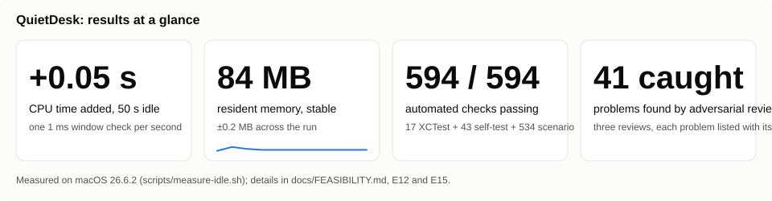
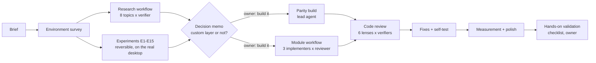
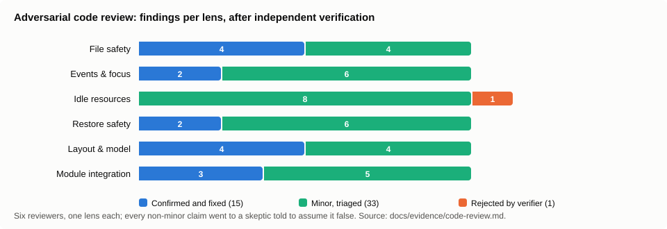
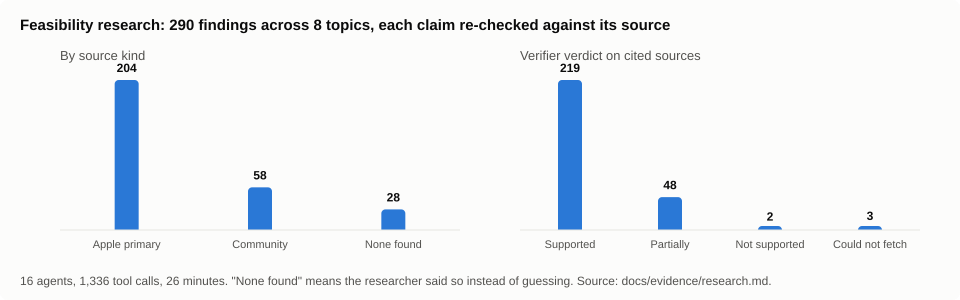
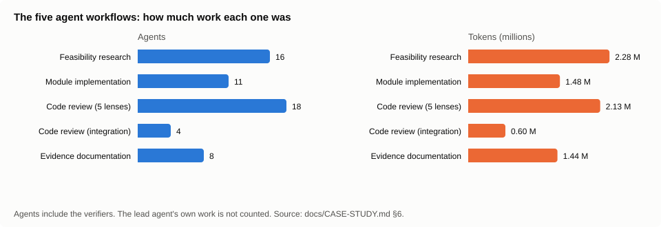

# How QuietDesk was built

**If you only read one paragraph.** One person wanted a Mac desktop where the icons stay but the
names only appear when you point at them. Nobody had built it, and it turned out there is no
switch for it anywhere in macOS. So the work went like this: first find out, with Apple's own
documents and small experiments, what the operating system will and will not allow; then stop and
let the person decide whether the only workable route (drawing the icons ourselves) was worth its
costs; then build it, have it torn apart by reviewers whose findings were fact-checked, fix what
survived, and measure the result. One human directed one AI, which delegated to 137
short-lived helpers in eight organized rounds, from 2026-09-16 to 2026-09-18. This page
tells that story; the plain-language explanations of the ideas involved are in
[CONCEPTS.md](CONCEPTS.md).



**Start here:** [concepts](CONCEPTS.md) → [the brief](BRIEF.md) → [feasibility](FEASIBILITY.md) → [prompt library](PROMPTS.md) → evidence ([research](evidence/research.md), [experiments](../experiments/README.md), [modules](evidence/modules.md), [code review](evidence/code-review.md)) → [validation checklist](VALIDATION-CHECKLIST.md).

## 1. What the brief asked for, and why it worked as a prompt

The [brief](BRIEF.md) is a product document, not a feature list, and that is why it worked. It
told the AI what must never happen, what to prove before building, and how to be honest about
the result. Five properties made it a strong opening prompt:

1. **A non-negotiable invariant** ("preserve my actual desktop": no renames, moves, flags, aliases).
   Every later decision could be tested against it.
2. **Required distinctions** (documented API vs user-facing setting vs undocumented preference vs
   custom surface), which forced honest labelling of every mechanism.
3. **Milestone gating** ("prove the difficult part before building the easy part") and an explicit
   instruction to stop for a decision before a material tradeoff.
4. **Performance as a requirement with a measurement obligation**, including "do not invent numbers".
5. **Honesty requirements** ("clearly distinguish working features, unverified assumptions, and
   incomplete work"), which shaped every output schema downstream.

## 2. The shape of the work

In one sentence: survey the machine, research the rules, run experiments, stop for the human's
decision, build, review, fix, measure, hand over. The diagram shows the same thing.



| Stage | Who | Output |
|---|---|---|
| Environment survey | lead | macOS 26.6.2, no Xcode, two displays, the owner's desktop settings, which permissions the session had ([FEASIBILITY §1](FEASIBILITY.md)) |
| Research | 8 researchers + 8 verifiers | Cited findings per mechanism, corrections, open questions ([evidence/research.md](evidence/research.md)) |
| Experiments | lead, on the live desktop with capture/restore | E1 to E15: what Finder accepts, what the window server does, what WindowManager adds. E13 to E15 came later: grid calibration, revealing the desktop, and the idle cost with the reveal check ([experiments/](../experiments/README.md)) |
| Decision | owner | "Build the custom layer to full parity, then test" |
| Parity build | lead + 3 module implementers + 3 module reviewers | 12 feature areas (the rows of the README's feature table), three modules with harness-verified behaviour ([evidence/modules.md](evidence/modules.md)) |
| Code review | 6 reviewers + 16 verifiers | 15 confirmed defects fixed, 1 rejected, 33 minors triaged ([evidence/code-review.md](evidence/code-review.md)) |
| Feature reviews (each new feature, before it was committed) | 7 reviewers + 64 skeptics + 2 critics | 26 distinct problems found and resolved, 2 claims rejected ([evidence/feature-reviews.md](evidence/feature-reviews.md)) |
| Documentation review | 4 reader personas + 1 synthesizer | 87 exact-text fixes to stale facts, jargon and navigation (script 8 in [workflows/](workflows/)) |
| Measurement | lead | Idle: 0.0 % CPU in every sample, +0.05 s CPU time over 50 s, ~84 MB resident (`scripts/measure-idle.sh`) |
| Validation | owner | [VALIDATION-CHECKLIST.md](VALIDATION-CHECKLIST.md), demo video |

## 3. Five decisions, and the evidence behind each


Each row is a fork in the road, what was chosen, and the specific fact that forced the choice
(E-numbers are the experiments in [FEASIBILITY.md](FEASIBILITY.md)).

| Decision | Evidence that forced it |
|---|---|
| Native Finder cannot do hover-only labels; a custom layer is the only mechanism. | No API in AppKit or Finder's dictionary; Finder Sync cannot touch rendering (Apple docs); Finder rejects a scripted text size below 10 (E3); `desktop position` and `.DS_Store` are stale on a sorted desktop (E2, E5). |
| Hide native items with the same switch System Settings uses, not by relaunching Finder. | The setting applies live (E8 shows WindowManager reacting within two seconds); the `CreateDesktop` route needs Finder relaunches and removes drops and menus (research). |
| Put the overlay just above the desktop-icon level and let it own every desktop click. | With items hidden, WindowManager inserts a full-screen click-catcher at the icon level that re-shows native icons on any wallpaper click (E8); at the same level it ordered above ours. |
| Use a non-activating panel so the menu bar can stay with Finder. | Documented AppKit behaviour; the keyboard-focus race with Finder's activation was flagged by review and mitigated with a one-shot re-assert, and is on the checklist. |
| Never let anything download a cloud-only file. | Apple TN3150 (process I/O policy); the thumbnail generator runs out of process, so eligibility is checked before any request (module harness proved `st_flags` unchanged). |

## 4. What the process caught



These are the things that would have reached a user if the reviewers and their fact-checkers had
not been part of the process.

- **Two blockers** the tests would not have found: a crash on relayout when the selection had more items than the new grid, and copying a folder into its own subfolder (a verifier reproduced 450 levels of recursion before the path limit).
- **A silent data hazard**: hiding native icons even when Desktop access had been denied, leaving an empty desktop with no explanation.
- **An architecture trap**: `NSPanel` resets its level when `isFloatingPanel` is set after `level`; a 12-second run put the overlay above application windows before the hit test exposed it (E10).
- **An undocumented three-state behaviour** of `ignoresMouseEvents` (E11), matching a sentence in AppKit release notes from 2003 that a verifier dug up.
- **A wrong assumption in a brief**: the iCloud module was asked for Spotlight metadata queries; the implementer measured that they carry no iCloud attributes here and proposed a documented alternative instead of complying.
- **A relayout-under-the-pointer bug**, reported by the owner as "nothing opens any more" after using View Options: with a Stack open, the first click of a double-click collapsed it, the grid shifted, and the second click landed on whatever had moved there. Reading the code did not find it; a scenario test that sends synthesized clicks through the real overlay windows (about 500 checks across 25 View Options, layout and activation states) reproduced it in every state, the fix remembers what the first click hit, and CI now runs that test on a fixture desktop so it cannot come back.

## 5. What it did not do

Honesty about limits is part of the method, so here is what was deliberately not done or could
not be checked without a person at the keyboard.

- No sub-agent ever ran the app in live mode or changed a system preference; only the lead did, with capture and restore, for seconds at a time.
- Nothing was screenshotted (no Screen Recording permission); visual claims were verified by rendering the overlay offline into PNGs, and the owner's own screenshot was used to check the layout column by column.
- The hands-on checklist is still open ([VALIDATION-CHECKLIST.md](VALIDATION-CHECKLIST.md)). Still untested by hand: Mission Control, Stage Manager, full-screen apps, sleep/wake, display connection changes, desktop widgets, and the keyboard-focus behaviour after a Finder activation. The README's Known limitations carries the same list.
- Manual (unsorted) desktops were implemented from Finder's dictionary and the module's calibration; the owner's desktop is sorted, so they were never exercised for real.

## 6. Numbers






The line starts at 0.25 s, which is the cost of launching, and ends at 0.30 s. The difference, 0.05 s, is the whole cost of sitting idle for about 50 seconds.

| Workflow | Agents | Tokens | Tool calls | Wall clock |
|---|---|---|---|---|
| Feasibility research | 16 | 2.28 M | 1,336 | 26 min |
| Module implementation (two runs; the first hit a usage limit and was resumed with cached results) | 5 + 6 | 1.48 M | 265 | 58 min |
| Code review, five lenses | 18 | 2.13 M | 297 | 30 min |
| Code review, module integration | 4 | 0.60 M | 104 | 14 min |
| Evidence documentation (this repo's evidence pages) | 8 | 1.44 M | 215 | 19 min |
| Feature review: compact grid | 47 | 4.04 M | 499 | 22 min |
| Feature review: reveal desktop | 26 | 2.20 M | 343 | 29 min |
| Documentation review, plus the feature-reviews evidence page | 7 | 1.09 M | 226 | 45 min |

The figures on this page are generated from these numbers by `scripts/make-charts.py`.

The lead agent's own work (survey, experiments, core implementation, integration, fixes, docs) is not
counted above. Source size: about 4,700 lines of Swift at v0.9.0 and about 6,100 now (the Sources folder, tests not counted). No third-party dependencies.

## 7. Reproduce

```bash
./scripts/build-app.sh            # build + bundle with Command Line Tools only
.build/release/QuietDesk --self-test
scripts/measure-idle.sh 60        # idle measurement, restores the desktop afterwards
```

The experiment scripts in [experiments/](../experiments/README.md) are the smallest reproductions of
each finding; each one says what it changes and restores it.
