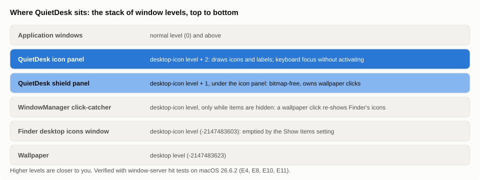

# The ideas behind QuietDesk, explained simply

I am Alex Toumayan, and QuietDesk is my project. This is the page I would hand a friend who asked
me what it actually does and why it was hard. It explains, in plain language, every idea the
project depends on. You do not need to know anything about how macOS works inside. Each section
says what the thing is, why it mattered to me, and what I found out.

A word about how it was made, because it shapes the rest of this page. I wrote the brief, made
the decisions and tested the result by hand on my own Mac. I directed an AI, Claude, working in
Claude Code: it did the research, ran the experiments, wrote the Swift code and drafted these
pages while I reviewed them, and it handed small pieces of the job to short-lived helper agents. A
helper is a separate, temporary AI session given one job and no memory of the others. Section 13
explains that part. So when a sentence below says "Claude found" or "I had Claude measure", that
is literally what happened.

If you want the citations and the exact experiments, they are in
[FEASIBILITY.md](FEASIBILITY.md) and [experiments/](../experiments/README.md); this page is the
version you can read on a phone.

---

## 1. Your desktop is a window, not a place

When you look at your Mac's desktop you see three things stacked on top of each other: the
wallpaper, the icons, and your open app windows. Each of those is a separate *window* in the
technical sense, even the wallpaper.

- The **wallpaper** is a full-screen window drawn by a system helper (the same program that runs
  the Dock).
- The **icons** are drawn by **Finder**, in a transparent full-screen window that sits just above
  the wallpaper. When you click an icon, you are clicking Finder's window.
- **App windows** sit above both.

Why it matters to me: QuietDesk does not change Finder. It asks macOS to make Finder's icon window
empty (using an ordinary switch in System Settings), and then draws its own icons in a new
transparent window in the same place. Finder, Finder windows, Spotlight and the menu bar carry
on exactly as before; only the "layer of icons on the wallpaper" changes hands.

## 2. Windows live on numbered sheets of glass

Imagine a stack of glass sheets. Each window is drawn on one sheet, and the sheets have numbers.
Higher numbers are closer to you. macOS reserves a few numbers for special things: the wallpaper
sheet is at the very bottom, the desktop-icons sheet is one step above it, and normal app
windows are far above both.

QuietDesk draws on sheets **just above the desktop-icons sheet**. That keeps it below every
app window (it can never cover your work) and above Finder's icon window and, as it turned out,
above an invisible window macOS adds when icons are hidden (see §4).

*The same stack as a picture. Higher sheets are closer to you.*

There was one trap here, and QuietDesk fell into it. The kind of window it uses (a "panel") silently
moves itself to the normal-app sheet if two settings are applied in the wrong order. For twelve
seconds during a test, the overlay sat on top of every app on my screen. The fix was a one-line
ordering change and a guard; the lesson is recorded as experiment E10. (Codes like E10 are
experiment numbers. The numbered list is in section 3 of [FEASIBILITY.md](FEASIBILITY.md).)

## 3. How a click finds its window

When you click, macOS walks down the stack of sheets from the top and stops at the first window
that is *there* at that point. "There" is subtle: for windows with transparent parts, a fully
transparent pixel does not count, so the click falls through to whatever is underneath. A pixel
that is even one step away from fully transparent (1 on a scale of 0 to 255) counts as solid.
I had Claude measure this on my Mac by stacking two test windows and asking macOS which one a
click would hit.

Each window also has a switch with three positions. Left alone, the rule above applies. Set to
"ignore", clicks pass through the window everywhere. Set to "catch", the window catches clicks
everywhere, even on its transparent parts. Apple described this in release notes in 2003 and it
still holds on macOS 26. QuietDesk uses the "catch" position on purpose (§4 explains why). It also
keeps a second, invisible full-screen window underneath as a safety net, so a desktop click can
never slip past QuietDesk to the click-catcher described in §4.

## 4. The "Show Items" switch and the invisible click-catcher

System Settings › Desktop & Dock has a switch, "Show Items › On Desktop". Turning it off hides
Finder's desktop icons instantly, without restarting Finder. QuietDesk flips the same switch
(it is stored as a preference key that Apple does not document, so the app captures the old
value first and puts it back on quit, and even after a crash on the next launch).

The surprise: while the switch is off, macOS adds an invisible full-screen window at the
desktop-icons level whose only job is to notice a click on the wallpaper and bring the native
icons back. If QuietDesk let wallpaper clicks fall through, every click on empty desktop would
make Finder's icons reappear underneath QuietDesk's. So while QuietDesk is enabled it owns every
click on the desktop, and provides the things a wallpaper click used to do (deselect, rubber-band
select, the right-click menu, drops) itself.

That left the "click the wallpaper to reveal the desktop" gesture, where every window slides
aside. I did not want to lose it. An experiment showed how to bring it back: when you click empty
wallpaper, QuietDesk asks the Dock to do its normal "show desktop" slide, as long as that gesture
is switched on in System Settings.

The same experiment turned up another surprise. Whenever the desktop is revealed, by a click, by
F11 or by the trackpad gesture, macOS shows Finder's own icons again until the reveal ends, even
though they are switched off. It does that for everyone who hides desktop items. QuietDesk's icons
on top of Finder's would be doubles, so QuietDesk steps aside while the desktop is revealed and
comes back when it ends.

There is one catch: macOS tells nobody when a reveal starts or stops. Claude listened on every
channel an app is allowed to listen on and heard nothing. The only trace is a window the Dock puts
up while the desktop is revealed. So QuietDesk looks at the list of windows once a second, for as
long as it is on, and four times a second while the desktop is revealed so that it comes back
promptly. Each look takes about a thousandth of a second, and it is the one piece of regular work
QuietDesk does at rest. If a reveal is started by F11 or the gesture, QuietDesk can take up to
about a second and a half to notice, so you may see doubled icons for a moment.

## 5. Why the names could not simply be hidden

The obvious idea, and the one I started with, is to keep Finder's icons and just hide the names.
I had Claude look hard for a way, and each door was closed:

- There is no setting or programming interface for "hide desktop names". Apple's own user guide
  lists what the desktop view options can do (icon size, spacing, text size, label position) and
  hiding names is not among them.
- Finder can be scripted to change the label text size, but it refuses anything below 10 points
  (Claude tried 4 and got an error; 10 worked and was put back to 12).
- Finder's extension mechanisms (the ones apps like Dropbox use) can add badges and menu items,
  not change how names are drawn. Apple says so directly.
- Covering the names with wallpaper-coloured patches would need pixel-perfect copies of the
  wallpaper, which is impossible for animated or time-of-day wallpapers without screen recording.

So the only honest route left was for QuietDesk to draw the icons itself, and the rest of the
project is about doing that without breaking anything the desktop already did. That was the point
where I stopped and decided it was worth the cost, rather than letting the work drift into it.

## 6. Knowing where every icon belongs

Finder arranges a "Sort By" desktop in columns from the top-right corner downward, then leftward.
QuietDesk recomputes that order from the same information (dates, names, kinds) and the same grid
size. The result matched my own crowded desktop icon for icon, including the date Stacks. The
spacing between icons was measured from screenshots of Finder at three combinations of icon size
and spacing. The third measurement exposed an error of 2 points (under a millimetre) that I had
already spotted by eye. That is a good reminder that "looks right" is a measurement too. Other
settings may be a few points off, which is documented.

**Why the grid can get denser.** Finder leaves two lines of room under every icon for its name.
Once names only appear on hover, that room is empty most of the time, so QuietDesk's "compact
grid" packs the icons as if there were no names at all and lets a name fade in over the row below
when you point at its item. The icons never move while you hover: a name that pushed its
neighbours away would also move the thing you were about to click, which is exactly the kind of
bug the automatic click-through test exists to catch (a program that clicks around a test desktop
after every settings change).

For desktops arranged by hand, Finder can be *asked* where each icon is, through its scripting
interface. Claude found that on a sorted desktop those stored positions are stale leftovers from
old layouts (experiment E2 in [FEASIBILITY.md](FEASIBILITY.md)), which is why QuietDesk only uses
them when Finder itself is in manual mode, and keeps its own positions otherwise.

## 7. Permissions: the Mac asks before an app may look

macOS protects a few folders (Desktop, Documents, Downloads) and a few abilities (controlling
other apps, recording the screen, reading everything). An app gets a dialog the first time it
needs one, and the answer is remembered per app. QuietDesk needs:

- **Desktop folder access**, to list the names of the items to draw (never their contents).
- **Automation of Finder**, only when you use Get Info, open a new Finder window from the
  desktop, or drag icons around on a manually arranged desktop.

It does not need Accessibility or Screen Recording, the two broad permissions people are right
to be wary of. That was a line I set in the brief, and I kept it. One quirk worth knowing: the app
is signed with a throwaway ("ad-hoc") signature, so macOS may ask again after you rebuild it,
because it cannot prove the new build is the same app.

## 8. Cloud-only files, and never downloading them by accident

With iCloud Desktop sync and "Optimize Mac Storage", some files on your desktop are only
placeholders: the name and icon are there, the contents are in the cloud and download the moment
anything reads the file. A desktop utility that reads files to draw them could quietly pull
gigabytes down. My own desktop syncs that way, so this one was personal.

QuietDesk closes it in two layers. It tells macOS, for the whole process, "never download a
placeholder for me" (a documented setting; a read of such a file fails instead). And because
preview thumbnails are made by a separate system helper that does not inherit that setting, the
app checks each file's local/placeholder status first and simply never asks for previews of
placeholders. Opening or Quick-Looking such a file does download it, the same as in Finder,
because that is what you asked for.

## 9. Asking Finder politely: Apple Events

Some things only Finder can do well: its Get Info window, a new Finder window, remembering where
you put an icon. macOS has a decades-old way for one app to ask another to do something ("Apple
Events", what AppleScript is built on). QuietDesk sends those requests from inside itself, in the
background, and if you say no to the permission dialog it treats that as a normal answer with a
clear message, never as a crash.

## 10. Keyboard focus without stealing the stage

When you click a normal app's window, that app "activates": its name appears in the menu bar
and it takes keyboard input. If QuietDesk did that on every desktop click, the menu bar would
say "QuietDesk" instead of "Finder", which is not how a desktop feels.

The fix uses a special kind of window (a non-activating panel, the same trick Spotlight uses) that
can accept keyboard input without making its app the active one. On a desktop click, QuietDesk
brings Finder forward for the menu bar and keeps the keys for itself. This is the one behaviour
no test could settle for me, only a person sitting at the keyboard, so it is a switch in the menu
and the first item on my validation checklist.

## 11. Doing nothing, measurably

"Efficient" is easy to claim and easy to check, so I asked for numbers instead of a claim. At rest
the app does one small thing: once a second it glances at the list of windows, which takes about a
thousandth of a second, because that is the only way to notice that the desktop has been revealed
(section 4). That glance happens for as long as QuietDesk is on, and speeds up to four times a
second while the desktop is revealed. Otherwise the app only wakes up when macOS tells it
something happened: the pointer entered an icon, a file appeared on the Desktop, a disk was
mounted, a display was plugged in, an iCloud status changed. Redraws touch only the icon that
changed.

I had Claude measure it the plain way: run the finished app with the desktop taken over, do
nothing for a minute, and check its CPU use every five seconds. Every check read 0.0 % CPU. Over
50 seconds the app used five hundredths of a second of processor time in total, and it held about
84 MB of memory without growing. You can repeat it yourself with `scripts/measure-idle.sh 60`.

## 12. Undo, and why file operations are careful

Every file action the desktop offers (rename, duplicate, alias, move, copy, trash, new folder,
tags) is recorded so that ⌘Z puts things back, and long copies run in the background so the
desktop never freezes. Two things the code review caught are worth knowing: copying a folder into
its own subfolder would have recursed until the file system gave up (Finder refuses this; now so
does QuietDesk), and a copy that fails halfway now cleans up its partial result and beeps instead
of leaving a folder that looks complete.

## 13. How the AI work was organized, in plain words

I built QuietDesk in one stretch of work by directing an AI, Claude, and Claude in turn handed
small pieces of the job to short-lived helper agents. I want to be exact about the split, because
it is the interesting part. I decided what to build and why, wrote the brief, approved every
experiment before it touched my Mac, chose between the options I was given, and tested the result
by hand. Claude did the research, ran the experiments, wrote the Swift code and drafted these
pages. Three habits made that work:

- **Research team plus fact-checkers.** Eight helpers each researched one question using Apple's
  own documentation. Eight other helpers then fetched every cited page and checked that it really
  said what was claimed, with instructions to assume "not supported" when in doubt. Several claims
  were corrected or downgraded that way before any code existed. That mattered to me: I did not
  want to build on something an AI had simply remembered wrong.
- **Builders in separate rooms.** Three parts of the app (previews, iCloud status, talking to
  Finder) were built by separate helpers who were each given an exact interface to fill in and a
  private scratch project to build it in, so they could not step on each other or on the main
  code. Each part was then checked by a skeptical reviewer before it was allowed in.
- **Reviewers plus skeptics.** Six reviewers each looked at the finished code through one lens
  (file safety, focus and events, idle cost, restoration, layout maths, module integration).
  Every finding they raised was handed to a separate helper told to assume it was false unless
  it could show the failure from the code. Fifteen real problems survived that filter and were
  fixed, one of them only in part; one was rejected with a written reason.

The exact instructions I gave, and that Claude gave each helper, are in [PROMPTS.md](PROMPTS.md),
and the outputs they produced are under [evidence/](evidence/). I stayed in charge of the
decisions that mattered: whether to build a custom desktop layer at all, and which icon to use.
