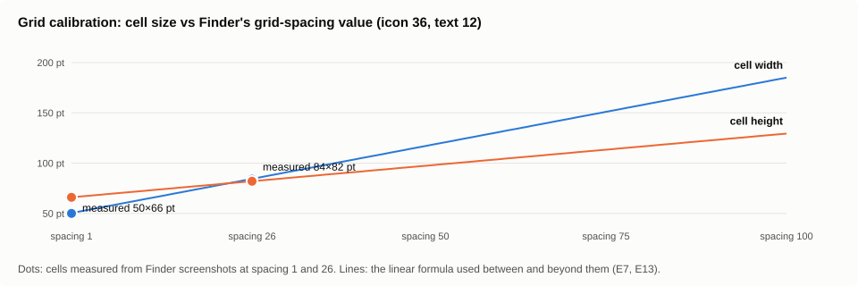
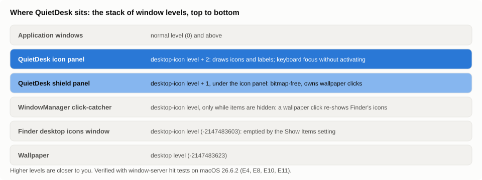

# QuietDesk feasibility assessment (milestone 1)

Date: 2026-09-17. Machine: macOS 26.6.2 (Tahoe, build 25G83), Finder 26.4, Apple Silicon, Command Line
Tools only (Swift 6.1, macOS 15.4 SDK, no Xcode). Two displays (built-in Retina 1728x1117 @2x with a
33 pt menu bar; external 1920x1080 @1x above it). Desktop: Sort By Date Added, Stacks grouped by Date
Added, icon size 36, text size 12, grid spacing 26, icon previews on, 148 items, iCloud Desktop sync on,
one mounted disk image shown as a desktop volume.

## 0. In plain words

The question was whether a Mac can be made to show desktop icons without their names until you
point at them. We checked every route that would keep Finder in charge of the icons, and each
one is closed: there is no setting or programming interface for hiding names, Finder refuses to
make the text smaller than 10 points, and Finder's plug-in mechanisms can only add badges and menu
items. The one route that works is to ask macOS to hide Finder's icons (a normal switch in System
Settings) and draw the icons ourselves in a transparent layer that sits just above the desktop and
below every app window. The rest of this document is the evidence: what we read, what we tried on
the real machine (each experiment was reversible and took seconds), what the layer must recreate,
what it costs, and what could go wrong. A gentler explanation of each idea is in
[CONCEPTS.md](CONCEPTS.md).

## 1. Conclusion in one paragraph

Native Finder cannot show desktop labels only on hover, and nothing supported can hide its labels while
keeping its icons. Every route that keeps Finder's own icons was checked and is closed: there is no
public API, no Finder Sync or other extension point can touch label rendering, Finder rejects a label
text size below 10, and covering labels with wallpaper patches would depend on pixel-exact wallpaper
reproduction that fails for dynamic wallpapers. The only mechanism that delivers the feature is a
custom desktop layer: hide Finder's items with the same user-facing setting System Settings uses
("Show Items > On Desktop"), and draw the icons ourselves in a transparent window one level above the
desktop-icon level. The prototype in this repository does exactly that. It reproduces this desktop's
sorted grid and Stacks column-for-column, shows labels on hover, selection and keyboard focus, restores
the native desktop on disable, quit and after a crash, and idles at zero CPU. The price is that, while
enabled, desktop interactions are provided by QuietDesk rather than Finder. Which interactions that
covers today, and what it does not, is listed in section 5. Whether to accept that tradeoff is the
decision this milestone was meant to inform.

## 2. Mechanisms evaluated

Categories: **API** = documented public API; **Setting** = user-facing macOS setting; **Undocumented** =
preference key or file format Apple does not document; **Surface** = drawing our own layer.

| Mechanism | Category | What it can do | Verdict | Evidence |
|---|---|---|---|---|
| Finder View Options for the desktop (icon size, grid spacing, text size, label position, item info, icon preview) | Setting; scriptable via Finder's dictionary | Text size 10–16 only. No option to hide names. | Cannot hide or hover-reveal labels. | Apple user guide [mchlp2209]; Finder.sdef `icon view options`; experiment E3: `set text size ... to 4` fails with error -10000, `to 10` and back to 12 applies live. |
| Finder scripting `desktop position` | API (scripting dictionary) | Reads/writes an item's position. | Positions are **stale** when the desktop is sorted ("Sort By: Date Added"); usable only for manually arranged desktops. | Finder.sdef line 147; experiment E2: reported positions (e.g. y = -811 for a folder visible in column 5 of the built-in display) do not match the screen. |
| `~/Desktop/.DS_Store` `Iloc` records | Undocumented | Stored icon centres. | Stale and incomplete on this desktop: 58 records for 148 items, values from old layouts. | Experiment E5 (read-only parse of a copy). |
| Finder Sync, File Provider decorations, Quick Actions, Services | API | Badges, menu items, toolbar buttons, sidebar icon. | No drawing, text, visibility or hover hooks; Apple says Finder Sync is not a general Finder-UI tool. | [FinderSync docs]. |
| Accessibility API on Finder | API, broad permission | Could read icon frames and selection. | Cannot change rendering; needs the Accessibility grant; not used. | Research topic "finder-extension-limits". |
| "Show Items > On Desktop" switch → `StandardHideDesktopIcons` in `com.apple.WindowManager` | Setting (documented); key is Undocumented (community) | Hides Finder's desktop items live. | **Used.** Applies within ~2 s without any Finder restart; WindowManager also adds a full-screen click-catcher window at the desktop-icon level while items are hidden. Restoring the key removes it. | Apple user guides [mchlp1119], [mchl534ba392]; key names from community [nix-darwin], [raycast]; experiments E1/E8. |
| `defaults write com.apple.finder CreateDesktop -bool false` + `killall Finder` | Undocumented | Removes Finder's desktop entirely. | Rejected: requires Finder relaunches, removes desktop drop target and menu, known revert problems. | Community [eclecticlight-2022]; research topic "hide-desktop-items". |
| Cover only the label areas with wallpaper-coloured patches (keep native icons) | Surface | Would hide labels and reveal native ones on hover. | Rejected: needs pixel-exact wallpaper reproduction; dynamic, solar and aerial wallpapers make that impossible without Screen Recording; DeskMat's author reports the same problem. | [deskmat-postmortem]. |
| Custom layer at `kCGDesktopIconWindowLevel + 1` drawing icons and labels, Finder items hidden by the setting above | Surface (documented window APIs) | Full control of labels; icons where Finder would put them. | **Prototype built and measured.** | Section 3–5, experiments E4/E6–E9. |

## 3. Experiments (all reversible; state captured before and restored after)

- **E1 — hide setting round trip.** Wrote `StandardHideDesktopIcons = true`, waited 2 s, deleted the key. Finder's two desktop windows (one per display, level -2147483603) stayed in the window list unchanged; Finder's PID did not change (no relaunch).
- **E2 — Finder scripting.** `{name, desktop position, class} of every item of desktop` returned 148 items in one round trip (one Apple event), plus view options (36, 12, bottom, "not arranged", preview on). Positions did not correspond to the visible sorted grid. Files inside Stacks are listed individually. A mounted disk image appears as class `disk`.
- **E3 — label text size.** Setting 4 → error -10000; setting 10 then 12 → accepted and applied live. Conclusion: the range is enforced and labels cannot be shrunk away.
- **E4 — window level, ordering, hit testing.** A transparent borderless window at the desktop-icon level orders above Finder's desktop window when shown later. `NSWindow.windowNumber(at:belowWindowWithWindowNumber:)` returns our window at an opaque point and Finder's desktop window at a fully transparent point. Tracking-area enter/exit fired on cursor warps even with `ignoresMouseEvents = true`.
- **E5 — .DS_Store.** Parsed a copy: 724 records, 58 `Iloc` entries, stale values (see table).
- **E6 — alpha threshold.** Two stacked windows of our own: a point with alpha 1/255 hits the upper window; a fully transparent point skips it. There is no threshold above zero. (An earlier attempt was invalidated by application windows covering the test points; the two-window design removes that dependency.)
- **E7 — layout reproduction.** The prototype's computed order and cell positions matched the user's screenshot column for column: volume, 8 date stacks (Previous 30 Days, June, May, April, February, January, 2025, Earlier), then 80 folders in Finder's order, 13 rows, 7 columns, last column ending at row 11. Cell pitch 84x82 pt, first icon centre at (1677, 60).
- **E8 — click-catcher window.** With the key set, a new full-screen `WindowManager` window appears at the desktop-icon level on the built-in display and takes hit tests. Moving the overlay to level +1 puts it above that window (hit tests then return QuietDesk at icon, label and gap points).
- **E9 — resource use.** Release build, real mode (native items hidden, overlay shown), no interaction: CPU time constant at 0.13 s across a 40 s run (0.0 % in every `ps` sample), resident size 83 MB stable (65–77 MB in shorter runs). During runs where the overlay was interacted with, CPU rose by ~0.3 s and resident size by up to 28 MB; the icon cache now pre-renders one small bitmap per icon to bound that. The overlay makes no timers, no polling, no disk reads after the initial scan except on a Desktop folder change, volume mount/unmount or display change.

- **E10 — NSPanel level trap.** Switching the overlay to a non-activating `NSPanel` (so keyboard focus works without activating the app) silently reset its level to normal because `isFloatingPanel` rewrites `level`; a 12 s run put the overlay above application windows. Fixed by setting `isFloatingPanel` first and guarding the `level` setter; hit tests now report level -2147483602.
- **E11 — three-state `ignoresMouseEvents`.** With the property left at its default, fully transparent pixels of a non-activating panel pass clicks through (two-window test: transparent point → window beneath). With it set explicitly to `false`, the same panel receives clicks everywhere in its frame, transparent pixels included (window-corner point → QuietDesk). This matches the behaviour Apple described in the AppKit 10.3 release notes. QuietDesk sets it to false on purpose and keeps the shield beneath as a second line of defence.

- **E13 — grid calibration, second point.** With Finder's grid-spacing slider at its minimum, Finder stores `gridSpacing = 1` and draws 50 x 66 pt cells for icon 36 / text 12 (measured from a screenshot); at 26 it draws 84 x 82. The formula is linear between them. Also found: reading another app's preferences returns a per-process cached copy unless `CFPreferencesAppSynchronize` is called first, which is why a freshly changed Finder setting was missed once.
- **E12 — resource use with the full feature set.** Release build, real mode, all modules in, after the review fixes, no interaction, 40 s: CPU time constant at 0.22 s (0.0 % in every sample), resident 75 MB. First-run thumbnail generation for the visible stack piles is a one-time cost (tens of ms per file, in QuickLook's own process).

Not measured: GPU work (no tools without Xcode), behaviour during Show Desktop, Mission Control, Stage Manager, full-screen apps, sleep/wake and display reconfiguration (see the checklist), and the .app bundle's own permission prompts (the experiments ran the bare executable, whose prompts are attributed to the parent process).

## 4. How the prototype works

1. Read Finder's desktop view options from `com.apple.finder` `DesktopViewSettings` (read only, undocumented keys) and the volume-visibility flags.
2. List the top level of `~/Desktop` (directory metadata only; never file contents) plus mounted volumes Finder would show. The process opts out of materializing cloud-only files (`setiopolicy_np`, per [TN3150]), so nothing it does can trigger a download.
3. Order entries the way Finder fills a sorted desktop (volumes, then Stacks newest bucket first, then folders/files by the sort key, ties by name) and lay them out from the top-right of the main display downward, then leftward, then on the next display. Cell size is calibrated to Finder (icon + spacing + 22 wide, icon + two label lines + 16 tall) and verified for this configuration only.
4. Per display, show a bitmap-free full-screen shield window (a single colour layer at alpha 1/255) and, above it, a window sized to the icon grid that draws icons and labels. Both are borderless, non-activating `NSPanel`s at `kCGDesktopIconWindowLevel + 1` with `canJoinAllSpaces`, `stationary`, `ignoresCycle`. Non-activating means the icon panel can take keyboard focus while Finder stays the active application, so a desktop click brings Finder's menu bar forward as it does natively (switchable in the menu).
5. Only then write the hide setting. On disable or quit, remove the windows, restore the setting to the captured value (or delete it if it was absent), and clear the durable restore record. If the record is still present at the next launch (crash or force-quit), restore first. If the setting was changed outside the app while running, leave it alone.
6. Hover uses per-item tracking areas (window-server enter/exit events, no polling). Redraws are limited to the cells that changed. Icon previews come from QuickLook's thumbnail generator, requested only for files verified to be fully local (SF_DATALESS flag and iCloud download status checked first, because the generator runs in another process that does not inherit our no-download policy). iCloud status glyphs come from the items' URL resource values (metadata only), re-read when FSEvents, an NSFilePresenter on the Desktop folder, or a Progress subscription reports a change; nothing polls. (Spotlight metadata queries were tried first and rejected: on this machine they carry no iCloud attributes for the user's Desktop and the recursive scope returned ~200k items.)
7. File actions (rename, duplicate, alias, compress via Archive Utility, copy, move, trash, new folder, tags) are ordinary Foundation operations registered with an undo manager. Get Info, New Finder Window and manual-layout icon positions go through Finder's public scripting dictionary via in-process Apple events, which needs the one-time Automation consent for Finder.

Permissions: **Files and Folders → Desktop** (first listing of `~/Desktop`; the .app carries `NSDesktopFolderUsageDescription`) and, only when Get Info, ⌘N or a manually arranged desktop is used, **Automation → Finder** (one prompt; denying disables just those). No Accessibility, no Screen Recording.

## 5. What the overlay takes over while enabled

Preserved as native: file contents, names, flags, positions, cloud sync state (nothing on disk is touched except by explicit user actions that Finder would perform the same way); Finder's desktop settings; wallpaper, widgets, Dock, Spaces; Finder windows, Finder's menus and Spotlight; opening items in their apps; "Show in Finder"; Finder's Info window; moving to Trash with Put Back.

Recreated by QuietDesk on its own layer: icon rendering with previews, cloud glyphs, tag dots and alias badges; sorted and manual layouts; Stacks with in-place expansion; hover/selection/focus labels; click, Cmd-click, Shift-click, rubber band, type-to-select, arrow keys; open, Open With, spring-loaded folders; rename; Quick Look; Duplicate, Make Alias, Compress, Copy/Paste/Move-here, New Folder, Trash, Eject, Show Original, Tags, Share; undo/redo; drag-out with a count badge; drops of files and file promises onto the desktop and folders; item and empty-desktop context menus; Sort By and Stacks controls; accessibility names.

Manual layouts: Finder's `desktop position` is read and written only while Finder's own desktop is set to Sort By None or Snap to Grid; on a sorted Finder desktop those values are stale (E2), so QuietDesk's "None" mode keeps app-local positions seeded from the current grid. Drags that happen while a Finder read is in flight are preserved (generation-tagged overrides), and one re-read follows each batch of writes.

Deliberately not offered: "click the wallpaper to reveal desktop" (any wallpaper click would make WindowManager re-show Finder's native icons under ours); Finder's own View Options panel for the desktop (QuietDesk's Sort By and Stacks menus replace it); Finder's menu-bar commands acting on QuietDesk's selection (they act on Finder's hidden desktop, which has no selection).

## 6. What could break, and what happens then

- Apple changes the meaning of `StandardHideDesktopIcons`: enabling would show both native icons and ours. Recovery: Disable, or flip "Show Items > On Desktop" in System Settings (a menu item opens that pane).
- Finder's grid formula differs from the calibration for other icon sizes or text sizes: icons would be offset from where Finder draws them when the utility is disabled. Cosmetic; the order stays correct.
- Transparent-window hit-testing regressions (reported for 26.3 RC and a 26.4 beta on the Apple forums [forum-814798]): clicks might not reach the overlay, or might pass through. The setting is still restored on quit.
- Crash or force-quit: the durable record restores the setting on next launch; manual recovery is a single `defaults delete`.

## 7. Status after milestone 2

The custom-layer option was chosen and the desktop feature set was implemented to parity (section 5). Remaining work is validation by hand (docs/VALIDATION-CHECKLIST.md), calibration of the grid for other View Options, and a decision on signing for distribution.

## 8. Sources

Apple documentation and guides (primary):
- [mchlp1119] Change Desktop & Dock settings, macOS Tahoe 26 — https://support.apple.com/guide/mac-help/mchlp1119/26/mac/26
- [mchl534ba392] Stage Manager / hidden desktop items text — https://support.apple.com/guide/mac-help/mchl534ba392/26/mac/26
- [mchlp2209] Desktop view options (icon size, grid spacing, text size, Sort By, Stacks) — https://support.apple.com/guide/mac-help/mchlp2209/mac
- [mh35846] Organise files on the desktop / Stacks — https://support.apple.com/guide/mac-help/mh35846/mac
- Finder scripting dictionary — /System/Library/CoreServices/Finder.app/Contents/Resources/Finder.sdef (`desktop position`, `icon view options`)
- [FinderSync docs] — https://developer.apple.com/documentation/findersync
- CGWindowLevelKey.desktopIconWindow — https://developer.apple.com/documentation/coregraphics/cgwindowlevelkey/desktopiconwindow
- NSWindow.windowNumber(at:belowWindowWithWindowNumber:) (hit-testing rule: skips transparent points and windows that ignore mouse events) — https://developer.apple.com/documentation/appkit/nswindow/windownumber(at:belowwindowwithwindownumber:)
- NSWindow.ignoresMouseEvents — https://developer.apple.com/documentation/appkit/nswindow/ignoresmouseevents ; historical semantics in the archived AppKit release notes — https://developer.apple.com/library/archive/releasenotes/AppKit/RN-AppKitOlderNotes/index.html
- NSWindow.CollectionBehavior .stationary / .transient / .canJoinAllSpaces — https://developer.apple.com/documentation/appkit/nswindow/collectionbehavior-swift.struct/stationary , .../transient , .../canjoinallspaces
- NSTrackingArea.Options.activeAlways — https://developer.apple.com/documentation/appkit/nstrackingarea/options-swift.struct/activealways
- NSWorkspace.icon(forFile:) — https://developer.apple.com/documentation/appkit/nsworkspace/icon(forfile:)
- URLResourceKey.addedToDirectoryDateKey — https://developer.apple.com/documentation/foundation/urlresourcekey/addedtodirectorydatekey
- DispatchSource.makeFileSystemObjectSource — https://developer.apple.com/documentation/dispatch/dispatchsource/makefilesystemobjectsource(filedescriptor:eventmask:queue:)
- FSEvents programming guide — https://developer.apple.com/library/archive/documentation/Darwin/Conceptual/FSEvents_ProgGuide/TechnologyOverview/TechnologyOverview.html
- [TN3150] Getting ready for data-less files — https://developer.apple.com/documentation/technotes/tn3150-getting-ready-for-data-less-files
- [TN3127] Inside code signing: requirements (TCC grants keyed on the designated requirement; ad-hoc signatures are unstable) — https://developer.apple.com/documentation/technotes/tn3127-inside-code-signing-requirements
- NSDesktopFolderUsageDescription — https://developer.apple.com/documentation/bundleresources/information-property-list/nsdesktopfolderusagedescription
- NSAppleEventsUsageDescription — https://developer.apple.com/documentation/bundleresources/information-property-list/nsappleeventsusagedescription
- WWDC19 701 (Files and Folders consent blocks the calling thread) — https://developer.apple.com/videos/play/wwdc2019/701/
- SMAppService.mainApp (launch at login without helpers) — https://developer.apple.com/documentation/servicemanagement/smappservice/mainapp
- Big Sur 11.0.1 universal-apps notes (linker ad-hoc signature covers only the executable) — https://developer.apple.com/documentation/macos-release-notes/macos-big-sur-11_0_1-universal-apps-release-notes
- Apple Developer Forums thread on transparent-window hit-testing regressions in 26.3/26.4 betas [forum-814798] — https://developer.apple.com/forums/thread/814798

Community sources (labelled as such):
- [nix-darwin] WindowManager defaults keys — https://mynixos.com/nix-darwin/options/system.defaults.WindowManager
- [raycast] Raycast extension issue on Tahoe and the hide-icons key — https://github.com/raycast/extensions/issues/8599
- [deskmat-postmortem] DeskMat post-mortem (wallpaper-cover approach and its problems) — https://blog.eternalstorms.at/2025/04/18/deskmat-the-post-mortem/
- [eclecticlight-2022] Howard Oakley on CreateDesktop and the Show Items setting — https://eclecticlight.co/2022/11/24/dealing-with-a-dysfunctional-desktop/
- Hammerspoon canvas notes on desktopIcon+1 for reliable clicks — https://github.com/Hammerspoon/hammerspoon/blob/master/extensions/canvas/libcanvas.m

Experimental findings in this document are my own measurements on the machine described above and are marked as experiments; documentation is cited where it exists. The background research was produced by eight research passes each checked by an independent verification pass; corrections from the verifiers were applied above.
