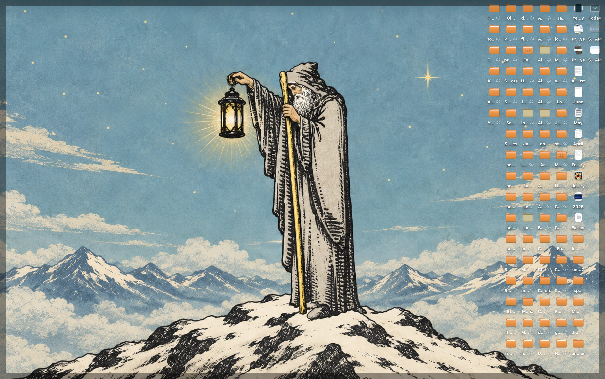
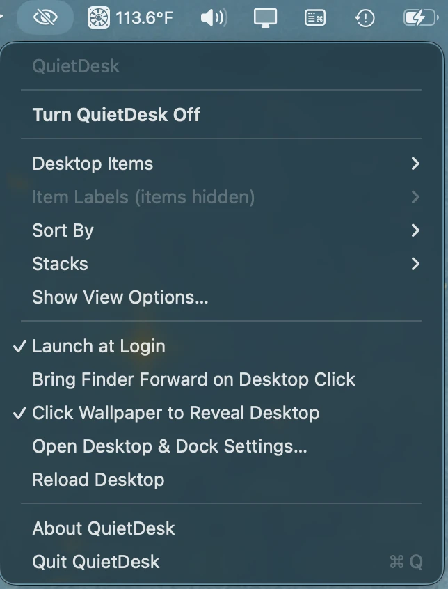
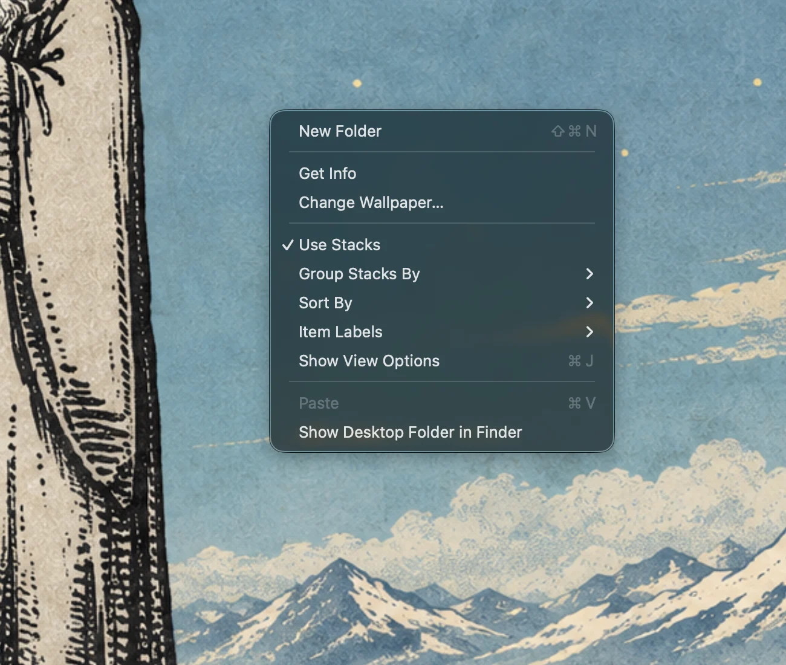

# QuietDesk screenshots

These are captures Alex supplied from his Mac. The PNG links lead to the original, unedited files;
the images shown on this page are lighter WebP previews. The wallpaper and desktop files provide
context for the demonstration and are not bundled with QuietDesk.

## From a clear surface to labels on hover

### Clear desktop

No desktop items are visible in this frame. The illustrated wallpaper makes the change in the next
two frames easy to see.

[Open the original PNG](assets/screenshots/original/clear-desktop.png)

### Items and labels visible

The same desktop, with its files and folders visible and their names shown beneath each icon.

[Open the original PNG](assets/screenshots/original/labels-visible.png)

### QuietDesk on

The items remain visible. Their labels are hidden until an item is pointed at; one name is showing
in this capture.

[Open the original PNG](assets/screenshots/original/labels-on-hover.png)

## Controls in context

### Menu bar

The QuietDesk menu contains the on/off switch, desktop-item and label choices, sorting and Stacks,
View Options, launch-at-login, Finder and wallpaper-click behavior, and a desktop reload action.
Item Labels is unavailable in this captured state because desktop items are hidden.

[Open the original PNG](assets/screenshots/original/menu-bar-controls.png)

### Desktop context menu

Right-clicking the wallpaper keeps familiar actions such as New Folder, Get Info, sorting, View
Options and opening the Desktop folder in Finder. The preview is cropped so the menu can be read;
the original PNG contains the entire desktop.

[Open the full original PNG](assets/screenshots/original/desktop-context-menu.png)

For behavior beyond these still images, see the [full feature inventory](../README.md#everything-the-desktop-still-does),
[known limitations](../README.md#known-limitations), and [hands-on validation checklist](VALIDATION-CHECKLIST.md).
