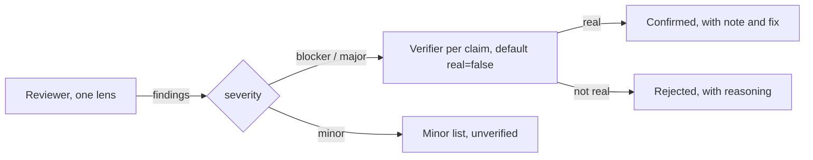

# Code review: adversarial lenses, verified by skeptics

**In plain words.** Once the app was feature-complete, six reviewers each looked for one kind of problem (file safety, clicks and focus, idle cost, restoring the desktop, layout maths, how the parts fit together). Every problem they raised went to a separate skeptic who was told to disbelieve it unless the code proved it. Fifteen real defects survived that filter, two of them serious, and all were fixed; one claim was rejected with a written reason. This page lists each finding, what could have gone wrong for a user, and how it was resolved. Ideas explained simply: [CONCEPTS.md](../CONCEPTS.md).

After the feature set was complete, the codebase went through two automated review workflows in the
same session. Each workflow gave one reviewer agent a single lens (a dimension of failure to hunt for),
then handed every non-minor claim to an independent verifier agent whose instructions were to default
to "not real" unless the failure could be shown from the code. Both roles were forbidden to run the
app live, change system preferences, touch `~/Desktop` or touch git; they could build, run the pure
`--self-test`, `--dump-layout` and `--render` flags, and write scratch programs. This page records
the design of that review, every confirmed finding with what the current code does about it, the one
claim the verifier rejected, and the minor findings with their status. Line numbers cited by the agents
refer to the code at review time; the resolution column names symbols in the code as it is now.

## Review design

| Element | Detail |
|---|---|
| Lenses | Six: file-operation safety and undo; event handling, focus and windows; idle behaviour, resources and leaks; restoration, crash safety and settings; layout and model correctness; integration of the thumbnail, Finder-automation and iCloud-status modules |
| Shared context | Product constraints restated verbatim to every agent: never modify user files except as an explicit action Finder would perform the same way; never trigger cloud downloads of dataless files; near-zero idle work; no subprocesses; only Desktop-folder and Finder-Automation permissions; restore the desktop setting on disable, quit and after crashes; bounded memory; public APIs, with any undocumented reliance flagged |
| Reviewer prompt | The shared context plus a per-lens hunt list (for example "undo that restores the wrong thing", "non-activating NSPanel becoming key vs Finder activation ordering", "comparator inconsistency (non-strict weak ordering crashes in sort)"). Output forced through a schema: file, line, severity (blocker / major / minor), summary, concrete failure scenario, suggested fix. "Report only real defects with a concrete failure scenario; skip style nits." |
| Verifier prompt | "You are a SKEPTICAL VERIFIER. A reviewer claims the following defect. Read the actual code and decide whether it is real, with a concrete reproduction argument; default to real=false if you cannot show the failure from the code. Do not fix anything." Output schema: real, severity (may differ from the reviewer's), note, fix |
| What was verified | Every blocker and major claim (up to 12 per lens), one verifier per claim, in parallel. Minor claims were passed through unverified and are marked as such below |
| Not allowed | Live runs (`--test-seconds` without `--no-hide`, opening the .app), changing preferences, modifying `~/Desktop`, git |
| Model | All 22 agents ran on the same model (`claude-fable-5-1`) |

### Numbers

| Run | Agents | Tokens | Wall clock | Tool calls | Raised | Verified | Confirmed | Rejected | Minor |
|---|---|---|---|---|---|---|---|---|---|
| Core (five lenses) | 18 | 2.13 M | 30 min | 297 | 41 | 13 | 12 | 1 | 28 |
| Module integration | 4 | 0.60 M | 14 min | 104 | 8 | 3 | 3 | 0 | 5 |

| Lens | Raised | Verified | Confirmed | Rejected | Minor |
|---|---|---|---|---|---|
| file-safety | 8 | 4 | 4 | 0 | 4 |
| events-focus | 8 | 2 | 2 | 0 | 6 |
| idle-resources | 9 | 1 | 0 | 1 | 8 |
| restore-safety | 8 | 2 | 2 | 0 | 6 |
| layout-model | 8 | 4 | 4 | 0 | 4 |
| modules-integration | 8 | 3 | 3 | 0 | 5 |

Reviewers took 8 to 21 minutes each; verifiers 2 to 9 minutes each. Verifiers wrote scratch programs
where the code alone was not conclusive: a `didSet` reproduction, a run-loop undo test, a re-entrancy
harness, a copy-into-self test, a standalone non-activating panel, and an Objective-C runtime probe.

## Confirmed findings

Severity is shown as reviewer → verifier where they differed. The resolution column was checked
against the current sources under `Sources/QuietDesk/`.

| # | Lens | Severity | File | What could go wrong | Resolution in current code |
|---|---|---|---|---|---|
| 1 | file-safety | blocker | FileOperations.swift | Copying a folder into itself or a descendant (⌘V of `~/Desktop` onto the desktop, or ⌥-drag of a folder onto its own icon) recursed 455 levels deep in the reviewer's scratch test (453 in the verifier's independent reproduction), could fill an iCloud-synced disk, and the error was swallowed with no undo. | Fixed: `isSameOrDescendant` guard in `copy` and `move` skips such sources and beeps; three `--self-test` checks cover it. |
| 2 | file-safety | major | FileOperations.swift | `copyItem` errors were swallowed with `try?`, leaving a partial "Folder copy" that looks complete, is not undoable and gives no feedback; guaranteed with cloud-evicted files under the process's no-download policy. | Fixed: `copyItemCleanly` removes the partial destination on failure and beeps; failed items never enter the undo list. No alert names the failed items. |
| 3 | file-safety | major | FileOperations.swift | Undo for Duplicate, Copy and Move was registered only after the background work finished, so ⌘Z during a long copy undid the previous action, and a redo chain crossing a Move cleared the redo stack (reproduced in a run-loop test). | Fixed: `perform` registers the undo synchronously with a `Deferred` box the background work fills in; Move undo and redo reuse `moveItems`, so registration happens inside the undo/redo context. |
| 4 | file-safety | major | FileOperations.swift | Undo of a cross-volume move ran `moveItem` on the main thread inside the key handler, freezing the overlay, menus and quit for the whole copy-back. | Fixed: the Move undo closure calls `moveItems`, which runs on the background queue. |
| 5 | events-focus | major | OverlayController.swift | With "Bring Finder Forward on Desktop Click" on (the default), the first desktop click after using another app lost keyboard focus to Finder, so arrows, Return, Space, ⌘A and ⌘⌫ did nothing until a second click. | Fixed: `surfaceDidReceiveClick` installs a one-shot `didResignKey` observer (cleared after 0.6 s) that calls `makeKey()` again, the approach the verifier's experiments showed to stick. |
| 6 | events-focus | major → minor | DesktopView.swift | A failed rename showed two stacked alerts: the alert made the panel resign key, and the resign observer re-entered `commitRename` with the same bad name. | Fixed: `committingRename` re-entrancy flag around the alert. |
| 7 | restore-safety | major | AppDelegate.swift | If Desktop folder access was denied, `enable()` still wrote the hide key and drew an empty desktop with no message, repeating on every launch. | Fixed: `DesktopModel.listingFailed` distinguishes "empty" from "failed"; `enable()` stops the controller, resets `enabled`, shows an alert pointing at Privacy & Security, and never writes the hide key. |
| 8 | restore-safety | major | OverlayController.swift | "Desktop Items › Hidden" ordered out the shield windows too, so one wallpaper click reached macOS's click-catcher and re-showed Finder's native icons and labels. | Fixed: `hide()` orders out only the icon windows and keeps the shields front; `rebuildWindows` honours the same state. There is no separate inert mode: the shield still owns clicks, menus and drops while hidden. |
| 9 | layout-model | blocker | DesktopView.swift | `cells.didSet` applied the old selection indices to the new array: a relayout with fewer cells trapped (overlay dies with the native desktop still hidden), otherwise the highlight silently moved to whatever item now sat at that index, so the next ⌘⌫ could trash a file the user never chose. | Fixed: `willSet` captures the old selection's URLs (`keptSelection`) and `didSet` re-selects by URL. `focusIndex` is still dropped on relayout rather than mapped through its URL. |
| 10 | layout-model | major | Layout.swift | `Layout.compute` stopped once every display's cells were used, so on a full desktop the remaining items were not drawn, selectable or reachable (harness: 556 entries on 546 cells, 10 dropped; a 13-inch display at Finder defaults holds about 70). | Fixed: an overflow pass wraps onto the main display with a growing 14 pt offset; `--self-test` asserts that capacity + 25 entries are all placed and on screen. |
| 11 | layout-model | major | Layout.swift | `slot(for:)` floored the row but rounded the column, so a drop 1 pt above a row centre snapped a full row up while 60 pt below stayed put. | Fixed: both axes use `.rounded()`; `--self-test` checks that a 3 pt nudge lands in the same slot. |
| 12 | layout-model | major | Layout.swift | A Finder position outside every display fell back to screen 0 unclamped, creating invisible cells that ⌘A and arrow keys could still act on; the verifier also found a `CGRect.null` window frame that throws at enable. | Fixed in part: a position outside every display is now treated as unplaced and takes a free slot (`--self-test` covers it). A point inside a display but under the menu bar is still used as-is, and `windowRegion` has no null-rect guard. |
| 13 | modules-integration | major | OverlayController.swift | A Finder-positions read finishing after a drop overwrote the just-dragged position wholesale, snapping the icon back until the next Desktop change. | Fixed: `positionsGeneration` and `localOverrides` merge drags made during an in-flight read; one follow-up read is issued after the last pending write. |
| 14 | modules-integration | major | OverlayController.swift | Choosing Sort By › None while Finder's own desktop was sorted read 148 stale positions (several old grids, two items at the same partly off-screen slot) and then wrote positions into a desktop Finder was still sorting. | Fixed: `finderSyncsPositions` gates reads and writes on Finder's own `arrangeBy`; otherwise positions are seeded from the current grid and kept in QuietDesk's preferences (`localPositions`). Documented in the README's known limitations. |
| 15 | modules-integration | major | ThumbnailCache.swift | A "no thumbnail" verdict for a cloud-only file was never cleared when the download finished, so the generic icon stayed for the rest of the session. | Fixed: `OverlayController.cloudStatusChanged` diffs per-item status and calls `ThumbnailCache.invalidate` for items that became `.current`. |

### Where the verifier changed or narrowed a confirmed claim

| # | Reviewer said | Verifier found |
|---|---|---|
| 5 | Key focus is lost "~100 ms later"; fix by re-asserting key after `NSWorkspace.didActivateApplicationNotification`. | The resign arrives about 1 ms after `activate()`. The reviewer's proposed fix does not work: the notification was delivered before the window server's resign reached the panel, and `makeKey()` on a still-key window is a no-op. Re-asserting from the resign notification does stick. Side observation, not fully verified: `orderFrontRegardless()` at enable may itself take focus from the user's app. |
| 6 | Major. | Minor: deterministic and user-visible, but bounded to exactly two alerts, no data touched, fully recoverable. |
| 7 | The overlay never recovers even if access is granted later. | Partial mitigation the claim overlooked: Reload Desktop, sort changes and mount events rerun the scan, so recovery without relaunch was possible; nothing told the user to try. |
| 8 | Wallpaper drops go to WindowManager instead of `~/Desktop`. | Where drops land in Hidden mode could not be shown from the code; that part was left unverified. |
| 12 | Off-screen cells are invisible but actionable. | Confirmed, and an additional crash was found while verifying: a screen whose every cell is off-screen makes `windowRegion` return `CGRect.null`, which `NSPanel(frame:)` rejects. |
| 13 | `positionsRequested` prevents a re-read after the write. | Imprecise: the flag is reset on completion. The real gap was that no re-read was ever issued after a write. |
| 14 | Reproduce by choosing the menu entry. | Not reproduced live, because that sends Apple events to Finder and could raise a consent prompt; verified from the code chain plus `defaults read` of Finder's desktop view settings. |

## The rejected claim

The idle-resources reviewer claimed that `QLPreviewPanel` keeps non-zeroing (`assign`) `dataSource`
and `delegate` pointers to the `DesktopView`, so `stop()` and `rebuildWindows()` would free the view
and leave an open Quick Look panel with dangling pointers.

The verifier's note, condensed: the SDK header does declare both properties as `assign`, but the
QuickLookUI implementation retains them. This was checked two ways on macOS 26.6.2: (1) the
Objective-C runtime metadata of the panel's private reserved object marks `dataSource`,
`currentController` and `linkedWindow` as `__strong` in its ivar layout; (2) a non-GUI probe against
the real shared panel using only the public setters showed that after `panel.dataSource = obj` and
dropping every other reference, a weak reference to `obj` stays non-nil and it deinits only when
`dataSource` is set back to nil. Through the controller path the view stays alive until the panel
calls `endPreviewPanelControl`, which nils the pointers before the release. Conclusion: no
`EXC_BAD_ACCESS` is reachable from the code. Residual, not the claimed defect: after `stop()` the
panel stays open controlled by a detached view (stale item list, close animation to the wrong spot),
bounded and transient. Caveat recorded by the verifier: this is an implementation detail contrary to
the header contract, verified only on the project's sole tested OS version
([QLPreviewPanel](https://developer.apple.com/documentation/quartz/qlpreviewpanel)).

The current code still clears the pointers in `DesktopView.deinit` when it is the panel's data
source, which costs nothing and removes the dependence on the implementation detail.

## Minor findings

Minor claims were not verified by a second agent. Status was checked against the current code and
the README. Several were raised independently under more than one lens; duplicates are marked.

| Lens | Finding | Status |
|---|---|---|
| file-safety | `rename` accepts names Finder rejects: a leading "." hides the item; ":" is stored verbatim and shown as "/". | Partly fixed: a leading "." now throws `leadingDot`; ":" is still stored as typed. |
| file-safety | The 0.7 s slow-click rename timer captures a cell index that a relayout can reassign to another file. | Fixed: `cells.didSet` and `keyDown` cancel `pendingRenameClick`. |
| file-safety | `commitRename` re-entered from the resign-key observer. | Fixed (confirmed #6). |
| file-safety | Keyboard shortcuts skip the volume guards the context menu applies (⌘⌫, ⌘D, ⌘L on a mounted volume). | Fixed: `selectedFileURLs` filters volumes for ⌘⌫, ⌘D and ⌘L. |
| events-focus | Any Desktop change while a name is being edited discards the typed name. | Accepted and documented: README "Known limitations". |
| events-focus | `pendingRenameClick` not cancelled by `keyDown` or a cells change. | Fixed (duplicate). |
| events-focus | `menu(for:)` neither commits nor cancels an in-progress rename, leaving an orphaned field that blocks later renames. | Fixed: `menu(for:)` commits the rename first. |
| events-focus | Rubber-band anchor stays set when a context menu swallows the mouse-up; the next icon drag draws a band instead. | Partly fixed: `DesktopView` resets `bandStart` in `mouseDown` and `menu(for:)`; `ShieldView.menu(for:)` still leaves `downPoint` and the band layer. |
| events-focus | A relayout mid-drag leaves the spring-loading timer running, opening a folder the cursor has left. | Fixed: `cells.didSet` calls `setDropTarget(nil)`, which invalidates the timer. |
| events-focus | ⌘⌫, ⌘D, ⌘L on volumes. | Fixed (duplicate). |
| idle-resources | `draw(_:)` measured the expanded label rect for every cell on every partial redraw (1.88 ms per pass for 148 names). | Fixed: a cheap `reach(of:)` bound replaces the text measurement in the dirty-rect test. |
| idle-resources | `pendingRenameClick` index capture. | Fixed (duplicate). |
| idle-resources | `springTimer` used `Timer.scheduledTimer` (default mode only), so it never fired during the overlay's own drags. | Fixed: `RunLoop.main.add(timer, forMode: .common)`. |
| idle-resources | `draggingUpdated` did a pasteboard XPC round trip on every mouse move. | Fixed: the file-promise check runs once in `draggingEntered` (`dragCarriesPromise`); `wantsPeriodicDraggingUpdates` is not overridden. |
| idle-resources | `invalidate(url:)` ignored stack piles, so pile thumbnails never redrew on arrival. | Fixed: `invalidate(url:)` also matches the top three items of a stack. |
| idle-resources | `ThumbnailCache.invalidate` and `IconCache.invalidate` were never called; a file replaced by an atomic save kept its old preview. | Fixed: `invalidateChangedItems` compares modification dates on each reload. |
| idle-resources | `IconCache` flushes the whole dictionary at 600 entries, defeating the cache on large desktops. | Open: `cache.removeAll()` at the limit is unchanged. |
| idle-resources | `CloudStatusMonitor` was a no-op stub while the docs described a working monitor. | Fixed: a real `CloudStatusMonitor.swift` (FSEvents, file presenters, `Progress`); the stub file is gone. |
| restore-safety | The bare executable and the .app used different `UserDefaults` domains, so a crash record from one was invisible to the other (a leftover plist on disk showed it had happened). | Fixed: `Settings.defaults = UserDefaults(suiteName: "dev.quietdesk.QuietDesk")` for both. |
| restore-safety | The restore record was not flushed before the hide key was written; a power loss in between leaves the desktop hidden with no record. | Fixed: `RestoreRecord.save` calls `synchronize()` before the system key changes. |
| restore-safety | No SIGTERM handling: `kill`, `killall` and logout skipped `applicationWillTerminate`. | Fixed: `installSignalHandler` turns SIGTERM into `NSApp.terminate`. |
| restore-safety | Launch at Login silently did nothing when `SMAppService` reported `.requiresApproval`. | Fixed: `toggleLaunchAtLogin` checks `requiresApproval`, explains, and opens Login Items ([SMAppService](https://developer.apple.com/documentation/servicemanagement/smappservice)). |
| restore-safety | The status menu was a static snapshot; Launch at Login and "Finder's Setting" titles drifted. | Fixed: `menuNeedsUpdate` rebuilds the menu each time it opens. |
| restore-safety | "Bring Finder Forward" most likely loses keyboard focus (flagged unverified by the reviewer). | Fixed (confirmed #5). |
| layout-model | "Date Last Opened" uses the file's access time, not Launch Services' last-used date. | Accepted and documented: README "Approximations". |
| layout-model | The "Screenshots" kind is detected by the English name prefix, not `kMDItemIsScreenCapture`. | Accepted and documented: README "Approximations". |
| layout-model | Sort By Kind compared coarse categories rather than Finder's Kind string. | Fixed: the comparator uses `item.kind` (folders as "Folder"). |
| layout-model | The self-test could not catch the layout defects above. | Mostly fixed: checks added for overflow, snap rounding, off-screen positions and the descendant guard; the rows check still compares against `frame.height` rather than `visibleFrame`. |
| modules-integration | ⌘N swallowed every FinderAutomation error. | Fixed: shows "New Finder Window needs Finder" through `DesktopMenus.showError`. |
| modules-integration | Denied Automation on a manual desktop: silent grid fallback, every Desktop change re-sent a failing Apple event, writes failed silently, and the existing `status()` preflight was never called. | Partly fixed: a `.notPermitted` read sets `positionsUnavailable`, stops further reads and shows one alert; `FinderAutomation.status()` is still unused and write failures are only logged. |
| modules-integration | Every `Progress` KVO tick caused a full redraw and re-read eligibility for every file. | Fixed: `cloudStatusChanged` diffs statuses per item and invalidates only the changed cells. |
| modules-integration | Quick Look on an evicted file downloads it, because the QuickLook service does not carry the process's I/O policy ([TN3150](https://developer.apple.com/documentation/technotes/tn3150-working-with-dataless-files)). | Accepted and documented: README "Quick Look and Open on a cloud-only (evicted) file download it, exactly as in Finder". |
| modules-integration | The `x-apple.systempreferences:` scheme is undocumented and had no comment or fallback. | Fixed: `UNDOCUMENTED` comment on `openSystemSettings` and a fallback that opens System Settings itself. |

Tally of the 33 minors: 24 fixed (including 5 duplicates of other rows), 4 accepted and documented,
3 partly fixed, 1 mostly fixed, 1 open.

## What the review caught that testing would have missed

- **A latent crash with the native desktop hidden.** The `cells.didSet` trap (#9) fires only when a
  relayout shrinks the cell count while the highest selected index is gone, for example ⌘A then ⌘⌫.
  The author's desktop, the self-test (30 entries, no live selection) and every manual run had missed
  it; the verifier reproduced the `Index out of range` trap in an optimised scratch build.
- **A destructive file-system path.** Copying `~/Desktop` into itself (#1) could only have been
  discovered by doing it, on a cloud-synced Desktop. The reviewer, and then the
  verifier independently, reproduced `copyItem` recursing 455 and 453 levels deep on throwaway
  directories instead.
- **Timing bugs across the async boundary.** Undo registered after completion (#3) and the
  ~1 ms focus loss after Finder activation (#5) need specific timing to observe; manual testing would
  have shown "sometimes ⌘Z does the wrong thing" and "sometimes keys go nowhere" without the cause.
  Both verifiers built minimal harnesses, and one showed that the reviewer's own proposed fix would
  not have worked.
- **Gaps invisible on the calibration machine.** Overflow dropping (#10) never triggers with 89
  entries in 260 cells; stale Finder positions (#14) only appear when a sorted desktop is switched to
  manual; the split preferences domain was found from a leftover plist that a bare-binary test run had
  written. Each is a real-world configuration the single development machine does not exercise.
- **A plausible claim that was wrong.** The dangling-pointer claim matched the SDK header and would
  have prompted a defensive rewrite; checking the runtime instead showed the object is retained.
  The default-false verifier is what kept a non-bug out of the fix list.

Related: [FEASIBILITY.md](../FEASIBILITY.md) for the mechanism and experiments the reviewers were
told to read first, and [VALIDATION-CHECKLIST.md](../VALIDATION-CHECKLIST.md) for the manual checks
that remain.
