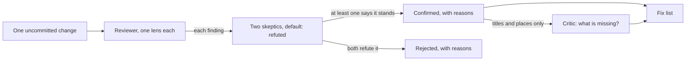

# Feature reviews: one change, attacked before it is committed

**In plain words.** Two new features, the compact grid and "reveal desktop", were each put in front of a small team of AI helpers before they were saved into the project. A few reviewers each hunted for one kind of mistake. Every mistake they reported went to two skeptics whose job was to prove the reviewer wrong. At the end one more helper, the critic, read the list and asked what everybody had missed. The two reviews turned up 26 distinct problems that the automated tests had not caught, five of them rated major. Almost all were fixed in the same commit as the feature, and the few that are still open are marked below. Ideas explained simply: [CONCEPTS.md](../CONCEPTS.md).

**If you are five.** You build a sandcastle. Before you say "done", three friends each poke one part: the walls, the moat, the flag. When a friend shouts "broken!", two other friends go and look. They only believe it if they can see the hole themselves. Then one last friend walks round the back and asks what nobody looked at. You fix the holes, and only then do you take the photo.

An adversarial review of one change is a code review aimed at a single diff, not at the whole
codebase. Every agent is told what the change does, which facts were measured and may be treated as
true, and which promises the product must keep. Then the reviewers are asked to break it. It was
worth doing here for three reasons. Both changes touched assumptions that had been safe since the
first version: where a name is drawn, and whether the app does any work at rest. The automated
checks had flagged none of what follows. And a single diff is a small target, so each review
finished in under half an hour. This page records the design of the two reviews, every distinct problem with what the
current code does about it, what the skeptics threw out or corrected, and what each review taught.
Line numbers cited by the agents refer to the code at review time. The "how it was fixed" columns
were checked against the current sources under `Sources/QuietDesk/` and the current docs. The
resolutions are also summarised in [CHANGELOG.md](../../CHANGELOG.md) under "Unreleased" and in the
two commit messages.

## Review design

Both reviews use the same three-step shape. The workflow scripts are in the repository:
[6-review-compact-grid.js](../workflows/6-review-compact-grid.js) and
[7-review-reveal-desktop.js](../workflows/7-review-reveal-desktop.js).

| Element | Detail |
|---|---|
| Target | One uncommitted change, read with `git diff` in `<repo>`. Not the whole codebase. |
| Shared context | Sent word for word to every agent: what the change does, step by step, and the product rules it must not break. Examples of those rules: icons are clickable exactly where they are drawn; no timers at idle; never leave the person with no icons, or with doubled icons, for long; the private entry point must fail safe. The reveal-desktop review also listed the measured facts from experiment E14, with the instruction to treat them as true. |
| Lenses | One reviewer per lens. A lens is a list of named suspects, not a vague area. Compact grid: geometry and hit-testing; layout modes and state; animation, timers and redraw; tests and consistency. Reveal desktop: state machine, timers and races; detection robustness and system semantics; click semantics, cost and claims. |
| Skeptics | Two per finding. They work independently and in parallel, and each finding goes to its skeptics as soon as its reviewer is done. |
| Confirmation rule | A finding is confirmed when at least one skeptic says it stands and at least half of the skeptics who answered say so. With two skeptics, a finding is rejected only when both refute it. |
| Critic | One per review, run last. It sees the list of lenses and, for each confirmed finding, only its title and its place in the code (file and line). It may add at most three items. Critic items do not go to skeptics. |
| Not allowed | Changing files, running the app or any QuietDesk binary, and, for reveal desktop, anything that triggers Show Desktop. Building the package was allowed. |
| Model | All 73 agents ran on the same model (`claude-fable-5-1`). |

The three roles, as cards:

| | Reviewer | Skeptic | Critic |
|---|---|---|---|
| How many | One per lens | Two per finding | One per review |
| Is given | The shared context and the hunt list of its lens | The shared context and one finding, as structured data | The shared context, the lens names, and the title, file and line of each confirmed finding |
| Is told | "Report only defects you can point to at a file:line, with a concrete failure scenario." An empty list is a valid answer. | "Try hard to REFUTE it by reading the actual code. Default to refuted=true if you cannot confirm the exact failure scenario from the code." | "What is MISSING? Name at most 3 concrete, verifiable defects or gaps nobody covered." An empty list is a valid answer. |
| Must return | A list of findings: file, line, title, description, failure scenario, severity (blocker, major, minor or nit) | refuted (true or false), the reason, and a one-line fix hint if the claim stands | Findings in the same format as a reviewer |
| Cap | Compact grid: the first six findings go to skeptics. Reveal desktop: at most five. | None | Three |

### Numbers

All figures are counted from the two workflow result files.

| Review | Lenses | Agents | Reviewers | Skeptics | Critic | Tokens | Tool calls | Wall clock |
|---|---|---|---|---|---|---|---|---|
| Compact grid | 4 | 47 | 4 | 42 | 1 | 4.04 M | 499 | 22 min |
| Reveal desktop | 3 | 26 | 3 | 22 | 1 | 2.20 M | 343 | 29 min |

| Review | Raised | Confirmed | Rejected | Added by the critic | Distinct problems |
|---|---|---|---|---|---|
| Compact grid | 21 | 21 | 0 | 3 | 15 |
| Reveal desktop | 11 | 9 | 2 | 3 | 11 |

| Review | Lens | Raised | Confirmed | Rejected |
|---|---|---|---|---|
| Compact grid | geometry | 6 | 6 | 0 |
| Compact grid | layout-modes | 4 | 4 | 0 |
| Compact grid | animation | 5 | 5 | 0 |
| Compact grid | tests-docs | 6 | 6 | 0 |
| Reveal desktop | state-machine | 4 | 4 | 0 |
| Reveal desktop | detection | 3 | 2 | 1 |
| Reveal desktop | interaction-cost | 4 | 3 | 1 |

Compact grid: reviewers took 8 to 10 minutes each, skeptics 1 to 6 minutes, the critic 6 minutes.
Reveal desktop: reviewers took 11 to 14 minutes each, skeptics 1 to 5 minutes, the critic 11
minutes. Skeptics did more than read. Several wrote small standalone scripts to measure the real
system font and recompute rectangles, to confirm that a rectangle of zero height contains no point,
or to check how a window's owner name is reported for an app launched in another language.

## Review 1: the compact grid

**The change.** The compact grid packs desktop icons as if names did not exist: no room is kept
under an icon, and a name fades in over the row below when its item is pointed at, selected or
focused. The same change added a third measured point to the grid calibration, so QuietDesk's cells
match Finder's at the tightest spacing too.

**The shape.** Four lenses, 21 findings, two skeptics for each finding (42), one critic: 47 agents.

### Problems found

The 21 confirmed findings describe 13 distinct problems, because the lenses overlap on purpose. The
critic added three items. One of them is the rename half of problem 2 and is folded in there, so
the table has 15 rows. Where two lenses gave the same problem different severities, both are shown.

| # | Problem, in plain words | Reported by | Severity | How it was fixed |
|---|---|---|---|---|
| 1 | The name of a selected or keyboard-focused item was painted right after its own icon. The icon in the row below was painted later, on top of it. A short name such as "Report.pdf" lost its bottom edge. A long name lost whole lines. This was permanent, not a flicker. | All four lenses (4 findings) | major | Names shown as pills are collected during the icon pass and drawn in a second pass, above every icon (`draw(_:)` in `DesktopView+Drawing.swift`). |
| 2 | The name you could see was not something you could click. On the compact grid the name's hit box had zero height, so a click on the name did nothing or selected the item below, a slow second click never started a rename, and the pointer moving onto a hovered name made it vanish. | geometry, tests-docs, and the critic for the rename half | major | `cellIndex(at:)` tests the visible pills first (`pillShown`, `expandedLabelRect`). The rename gesture uses `nameRect`, which is the pill when a pill is showing. On the compact grid each tracking area is the whole cell, so areas never overlap. |
| 3 | The name rises 3 pt while it fades in, but only its resting box was marked for redraw. For a few frames its rounded bottom was cut flat, and a thin sliver could be left behind on the bottom row. | geometry, animation | minor | `invalidate(_:)` also marks the box shifted by 3 pt. |
| 4 | The icon window kept room for five lines of name under the last row. A compact-grid name can be six lines tall and starts higher up, so a very long name in the bottom row was cut off at the window edge. | geometry, layout-modes | minor | `Layout.windowRegion` keeps room for the tallest pill the current grid can show. |
| 5 | On Finder's grid at the tightest spacing, the invisible name box of one item reached 7 pt over the icon below. A click on the top of that icon selected the item above. The overlap was older than this change; the new calibration widened it. | geometry | minor | Names are drawn at Finder's line pitch and show one line where only one fits, as Finder does. In `cellIndex(at:)` an icon now wins over the name box of the item above. |
| 6 | A wide name that is pushed sideways at a screen edge reached further than the redraw bound assumed. A neighbour's redraw could then erase part of a selected name. Older than this change, touched by it. | geometry (nit), animation (minor) | minor | `reach(of:)` extends 1.4 cell widths to each side, which covers the widest pill at its largest shift. |
| 7 | The View Options panel ignored manually arranged desktops, where the compact grid never applies. There the "Compact grid" box was live but did nothing, and "Names on hover" was greyed out although it worked. | layout-modes, tests-docs | minor | The panel uses the same three conditions as the controller (`compactApplies`). On a manual desktop the box is disabled and its tooltip says manual desktops always keep Finder's grid. |
| 8 | "Use Finder's Settings" quietly switched the compact grid back on, because Finder has no such setting and the default was on. | layout-modes | nit | QuietDesk's own options (compact grid, names on hover, iCloud status) are stored apart from the Finder-derived ones, so the button leaves them alone. |
| 9 | With names always visible, or on a keyboard-focused item, pointing at an item made its name blink out and fade back in. | animation | minor | `setHover` animates only a name that was not on screen yet (`materialises`). A visible name swaps at once, as before. |
| 10 | A relayout in the middle of a fade cleared the hover but left the 60 Hz fade timer running for the rest of its 120 ms. Harmless, but against the rule that the timer never outlives the hover. The timer also ran in Hidden mode, where nothing can fade in. | animation | nit | `cells.didSet` calls `settleHover()`, which stops the timer. No fade starts in Hidden mode, during a rename, or when neighbours are revealed. |
| 11 | The changelog said "Names on hover: neighbours" makes QuietDesk use Finder's grid. The code does the opposite: the compact grid wins and the neighbour reveal is off. | tests-docs | minor | Changelog reworded: turning the compact grid off keeps Finder's grid, which is what neighbours and item info need. |
| 12 | The four new scenario rounds only repeated the usual clicks. They never checked that the grid had changed, so they would pass even if the switch did nothing. | tests-docs | minor | `expectGrid(compact:)` runs after each of those rounds and checks the live view: the compact flag, the cell height and whether name boxes are empty or present. |
| 13 | The alignment check (`--no-hide`) and the README's "icons stay where they are" no longer held with the compact grid on by default. A tester would see doubled, offset icons and blame the calibration. | tests-docs | minor | `--no-hide` always uses Finder's grid (`forceFinderGrid`). The README's opening line, its flags table and the checklist say so. |
| 14 | "Show item info" and "Label position: Right" did nothing while the compact grid applied, yet stayed enabled with no explanation. | critic | minor | Both are disabled while the compact grid applies, together with "Names on hover". The tooltips for names on hover and item info say why. |
| 15 | No automated check said "a name box stays inside its cell", so problem 5 passed `swift test` and `--self-test`. | critic | minor | `testLabelBoxFitsItsCell` and a matching `--self-test` check assert it at the calibration points. |

### What the skeptics rejected

Nothing. All 42 skeptic votes said the claim stands. What the skeptics did change was the detail.
In six problems they corrected the reviewer while keeping the finding:

| # | Reviewer said | Skeptics found |
|---|---|---|
| 1 | Gave pixel figures for how much of a long name is hidden. | The measured figures differ a little. The defect does not depend on them. |
| 2 | A click on a hovered name lands on the item below. | Overstated for the hover-only case: the hovered name vanishes before the pointer can reach it, so the wrong hit happens, but not on a visible name. For a selected name the claim holds as written. |
| 3 | A label-mode change or an iCloud status change in the middle of the fade leaves a sliver. "The pill always extends below the cell." | Both doubted the label-mode trigger. They split on the iCloud one: one skeptic found nothing in the code that calls it, the other accepted it. A thumbnail arriving, or a selection change on the cell below, can do it. At wide spacing a short name stays inside its cell, so "always" is too strong. |
| 4 | The clipping also grows at the largest icon size. | The skeptics split on this aside. One called it wrong, because the wider cell keeps the name to two lines there. The other accepted it. Both: the core claim stands, and it grows with text size. |
| 6 | Redrawing the cell one column over erases part of the name. The example was a long screenshot name. | That cell does repaint the name. The cell two columns over is the one that erases it. The example name wraps at its spaces and does not show the problem; a long name with no spaces does. |
| 10 | The fade value is left half-way. | It is not. The orphaned timer runs to its end and sets the value to 1. The needless ticks are real. |

### What this review taught

One design decision, "give the name no room and draw it over the row below", broke three habits
that had been safe for the whole life of the project: draw each name right after its icon, test
clicks against the name's reserved box, and redraw only a fixed area around a cell. All four
reviewers ran into the first one, which is a good sign that it was real and that it mattered. Only
two lenses saw that the visible name could not be clicked. Only the critic saw that two panel
options had quietly become no-ops, and that no test pinned the rule the whole grid depends on. None
of this showed up in the automated runs, and the skeptics said why: the test hook that simulates a
hover sets the fade to its end state, and the scenario clicks aim at icons, never at names. The
review paid for itself by reading the code the tests do not reach.

## Review 2: reveal desktop

**The change.** On macOS a click on the wallpaper, F11, the spread gesture or a hot corner slides
every window aside, and while that lasts macOS shows Finder's own desktop icons again even if they
are hidden. The change makes the wallpaper click work through QuietDesk's layer, and makes
QuietDesk step aside for as long as any reveal lasts, which it notices by reading the window list
once a second because macOS sends no event.

**The shape.** Three lenses, 11 findings, two skeptics for each finding (22), one critic: 26 agents.

### Problems found

The 9 confirmed findings describe 8 distinct problems: two lenses reported the same test bug (row
6), and one state-machine finding carried two problems at once, the stale README claim (row 2) and
the timer that never pauses (row 3). The critic added three more rows.

| # | Problem, in plain words | Reported by | Severity | How it was fixed |
|---|---|---|---|---|
| 1 | QuietDesk recognised the Dock by its display name, and that name is translated. On a Simplified Chinese, Arabic or Hebrew system the check could never match. QuietDesk would never step aside, and every wallpaper click would leave doubled icons for the whole reveal. | detection | major | The Dock is recognised by process id, looked up from its bundle identifier and looked up again after a Dock restart (`DesktopReveal.isRevealed`). |
| 2 | The README, CONCEPTS and the checklist still promised "no timers at rest", "no polling" and a constant CPU time. An older checklist line described the opposite of the new behaviour for Show Desktop. The published idle graph was measured before the timer existed. | interaction-cost (major), state-machine (minor) | major | The idle cost was measured again (experiment E15 in [FEASIBILITY.md](../FEASIBILITY.md)). The README and CONCEPTS section 11 now describe the once-a-second look at the window list, and the idle chart was redrawn from the new measurement. The old checklist line points to the new "Reveal desktop" section. Still open: the README's flags table does not list `--with-reveal`. |
| 3 | The once-a-second check never paused, not even with the displays asleep or the session switched out, when no reveal can start. | state-machine | minor | The timer stops on display sleep and when the session is switched out. On wake, or when the session returns, it is re-armed and one check runs at once (`startWatching()`). |
| 4 | Stepping aside first committed a rename in progress. If the typed name could not be used, a modal alert opened from inside the timer, doubled icons stayed on screen behind it, and ordering the window out then raised the same alert a second time. | state-machine | minor | `finishRenameQuietly()`: the typed name is used if it is valid and dropped if it is not, with no alert, before the windows are ordered out. |
| 5 | Turning QuietDesk on in the middle of a reveal put its windows on top of Finder's icons for up to a second and a half, until the first timer tick. | state-machine | nit | `startWatching()` runs `checkReveal()` immediately, so QuietDesk starts out of the way. |
| 6 | The `--with-reveal` test round ended its reveal with a blind toggle. If the wallpaper click had not started a reveal, the toggle started one, and the test exited with every window slid aside. | state-machine (nit), detection (minor) | minor | The test toggles only when `DesktopReveal.isRevealed` is true, and its finish step also ends a reveal that is still active. |
| 7 | "Was this a plain click?" was decided at mouse-up. A slow press never revealed the desktop, and a Command-click with Command released a moment early did. | interaction-cost | minor | The verdict is recorded at mouse-down (`plainDown`: one click, no modifiers) in both `ShieldView` and `DesktopView`. Mouse-up only adds "no drag". |
| 8 | Two checklist lines written for this change did not match the code. "Doubled icons last under a second" can be about a second and a half. The "Only in Stage Manager" line did not say that Stage Manager must be off. | interaction-cost | minor | Both lines reworded: "up to about a second and a half", with the reason, and "With Stage Manager off". |
| 9 | The wallpaper click kept asking for a reveal even when detection could not see reveals, so a click that used to be harmless now produced doubled icons. There was no switch to turn it off, and the risks section of the feasibility document listed neither new dependency. | critic | major | If a requested reveal is never seen in the window list, wallpaper clicks go back to only deselecting for the rest of the session, and this is logged (`revealUnseen`). The menu has a saved switch, "Click Wallpaper to Reveal Desktop". The README names the private entry point. Section 6 of FEASIBILITY.md now lists both dependencies and what happens if either breaks. |
| 10 | Nothing tested one click that both brings Finder forward and reveals the desktop. The step-aside logic reads the live window list directly, so it can only be tested with a real reveal, and the click in a gap between icons has no coverage. | critic | minor | A hand check was added to the checklist (another app in front, one click on the wallpaper). The scenario test now drives a simulated reveal through a test seam (`revealProbe`) on every run, including a relayout and `show()` in the middle of it, and clicks in a gap between icons. |
| 11 | The experiment script `reveal-probe.swift` sent three toggles and labelled its output as if it started revealed. Run from a normal desktop it left every window slid aside and printed each window list under the wrong label. | critic | minor | The script reads the state first, ends a reveal that is already active, then sends an even number of toggles, so it leaves the desktop as it found it and the labels are true. |

### What the skeptics rejected

Two findings. In both cases both skeptics refuted them, and both gave written reasons.

**"The check probably also matches Mission Control and App Exposé."** The detection reviewer argued
that QuietDesk would step aside, and commit a rename, in Mission Control, where nothing re-shows
Finder's icons. The skeptics' reasons, condensed: the claim rests on links nobody measured, and the
reviewer said as much ("from memory"). The behaviour it describes is the one the change's own
checklist expects ("Mission Control and Launchpad: QuietDesk's icons are hidden for their duration
and return afterwards"). Committing a rename when the window loses focus is existing policy, the
same as Finder's. And "stuck at revealed" had no concrete trigger. Verdict: a hand check to run
before shipping, which the checklist already holds, not a confirmed code defect.

**"The reveal check is never suspended."** The interaction-cost reviewer argued that the timer
keeps waking the process when no reveal can start. The skeptics agreed with the fact and refuted
the harm. The failing checklist item is caused by the check existing at all, which is deliberate
and documented, so suspending it would not make that item pass. By the reviewer's own measurement
the cost is about 0.03 % of one core. The "wake-ups per day" figure could not be confirmed, because
a sleeping machine fires no timers. The reviewer's side claim that the timer should not run in the
run loop's common modes was wrong: a reveal can start in the middle of a drag. And a careless fix
adds a failure: a missed wake notification would leave detection off. Both skeptics pointed at the
real issue instead, the stale documentation, which is row 2. The state-machine lens raised the same
fact with the README contradiction attached, and its two skeptics kept it as minor (row 3). The
pause was then built with the rejected finding's warning in mind: waking re-arms the timer and
checks at once.

Skeptics also narrowed four confirmed findings:

| # | Reviewer said | Skeptics found |
|---|---|---|
| 2 | Major. Every older document that says "no timers" is now wrong. | Both skeptics: on the high side for a documentation defect. Dated records (older experiments, the case study, the brief, the prompts page) are history and do not need editing. Live claims do. |
| 3 | A laptop left overnight makes about 30,000 window-list calls. | Only if the system stays awake with the display off. A sleeping machine runs no timers. Still a fair minor. |
| 4 | The alert appears twice. | Stands, with one condition the code cannot settle: the reveal must leave the rename field open until the timer tick. Nothing in the code prevents it. |
| 8 | The "Only in Stage Manager" line contradicts the code. | One skeptic: mostly refuted. The line was underspecified, not wrong; it needed "with Stage Manager off". The "under a second" half stands. |

### What this review taught

The most serious problem cannot be seen on any system where the Dock is called "Dock", which
includes every English one. Testing on such a system would never have shown it. It was found
because the detection lens named the suspect in advance (is the Dock's owner name the same in every
language?) and the reviewer went and read the Dock's own translation table. The second lesson is that a change can be right in
code and still break a promise somewhere else. "No timers at rest" was a measured claim in the
README, and this change made it false; the third lens was asked to list every statement the change
makes false, and it did. The third lesson came from the critic: the change gave the wallpaper click
something new to do, so a detection failure became more costly than before the change. That is
what led to the session fail-safe and the menu switch. A smaller pattern showed up in the test and
again in an experiment script: an entry point that toggles was treated as if it meant "end the
reveal".

## The pattern

What makes this workflow shape work, in order of how much it mattered here:

- **Review the diff, not the project.** The target is one change. Everything an agent needs fits in
  one shared context: what the change does, which facts were measured, and which promises it must
  not break. Reviewers start from the right files instead of exploring.
- **A lens is a list of suspects.** "Check the animation" finds little. "Does the timer outlive the
  hover when the cells are replaced?" finds problem 10. Each lens names the functions, states and
  documents to check.
- **Let the lenses overlap.** Four reviewers reporting problem 1 is not waste. It is a vote. The
  merge into distinct problems happens afterwards, by hand, and takes minutes.
- **Two skeptics, told to refute, who default to "refuted".** The burden of proof sits with the
  claim. A finding with no concrete failure scenario cannot survive, so reviewers learn to write
  one. Two independent readings also catch each other's gaps: in reveal desktop one skeptic refuted
  half of a finding that the other let through whole.
- **Skeptics judge; they do not fix.** Their most useful output was often a correction: the right
  trigger, the real measurement, a lower severity, a warning about the obvious fix. Those notes
  shaped the fixes.
- **One critic at the end, capped at three.** It sees only titles and places in the code, not
  the descriptions, so it thinks about coverage instead of repeating details. In these two runs it added six items, one of them major: options
  that had become no-ops, a missing test, a missing off-switch, an experiment script that misled.
- **Structured answers.** Every role returns a fixed set of fields, so results can be counted,
  merged and turned into tables like the ones above without rereading transcripts.
- **Read-only rails.** No agent may change a file, run the app or slide the person's windows about.
  The review can run on a working machine while the author keeps working.
- **Before the commit, not after.** The fixes land in the same commit as the feature, and the
  commit message lists what the review found. The history never contains the broken version.

Limits, stated plainly: skeptics read code and run small probes; they do not use the app. Claims
about live system behaviour (Mission Control, Stage Manager, one click that both activates Finder
and reveals) stay on the hand checklist. Critic items are not verified by skeptics. And a review
with nothing rejected, like the first one, is a reason to read the skeptics' corrections closely,
not a reason to skip them.

Related: [code-review.md](code-review.md) for the whole-codebase review that used one verifier per
claim, [PROMPTS.md](../PROMPTS.md) for the prompt designs, [FEASIBILITY.md](../FEASIBILITY.md) for
experiments E14 and E15, and [VALIDATION-CHECKLIST.md](../VALIDATION-CHECKLIST.md) for the hand
checks that remain.
