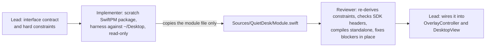

# Module workflow: three isolated modules, one skeptical reviewer each

**In plain words.** Three parts of the app (preview thumbnails, iCloud status, talking to Finder) were built by separate helpers, each in its own sandbox project against an interface written in advance, each tested on real desktop files without modifying or downloading anything, and each then checked by a skeptic who fixed what was wrong before the part was allowed into the app. This page shows what each part promised, what its tests proved, what it could not prove, and what the reviewer changed. Ideas explained simply: [CONCEPTS.md](../CONCEPTS.md).

Three of QuietDesk's self-contained Swift files, `ThumbnailCache`, `CloudStatusMonitor` and `FinderAutomation`, were not written in the main session. The lead wrote a contract for each module first (the exact Swift interface, the product's hard constraints, and what a harness had to demonstrate) into a workflow script, `quietdesk-modules-wf`, and ran it as a two-phase pipeline: one implementer agent per module, followed by one skeptical reviewer per module as soon as that module's implementation landed. The implementers never touched the project build: each worked in its own scratch SwiftPM package with a `main.swift` harness that exercised the module against the real `~/Desktop`, read-only, and copied only the finished module file into `Sources/QuietDesk/`. The reviewers then re-derived the constraints from the brief, Apple's documentation and the macOS 15.4 SDK headers, compiled the file standalone in a fresh package with an empty `main.swift`, re-ran harnesses, and fixed blockers and majors in place. The first run stopped at a usage limit; on resume the ThumbnailCache implementation was served from the workflow cache while the other two implementers ran again, found their own earlier drafts, and re-measured every claim instead of trusting them.



## The run

| Agent | Phase | Outcome | Duration | Tokens | Tool calls |
|---|---|---|---|---|---|
| impl:ThumbnailCache | Implement | served from cache (first run, before the usage limit) | n/a | not counted | not counted |
| impl:CloudStatusMonitor | Implement | done; found and superseded its own earlier draft | 25.1 min | 196,797 | 44 |
| impl:FinderAutomation | Implement | done; found the earlier run's file already in the project and overwrote it with a revised, re-verified version (149 changed lines) | 13.2 min | 151,315 | 32 |
| review:ThumbnailCache | Verify | done, 2 fixes applied | 18.3 min | 172,745 | 28 |
| review:FinderAutomation | Verify | done, 5 fixes applied | 20.7 min | 199,757 | 38 |
| review:CloudStatusMonitor | Verify | done, 2 fixes applied | 12.9 min | 149,926 | 25 |

Six agents, all `claude-fable-5-1`; 870,540 tokens and 167 tool calls recorded for the resumed run, 38 minutes wall clock. Each review started within seconds of its module's implementation finishing; the ThumbnailCache and FinderAutomation reviews ran while the other implementers were still working, and the CloudStatusMonitor review started after all three implementations were in. Two implementers flagged that the lead's temporary `_Stubs.swift` (placeholder types that let the core compile before the modules existed) would produce duplicate-type errors; the ThumbnailCache reviewer found its stub already removed from that file, and the CloudStatusMonitor reviewer, who ran later, found the file itself gone.

Hard constraints every reviewer checked against, taken from the product brief: never rename, move or modify user files; never trigger a cloud download of a dataless file; no polling or timers at idle; no subprocesses (no `Process`, no `osascript`); no Accessibility or Screen Recording permissions; bounded memory; public, documented APIs only (undocumented behaviour must be marked in a comment). Process rules for the agents: no `swift build` in the project (the lead was editing core files concurrently), no edits to existing project files, no git. The constraints are explained in [FEASIBILITY.md](../FEASIBILITY.md).

| Module | File | Lines after review | System frameworks |
|---|---|---|---|
| ThumbnailCache | [Sources/QuietDesk/ThumbnailCache.swift](../../Sources/QuietDesk/ThumbnailCache.swift) | 342 | AppKit, QuickLookThumbnailing, UniformTypeIdentifiers |
| CloudStatusMonitor | [Sources/QuietDesk/CloudStatusMonitor.swift](../../Sources/QuietDesk/CloudStatusMonitor.swift) | 607 | Foundation, CoreServices (FSEvents) |
| FinderAutomation | [Sources/QuietDesk/FinderAutomation.swift](../../Sources/QuietDesk/FinderAutomation.swift) | 607 | AppKit |

## ThumbnailCache

Finder-style "icon preview" thumbnails for desktop items, generated by [QLThumbnailGenerator](https://developer.apple.com/documentation/quicklookthumbnailing/qlthumbnailgenerator) with [`iconMode`](https://developer.apple.com/documentation/quicklookthumbnailing/qlthumbnailgenerator/request/iconmode) so the result carries Finder's decoration, and gated so that no request is ever made for a file whose contents are not on disk.

### Public interface (as it stands after review)

```swift
import AppKit
import QuickLookThumbnailing
import UniformTypeIdentifiers

final class ThumbnailCache {
    static let shared: ThumbnailCache                        // private init
    var onReady: ((URL) -> Void)?                            // main queue; fires only on success, never for failures
    func thumbnail(for url: URL, size: CGFloat, scale: CGFloat) -> NSImage?
        // main thread; never blocks; nil + enqueue on a miss
    func invalidate(_ url: URL)   // drops cached and negative entries for that path at every size/scale; cancels its jobs
    func removeAll()              // cancelAll() + clears cache and negatives
    func cancelAll()              // cancels in-flight requests, empties the FIFO, keeps cached results
    static func isFullyLocal(_ url: URL) -> Bool
        // lstat + reject symlink + SF_DATALESS (TN3150), then isUbiquitousItem -> downloadingStatus == .current || .downloaded
    static func isEligible(_ url: URL) -> Bool
        // regular file, not directory/package/alias, and isPreviewable(contentType)
    static func isPreviewable(_ type: UTType) -> Bool
        // added by the reviewer: pure type rule; 3D only as .usdz; else image/pdf/audiovisual/text/rtf/rtfd/
        // compositeContent/presentation/spreadsheet/font/epub
    var statistics: (cached: Int, bytes: Int, negative: Int, inFlight: Int, pending: Int)
        // added by the implementer: diagnostics only
}
```

Internals: cache key is `path|size|scale`; at most 500 entries and 32 MiB, oldest evicted; negative results bounded at 2,000 keys; 6 requests in flight with a FIFO of pending jobs deduplicated by key. Per job: `isFullyLocal && isEligible` on a serial utility queue (metadata only), then `generateBestRepresentation(for:)`, then the `CGImage` is copied into an sRGB bitmap the process owns at the result's pixel size, then a hop to main to store and fire `onReady`. The gate runs before the request because the QuickLook agent is a separate process that does not inherit the app's `IOPOL_MATERIALIZE_DATALESS_FILES_OFF` policy (see [TN3150](https://developer.apple.com/documentation/technotes/tn3150-getting-ready-for-dataless-files)).

### What the harness verified

- Clean `swift build -c release` in the scratch package; the module also passes `swiftc -typecheck -swift-version 5 -target arm64-apple-macosx14.0 -warnings-as-errors` standalone; the project copy's checksum equals the scratch copy.
- `isFullyLocal` / `isEligible` on 12 real Desktop items: a local PDF, PNG, Word document, text file, movie and spreadsheet were local and eligible; two cloud-only files (a PDF and a JPEG, `st_flags` dataless+compressed, status NotDownloaded) were eligible but not local; a folder, an app, a zip archive and a text clipping were not eligible. 0.1 to 6 ms per check, one cold call 70 ms.
- A burst of 15 requests at 36 pt @2x: in-flight peaked at exactly 6 with 9 queued; all 10 eligible local files produced 72x72 px bitmaps and `onReady` fired on the main thread for each; the two dataless files, the folder, the app and the zip became negative results and `onReady` never fired for them.
- Dataless files never reached QuickLook: their `st_flags` were unchanged after the run. The harness ran under the same I/O policy as the app's `main.swift`.
- Cold timings: PDFs about 59 ms, PNGs about 40 ms, movie 135 ms, text 558 ms, CSV 1.4 s, Word document 1.4 s; repeats 30 to 60 ms (QuickLook's own on-disk cache). A 128 pt @2x request returned 256x256 px in 6 to 30 ms.
- One 72x72 PNG was written to the scratch directory and inspected: a decorated Finder-style page thumbnail of a PDF. A 128 pt image thumbnail was also inspected, then deleted because it reproduced Desktop content.
- `cancelAll()` with 6 in flight and 4 pending: tables went to 0/0 at once, no callback in the following 2 s, a re-request regenerated all 10. `invalidate(url)`: both cached sizes for that path dropped (21 to 19 entries), one job re-queued, fresh `onReady`. Negative memory: a second request for a folder enqueued nothing; invalidating it re-queued exactly one job. `removeAll()`: every counter 0.
- 0.08 s user CPU over a 14 s run; no timers, all waiting was RunLoop-based.
- Nothing on `~/Desktop` was written; only `ThumbnailCache.swift` was created in the project.

### Caveats worth knowing

- `onReady` fires only on success. Failures are silent and remembered per key until `invalidate` or `removeAll`; a file whose generator later starts working is not retried on its own.
- `removeAll()` also cancels pending work, and `invalidate(url)` cancels that URL's in-flight job, so a changed file is regenerated fresh.
- Eligibility is a UTType heuristic. Some admitted types can still fail (they become negatives after one attempt). Packages are rejected, so iWork packages get no preview even though Finder shows one; a single-file spreadsheet did render.
- `.downloaded` (a local copy with a newer version known to exist) counts as local, which is correct for "no download triggered".
- No per-request timeout, deliberately: it would need a timer. A hung generator holds one of the 6 slots until QuickLook itself gives up.
- Time-of-check/time-of-use: a file evicted by Optimize Mac Storage between the check and the agent opening it would be materialized. No public API closes this window.
- `QuickLookThumbnailing` is not in `Package.swift`'s linked frameworks; Swift auto-links imported frameworks, and the scratch builds confirmed it.
- Swift 6 language mode would reject `static let shared` (non-Sendable); the project is in Swift 5 mode.
- Not verified by either agent: behaviour inside the built app; pixel fidelity against Finder's own decorations (checked only by eye); audio, font, epub and usdz generation (no such files on this Desktop); whether QuickLook's HTML thumbnailer makes network requests for remote resources; the `.usdz` restriction against a real dataless texture (cannot be created locally). The reviewer did cover two gaps the implementer listed: 1x scale (a 36x36 px image at 36 pt, so QuickLook honours scale) and eviction at capacity (held at the bound after a 600-key burst, 156 entries).

### Reviewer findings

The reviewer first noticed that the project file differed from the copy the implementer's harness had run on: between the cached implementation and the review someone outside the workflow (presumably the lead) had applied symlink rejection via `lstat`, normalized job size/scale and an eviction guard. The reviewer rebuilt the harness against the current file before judging it; all checks passed.

| Severity | Problem | Fixed? |
|---|---|---|
| major | Cloud-download hole via sibling files. `isEligible` admitted all of `UTType.threeDContent` (.obj, .usd/.usda, .dae). The QuickLook agent thumbnails those by opening the texture and material files they name by relative path; those siblings are never checked by `isFullyLocal`, and the agent does not inherit the app's I/O policy, so an .obj next to a cloud-evicted texture would trigger a download. Reproduced with an access-time detector on scratch fixtures (positive control valid): .obj and .usda thumbnails read a sibling PNG; .html, .svg, .md, .rtf and .csv referencing a sibling did not. | Yes. 3D content is admitted only as a self-contained `.usdz`; the rule is factored into the new `isPreviewable(_:)`, with the evidence in a comment. Re-verified: .obj/.usda/.dae false; .usdz and every other tested type true. |
| major | `invalidate(_:)` was not called anywhere in the project. The cache is keyed by path, so after an atomic save, a rename flow or a completed iCloud download the stale bitmap or the stale negative verdict would be drawn until the utility was toggled. | Not in this file (out of the reviewer's scope). Adopted by the lead afterwards, in the form the reviewer suggested: `OverlayController.invalidateChangedItems()` invalidates items whose modification date changed, and `cloudStatusChanged()` invalidates an item whose status becomes `.current`. |
| minor | `Key.init` used `Int(size.rounded())`: NaN or infinite input traps, and an absurd size asks QuickLook for a huge bitmap that the cache then copies and retains. | Yes. Size clamped to 0...1024 pt, scale to 1...4, with an `isFinite` guard; verified with NaN, infinity, 1e9 and negative inputs. |
| minor | `DesktopView` calls `isEligible` on the main thread per item (`isFullyLocal` and `isEligible` together measured at 1.4 to 9 ms per item, a metadata read) and reset its memo on every relayout; on a 148-item desktop that is tens to a few hundred ms per relayout. `DesktopItem` already carries the content type, so the pure `isPreviewable` would need no file-system access. | Not in this file. Partially adopted: the memo now persists across relayouts and is dropped per file on change; the call still runs on the main thread. |
| minor | Time-of-check/time-of-use window between `isFullyLocal` and the agent opening the file. | No; documented, no public API closes it. |
| minor | The pending FIFO has no explicit cap; it is bounded by the number of distinct keys requested. Measured: a 600-key burst held 594 pending, 6 in flight, drained in 2.6 s, 605 of 605 `onReady`. | No; acceptable, noted for future callers. |

The reviewer also verified every API signature against the SDK headers (`Request(fileAt:size:scale:representationTypes:)`, `iconMode`, `generateBestRepresentation(for:completion:)`, `cancel(_:)`, `SF_DATALESS = 0x40000000`, the ubiquitous download-status values) and confirmed no `Timer`, `asyncAfter`, timer source or `sleep` anywhere in the file.

**Integration.** `OverlayController.prepare()` sets `onReady` to redraw the cell(s) for that URL in every view, and `stop()` calls `cancelAll()` then `removeAll()`. `DesktopView.image(for:size:)` asks `isEligible` (memoized) and then `thumbnail(for:size:scale:)` with the window's backing scale, only when Finder's "Show icon preview" option is on and the item is not a folder, volume or package, falling back to `IconCache`.

## CloudStatusMonitor

Event-driven iCloud sync status for the top-level items of `~/Desktop` (iCloud Desktop sync is on for this machine). This module deliberately deviates from the brief.

### Why NSMetadataQuery was abandoned

The brief specified [NSMetadataQuery](https://developer.apple.com/documentation/foundation/nsmetadataquery) with the directory as search scope. Before writing the monitor, the implementer built a probe target and measured what the query actually returns on macOS 26.6.2 from an unentitled process:

| Attempt | Result |
|---|---|
| Directory-URL scope plus `searchItems` = the 159 top-level URLs | 159 results with 28 Spotlight attributes each, but no `NSMetadataUbiquitousItem*` or `NSMetadataItemIsUbiquitousKey` values at all |
| `NSMetadataItem(url:)` per item | No ubiquity values either |
| `NSMetadataQueryUbiquitousDocumentsScope`, `...DataScope`, `...AccessibleUbiquitousExternalDocumentsScope` | 0 results each (these scopes need an iCloud entitlement) |
| Recursive directory scope | 196,764 results in 5.9 s, resident memory 16 MB to 94 MB (breaks the memory bound) |
| Predicate `%K LIKE '*'` | Matches 0 items; `%K != ''` matches all (`mdfind` agrees) |

Spotlight-backed results on this machine carry no ubiquity attributes, so the query cannot deliver the status at any cost. The module instead treats URL resource values ([the ubiquitous `URLResourceKey`s](https://developer.apple.com/documentation/foundation/urlresourcekey)) as the truth and listens on four push channels: a file-level [FSEvents](https://developer.apple.com/documentation/coreservices/file_system_events) stream on the directory (main-queue delivery, 0.5 s coalescing, `NoDefer`, events at any depth mapped to their top-level item and only that item re-read); an [NSFilePresenter](https://developer.apple.com/documentation/foundation/nsfilepresenter) for the directory; one NSFilePresenter per item in transit, implementing `presentedItemDidChangeUbiquityAttributes(_:)`; and [`Progress.addSubscriber(forFileURL:)`](https://developer.apple.com/documentation/foundation/progress) with KVO on `fractionCompleted`. Refreshes are debounced 0.25 s and read on a utility queue; the map is bounded by the number of top-level items. The evidence is recorded in the file header, with a note that if a future macOS restores ubiquity attributes in the Spotlight index, the bounded form would be a directory scope plus `searchItems`, never the recursive scope.

### Public interface (as it stands after review)

```swift
import Foundation
import CoreServices   // FSEvents; outside the brief's framework list, flagged by implementer and reviewer

enum CloudStatus: Equatable {
    case notInCloud            // isUbiquitousItem != true
    case current               // downloadingStatus .current, or .downloaded (stale local copy the system refreshes itself)
    case notDownloaded         // downloadingStatus .notDownloaded (dataless)
    case downloading(Double)   // isDownloading; 0...1 from a published Progress, else 0
    case uploading(Double)     // isUploading; 0...1 from a published Progress, else 0
    case notUploaded           // isUploaded == false
    case error                 // downloadingError or uploadingError non-nil (checked first)
}

final class CloudStatusMonitor {
    init(directory: URL)
    var onChange: (() -> Void)?                  // main queue, coalesced; also once when the initial snapshot lands
    var diagnostics: ((String) -> Void)?         // added by the implementer: harness-only, nil in the app, zero cost
    func start()                                 // main thread; reads no file contents; cannot trigger downloads
    func stop()                                  // main thread; idempotent; removes every stream, presenter and subscriber
    func status(for url: URL) -> CloudStatus     // main thread; .notInCloud when unknown, hidden, outside the directory or stopped
    static func resourceStatus(for url: URL) -> CloudStatus   // synchronous one-shot from URL resource values, about 1.1 ms
}
```

### What the harness verified

- Scratch package with two targets (harness and probe) built in release with no warnings; the installed file passes a standalone typecheck and is byte-identical to the harness copy.
- `resourceStatus` over all 159 non-hidden top-level Desktop items: 178 to 181 ms in total; histogram current 128, notDownloaded 20, notInCloud 11 (the 11 are an office application's temporary lock files, whose `isUbiquitousItem` is false). The 20 notDownloaded items are exactly the 20 entries carrying the `SF_DATALESS` flag, 0 disagreements.
- Event mechanics in a scratch directory (never the Desktop): FSEvents delivered an uncoordinated create, an in-place modify, a deep change mapped to its top-level folder, a rename (both names) and a delete, each followed by a targeted refresh; a coordinated write reached the directory presenter; a published downloading `Progress` at 30% made `status(for:)` return `downloading(0.30)`, updating it to 70% fired `onChange`, unpublishing cleared it; a `copying` Progress was ignored; after `stop()` zero events arrived and status was `.notInCloud`; `start()` after `stop()` worked in this run (the reviewer later found the case where it did not; see below).
- Live monitor on `~/Desktop` for 5 s, read-only: `onChange` fired once, 151 to 173 ms after `start()`, with the full 159-item snapshot; `status(for:)` equalled `resourceStatus(for:)` for all 159 items; lookups resolved through the iCloud Drive symlink path, with a trailing slash and with the `/System/Volumes/Data` prefix; a URL outside the directory returned `.notInCloud`; 3 s of idle used 0.1 to 0.2 ms CPU with 0 events; resident memory 25.2 MB before start, 27.7 MB running, 27.7 MB after stop; the `SF_DATALESS` count was 20 before and after (nothing was downloaded).

### Caveats worth knowing

- The initial snapshot is asynchronous: `status(for:)` returns `.notInCloud` until the first `onChange` (150 to 180 ms for 159 items, about 1.1 ms per item because the file provider answers the ubiquitous keys). `resourceStatus` is the first-frame fallback, but not per frame.
- Update latency after a change is up to 0.5 s of FSEvents coalescing plus the 0.25 s debounce; no timer is armed while nothing changes.
- `.downloaded` is reported as `.current`: the local copy is usable and the system fetches the new version on its own, which then appears as `.downloading`.
- Only direct children are tracked, keyed by item name; dot-prefixed entries are ignored; items hidden only by Finder's invisible flag are present as `.notInCloud`, which is what Apple's keys say.
- The `~/Library/Mobile Documents/com~apple~CloudDocs/<name>` alias used as a second `Progress` subscription URL is community knowledge, not a documented API; it is checked read-only via `realpath`, marked as such in a comment, and a wrong guess only costs one useless subscription.
- The FSEvents stream watches the whole Desktop tree (about 196,000 descendants here). A burst of deep changes costs one batch callback and one resource read per affected top-level item; nothing at idle.
- Not verified by either agent: real iCloud transitions on the Desktop (download start and finish, eviction, upload, errors, progress percentages). None could be triggered without changing user files, so it is unknown whether the iCloud daemon emits FSEvents for evictions, coordinates its writes so the directory presenter hears them, sends ubiquity-attribute changes to per-item presenters, or publishes `Progress` for Desktop items. If none fire, a glyph can stay stale until the next event on that item, and an in-flight transfer without a published Progress reports as `.downloading(0)` or `.uploading(0)`. The per-item presenter path never executed (0 items were in transit during every run); upload percentages, behaviour with iCloud sync off, and multi-hour runs were not exercised.

### Reviewer findings

| Severity | Problem | Fixed? |
|---|---|---|
| major | After `stop()` then `start()`, the refresh pipeline could stick permanently: `stop()` never reset `refreshArmed`, so a debounce armed at stop time exited on the generation check without clearing the flag, and every later refresh request was dropped. Reproduced in a scratch harness (a temporary directory on the same firmlink as `~/Desktop`): FSEvents and presenter messages for a new file arrived after the restart, but no refresh followed. The app creates a fresh instance per enable, so it would not have hit this, but the documented contract ("start() again after stop() works") was violated. | Yes. `refreshArmed = false` added to `stop()`; re-verified: after the restart the new file triggered a refresh 0.25 s after its event and `onChange` fired. |
| minor | Data race: `presenter.monitor = nil` was written on the main thread while the presenter's serial utility queue may load that weak reference (concurrent loads are safe, a store concurrent with loads is not). The writes had no functional purpose, because every presenter message hops to main and is discarded by the `isRunning` check. | Yes. The three writes removed, so weak references are never written after init; presenters are still fully unregistered after `stop()` (`NSFileCoordinator.filePresenters` returns to 0). |
| minor | `import CoreServices` for FSEvents is outside the brief's framework list. It is public and documented; every symbol used was verified in `FSEvents.h`; SwiftPM autolinks it without a `Package.swift` change. | No change; flagged for the lead. |
| minor | Undocumented-layout dependency on the iCloud Drive alias path for the second Progress subscription (already marked in a comment). | No change. |
| minor | Interface deviations: the extra `diagnostics` member, and NSMetadataQuery not used (evidence in the file header). | No change; documented. |
| minor | Doc nit: `onChange` does not fire after the initial snapshot for an empty directory (nothing to redraw); the latency statement was made precise. | No change. |

The reviewer also confirmed, via the Objective-C runtime, that the two presenter classes respond only to notification selectors and to none of the relinquish, save or accommodate-deletion/eviction selectors, so coordinated writers and evictions never wait on the process; that `kFSEventStreamEventIdSinceNow` imports as `UInt.max` without a conversion trap; that the file has 0 errors even in Swift 6 mode (informational); and that `DesktopView` switches exhaustively over the seven cases.

**Integration.** `OverlayController.startWatching()` creates a monitor on the Desktop URL, starts it, and on `onChange` diffs the status of every visible item against the last snapshot, redrawing only the changed cells and clearing a thumbnail's negative verdict when an item becomes `.current`; `stop()` stops and discards it, so each enable gets a fresh instance. `DesktopView.drawBadges` draws an SF Symbol per status for items whose `isUbiquitous` flag is set (`checkmark.icloud` for current, `icloud.and.arrow.down` for notDownloaded and downloading, `icloud.and.arrow.up` for uploading and notUploaded, `exclamationmark.icloud` for error, nothing for notInCloud), and the delegate answers `.notInCloud` when no monitor is running.

## FinderAutomation

In-process Apple events to Finder through [NSAppleScript](https://developer.apple.com/documentation/foundation/nsapplescript), so that TCC attributes the request to the app rather than to a child process: reading and writing desktop icon positions on manually arranged desktops, opening Get Info windows, and opening a new Finder window. Consent is preflighted with [`AEDeterminePermissionToAutomateTarget`](https://developer.apple.com/documentation/coreservices/aedeterminepermissiontoautomatetarget(_:_:_:_:)).

### Public interface (as it stands after review)

```swift
import AppKit

enum FinderAutomationStatus { case allowed, denied, needsConsent, finderNotRunning }

enum FinderAutomationError: Error, CustomStringConvertible {
    case notPermitted          // -1743; description names System Settings > Privacy & Security > Automation
    case finderNotRunning      // -600, or Finder absent from NSRunningApplication (the module never launches Finder)
    case scriptError(String)   // "<Finder/AppleScript message> (<number>)"
    var description: String { get }
}

enum FinderAutomation {
    static func status() -> FinderAutomationStatus
        // askUserIfNeeded: false; 0 allowed, -1743 denied, -1744 needsConsent, -600 finderNotRunning;
        // hops synchronously to a private queue when called on main (Apple's header says not to call it there)
    static func readDesktopPositions(completion: @escaping (Result<[URL: CGPoint], FinderAutomationError>) -> Void)
        // serial script queue, completion on main; keys are standardized file URLs (folders and packages keep
        // a trailing slash); values are Finder points: origin top-left of the main display, y down, in points
    static func writeDesktopPosition(_ point: CGPoint, for url: URL, completion: @escaping (FinderAutomationError?) -> Void)
    static func openInfoWindows(for urls: [URL], completion: @escaping (FinderAutomationError?) -> Void)
    static func openNewWindow(at folder: URL, completion: @escaping (FinderAutomationError?) -> Void)
}
```

Internal (not private) helpers, usable by `SelfTest` and harnesses without sending events: the script sources, `itemReference`, `appleScriptStringLiteral` (escapes backslash, quotes, LF, CR, TAB), `parsePositions` / `parsePositionsReply` with `enum PositionsReply`, `quickDrawCoordinate`, and `describe` for descriptors. The compiled position scripts are cached (at most two) and touched only on the script queue.

### What the harness verified

- Clean release build of the scratch package with no warnings.
- `status()` returned `.allowed` from a background thread (55 ms) and via the queue hop from main (9 to 13 ms); never prompted.
- `readDesktopPositions`: 148 entries; 729 ms on the first call (includes compile), 682 to 763 ms cached, once 1.3 s; completion on the main thread (asserted); a second read equal to the first.
- Reply shape: a list of two lists, 148 `file:///` strings and 148 `{x, y}` integer pairs (AppleScript coerced Finder's QuickDraw points). A mounted volume was included; 87 of the 148 keys carry a trailing slash (folders and apps); every key exists on disk; item names containing apostrophes, commas and colons, and a text clipping, decoded to correct paths.
- Observed values (this desktop is sorted, so the stored positions are stale): main display 125 items, x 15 to 1685, y 15 to 1073, columns on a 78 pt pitch ending at 1685; the display above the main one 23 items, x 35 to 1264, y -1015 to -271 (its top edge is at -1080). Screens: (0, 0, 1728, 1117) at 2x and (-103, 1117, 1920, 1080) at 1x. Two never-placed items sat at (15, 15). Finder's `bounds` property was a stale 64x64 rectangle, not useful.
- A single-item read through the `(POSIX file ... as alias)` reference, the form the write and Get Info scripts use, returned the same point as the bulk read.
- Error mapping: a nonexistent item produced AppleScript -1700 (cannot make into alias), mapped to `.scriptError` with message and number. -1743 and -600 are mapped by code only.
- Quoting: a path containing a double quote, a backslash and a newline compiles; the write, Get Info and new-window sources all compile (compile only, nothing sent).
- 13 parser checks on hand-built descriptors (parallel lists, empty lists, a flat pair, per-item pairs, a non-list, a non-file URL skipped, doubles, raw QuickDraw point in host order, text rejected).
- `openNewWindow(at: ~/Desktop)` once: completed `nil` on main; Finder's window ids went from one to two; the new window's target was `~/Desktop`; it was closed by id with a follow-up script and the window set was restored. The frontmost app was `loginwindow` before and after (the screen was locked), so nothing visible was disturbed. 21 of 21 checks passed in 6.7 s.

### Caveats worth knowing

- Which point of the icon `desktop position` describes (centre or top-left) is undocumented, and the harness could not prove it: the stale values are consistent with the centre (rightmost x 1685 leaves 43 pt, half a cell; lowest y 1073 leaves 44 pt), but the stored grids (78 and 122 pt pitches) predate the current View Options, so no same-anchor comparison with the live layout (first centre at (1677, 60), 84x82 pt pitch, [FEASIBILITY.md](../FEASIBILITY.md) E7) was possible. `Layout.computeManual` treats it as the centre. To confirm: drag one icon on a Sort By: None desktop and read it back.
- On a sorted desktop Finder keeps drawing its own grid and read-back positions are whatever it last stored; only trust them when Sort By is None, as `OverlayController` already does.
- A full read of 148 items costs about a second inside Finder; the module sends nothing at idle, so callers must read on events only.
- Finder brings itself forward on `activate` in `openInfoWindows` and `openNewWindow`; [`NSApp.yieldActivation(to:)`](https://developer.apple.com/documentation/appkit/nsapplication/yieldactivation(to:)) is called first so cooperative activation on macOS 14+ lets Finder take focus.
- `status()` called on the main thread still blocks it for the synchronous hop (9 to 13 ms; the hop changes only the thread). The app does not call `status()`.
- Not verified by either agent: `writeDesktopPosition` and `openInfoWindows` were compiled but never executed, per the brief; the -1743 and -600 paths and the `denied` / `needsConsent` / `finderNotRunning` results (they would need the grant revoked or Finder quit); the raw QuickDraw-point decoding branch against Finder (it always handed back integer pairs); behaviour inside the bundled `.app` (`NSApp` non-nil, TCC attribution to the bundle rather than the harness's parent process).

### Reviewer findings

| Severity | Problem | Fixed? |
|---|---|---|
| major | Positions were paired by index across two independent Finder queries. `{URL, desktop position} of every item of desktop` is one `get` event per property, not "ONE Apple event" as the implementer's comment claimed, and Finder does not promise the same item order for two `every item` queries. Reproduced read-only on a scratch folder Finder had not listed before: `{URL, name} of every item of folder X` returned the two lists in different orders (URLs in directory order, names alphabetical). On the desktop the lists matched for all 148 items in every run, so the module worked by luck of Finder's loaded desktop model; in a manual layout the wrong file could have been placed at a given position. | Yes. The fast path now sends `{URL, desktop position, URL}` and requires both URL lists to be identical and as long as the position list; otherwise it re-reads with a per-item `repeat` loop inside Finder (2N events) whose pairs come from the same item reference. New `PositionsReply` and `parsePositionsReply(_:)`; the old parser is kept for legacy shapes. Cost: 1.09 to 1.16 s per read (was 0.73 to 0.82 s), fallback 3.2 to 3.3 s; `properties of every item` (23 s) was measured and rejected. 17 parser checks, and both scripts decode to the same 148-entry dictionary against Finder. |
| minor | `writePositionScriptSource` used `Int(point.x.rounded())`, which traps on NaN, infinity or a magnitude above 2^63. | Yes. `quickDrawCoordinate(_:)` rounds and clamps to the SInt16 range of a QuickDraw point; non-finite input completes on main with `.scriptError` before anything is sent (NaN verified; 1e300 clamps to 32767). |
| minor | `nonisolated(unsafe)` needs a Swift 5.10+ compiler, while the README at the time stated Swift 5.9+ and no other file uses it (the README now says 5.10+). | Yes. Replaced by a `ScriptCache: @unchecked Sendable` box in a `static let`, holding at most the two position scripts, touched only on the script queue under a `dispatchPrecondition`. |
| minor | `executeAndReturnError` is declared non-null but documented to return nil on failure. A probe confirmed nil arrives only with an error dictionary and a script without a result returns a `null` descriptor, so nothing dereferenced nil; but a nil reference could in theory have ridden inside `.success`. | Yes. Bound as an optional and replaced by `NSAppleEventDescriptor.null()`; the `describe` comment corrected. |
| minor | Comment corrections. (a) The implementer cited the archived [Threading Programming Guide](https://developer.apple.com/library/archive/documentation/Cocoa/Conceptual/Multithreading/ThreadSafetySummary/ThreadSafetySummary.html), which lists NSAppleScript as main-thread only, and called the background queue "beyond the documented contract"; the reviewer found the later [AppleScript 10.6 release notes](https://developer.apple.com/library/archive/releasenotes/AppleScript/RN-AppleScript/RN-10_6/RN-10_6.html), which state that OSA, AppleScript and NSAppleScript may be used from a non-main thread (one instance on one thread at a time), so the serial background queue is within documented behaviour. (b) The `writeDesktopPosition` doc comment asserted Finder accepts `set desktop position` on a sorted desktop, but that path was never executed; softened. (c) Timings updated; URL encoding of `#`, `?`, `%`, `[`, `]`, `;`, spaces and non-ASCII verified read-only on scratch files (Finder percent-encodes, `URL(string:)` round-trips). | Yes; header and comments. |
| minor | Not fixed, out of scope or unverifiable without changing the desktop: the write and Get Info paths never executed; the position anchor unproven; denied and not-running paths mapped from codes only; `status()` blocks the main thread for its hop (unused by the app); a read fails as a whole if Finder errors on any single item; Swift 6 mode would need `@Sendable` / `@MainActor` completions; the module cannot control what Finder itself does for Get Info or a new window (Finder is dataless-aware, and this process reads no contents and runs under the no-materialize I/O policy). | No. |

The reviewer verified the SDK signatures and Finder's scripting dictionary (`desktop position` read/write, `URL` read-only, `information window`, `make new Finder window to`), confirmed the Finder-running guard prevents `tell application` from launching Finder, and noted that `Info.plist` carries `NSAppleEventsUsageDescription` and the build script signs ad hoc without hardened runtime, so no entitlement is needed.

**Integration.** `OverlayController.requestFinderPositionsIfNeeded()` calls `readDesktopPositions` only while Finder's own desktop is manually arranged, merges the result with drags that happened during the read (a generation counter), and on `.notPermitted` stops asking and shows a dialog built from the error's description; `surface(reposition:on:)` writes each dragged item with `writeDesktopPosition` and re-reads once per batch of drags. `DesktopView` routes Get Info to `openInfoWindows(for:)` on the selection and Cmd-N to `openNewWindow(at:)` on the home folder, each surfacing the error description in a dialog when Finder refuses. `status()` is not called by the app.
