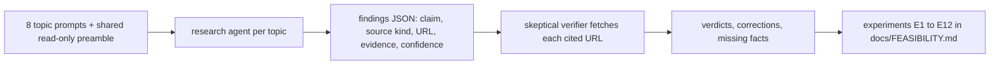

# Research evidence: primary-source feasibility research

**In plain words.** Before any code was written, eight helpers each researched one question using Apple's own documentation, and eight more helpers re-read every cited page to check that it really said what was claimed, assuming "not supported" whenever a page was silent. This page shows what survived that check, topic by topic, with the fact-checkers' corrections left visible. The short version: macOS offers no way to hide desktop names; its one supported switch hides whole icons; and a custom layer is possible using documented window behaviour. The gentler explanation of the ideas is in [CONCEPTS.md](../CONCEPTS.md).

This file records the documentation-research phase of QuietDesk's feasibility work: what was asked, what eight research agents found, and what an independent verifier agent made of each claim. The question was whether macOS 26.6.2 (Tahoe, Finder 26.4) offers any supported way to show desktop icon labels only on pointer hover without touching files, and, if not, which window, permission and file-system mechanics a custom desktop layer would rest on. Primary Apple sources were required (developer documentation, user guides, SDK headers and Finder's scripting dictionary, WWDC transcripts, Apple staff replies on the developer forums) because most folklore about desktop icons is stale or wrong; community sources were allowed but had to be labelled. Every medium- or high-confidence claim was then re-checked by a second agent that fetched the cited page and judged whether it says what the researcher said it says. The whole workflow was read-only: no `defaults write`, no `killall`, no scripting of apps, no experiments on the live desktop. The experiments that answered the open questions are recorded in [docs/FEASIBILITY.md](../FEASIBILITY.md) (E1 to E12) and are referenced below where they settled a question.

| Metric | Value |
|---|---|
| Topics | 8 |
| Agents | 16 (one research agent and one verifier per topic), all `claude-fable-5-1` |
| Findings | 290 (193 high, 73 medium, 24 low confidence, as rated by the researchers) |
| Source kinds | 204 Apple primary (91 developer docs, 54 headers or sdef, 35 WWDC or Apple staff, 24 user guides), 58 community, 28 none |
| Verdicts | 272: 219 supported, 48 partially supported, 2 not supported by the cited source, 3 could not fetch |
| Corrections and missing facts added by verifiers | 65 corrections, 72 missing facts |
| Open questions and recommended experiments | 79 questions, 62 experiments |
| Tokens | 2,280,965 (about 2.3M) |
| Tool calls | 1,336 (about 1,300) |
| Wall clock | 25.6 minutes, research agents in parallel, each verifier starting as its topic landed |

## How the agents were prompted

The workflow script (`quietdesk-feasibility-research`, two phases: Research, Verify) gave every research agent one shared preamble plus a topic prompt. The preamble fixed the target (macOS 26.6.2, Finder 26.4, Apple Silicon, Command Line Tools with Swift 6.1 and no Xcode, a Retina 2x built-in display plus a 1x external, a desktop sorted by Date Added with Stacks grouped by Date Added, icon size 36, text size 12, icon previews on, iCloud Desktop sync on) and then set the rules:

- "YOUR JOB: read-only documentation research. [...] Prefer PRIMARY sources [...] Community sources (StackOverflow, blogs, GitHub) are acceptable but must be labelled as such." A practical tip followed: developer.apple.com pages are JS-rendered, so fetch the JSON at `/tutorials/data/documentation/<path>.json`.
- "You MUST NOT change any system state: no 'defaults write', no 'killall', no osascript that controls apps, no launching apps, no writing outside /private/tmp. Do not run experiments on the live desktop; the orchestrator does that." Reading local files such as `Finder.sdef` and SDK headers was allowed.
- "For every claim, give source_kind, the URL, and a SHORT paraphrase [...] Mark confidence 'high' only if a primary Apple source states it directly. If you cannot find any source for something, say so explicitly (source_kind 'none') rather than guessing. List open questions the orchestrator should test experimentally."

Output was forced into a schema: `source_kind` in {apple-developer-doc, apple-user-guide, apple-header-or-sdef, apple-wwdc-or-forum-staff, community, none}, `confidence` in {high, medium, low}, plus `open_questions` and `recommended_experiments`.

Each verifier received the researcher's JSON and this instruction: "You are a SKEPTICAL VERIFIER. [...] For each finding with confidence 'high' or 'medium', fetch the cited URL [...] and decide whether the source actually supports the claim as stated. Default to 'not-supported-by-cited-source' if the page does not say it. Also list important facts the researcher missed and any claims that are overstated." Its schema was `verdict` in {supported, partially-supported, not-supported-by-cited-source, could-not-fetch} with a note and an optional `better_url`, plus `corrections[]` and `missing[]`. Low-confidence findings were outside the fetch scope, which accounts for two of the three "could not fetch" verdicts; the third was a page that has gone offline (HTTP 410). Three verifiers reported exhausting their web-search budget before finishing (one gave the figure: 200 of 200 queries), which is noted in the topics concerned.

Reading the tables below: "Conf." is the researcher's rating before verification; "Verifier verdict" is the second agent's judgement with its note condensed. Local sources (SDK headers, `Finder.sdef`, man pages, binaries inspected read-only) are shown as file names because they are not linkable. Each table keeps the eight to eleven findings that mattered most to the design out of 26 to 45 per topic.

## 1. Hiding Finder's desktop items without touching files

Apple documents exactly one supported, file-agnostic way to hide desktop items: System Settings > Desktop & Dock > "Show Items" (On Desktop / In Stage Manager), and the Tahoe 26 user guide keeps it in the same place. The preference keys behind it in `com.apple.WindowManager` are community-documented only, and no source said whether a raw write applies live. The older `CreateDesktop` route needs a Finder relaunch and removes the desktop's context menu and drop target. No public API exists: NSWorkspace, the AppKit headers, Finder's scripting dictionary and the MDM Desktop payload were all checked. 26 findings; 20 supported, 6 partially supported.

| Claim | Source kind | Conf. | Verifier verdict | Source |
|---|---|---|---|---|
| Tahoe 26 keeps "Show Items: On Desktop / In Stage Manager" under Desktop & Dock; the wallpaper-click control is now named "Show Desktop" | apple-user-guide | high | supported (verbatim in the /26 page; version banner checked) | [mchlp1119/26](https://support.apple.com/guide/mac-help/mchlp1119/26/mac/26) |
| Apple: when the option is off, "items on the desktop are hidden—click the desktop to show the items"; the sentence follows the In Stage Manager bullet, so its scope is ambiguous | apple-user-guide | high | supported; the verifier agrees the ambiguity is real | [mchl534ba392/26](https://support.apple.com/guide/mac-help/mchl534ba392/26/mac/26) |
| "On Desktop" maps to `StandardHideDesktopIcons`, "In Stage Manager" to `HideDesktop`, the click option to `EnableStandardClickToShowDesktop`, all in `com.apple.WindowManager` | community | medium | supported, community-only; Apple documents none of these keys | [nix-darwin options](https://mynixos.com/nix-darwin/options/system.defaults.WindowManager), [DeskMat thread](https://mjtsai.com/blog/2025/04/22/deskmat-1-0/) |
| The hide is orchestrated by the WindowManager process, which tells Finder to animate icons out, so no relaunch is needed | none (local symbols) | medium | partial: the symbols and Finder's `desktopwindowowner` entitlement reproduce, but Finder does not link WindowManager.framework, so the IPC step is unproven | `WindowManager.app`, `Finder` binaries |
| Whether a raw `defaults write` of the key applies live is undocumented; for the sibling click key, community reports moved from "needs restart" to "instant" | community | low | supported | [Der Flounder](https://derflounder.wordpress.com/2023/09/26/managing-the-click-wallpaper-to-reveal-desktop-setting-in-macos-sonoma/) |
| `CreateDesktop=false` plus `killall Finder` hides icons, needs a relaunch, and removes the desktop's drop target and context menu; Finder 26.4 still contains the key string | community | medium | supported (tests listed through Sonoma, none on Tahoe) | [macos-defaults](https://macos-defaults.com/desktop/createdesktop.html), [MacPaw](https://macpaw.com/how-to/hide-desktop-icons-on-mac) |
| No public API: NSWorkspace's only desktop API is the wallpaper image; AppKit headers, `Finder.sdef` and the MDM Desktop payload have nothing | apple-developer-doc | high | supported, with a caveat: the installed SDK is 15.4, so header greps cannot exclude 26-only additions | [NSWorkspace](https://developer.apple.com/documentation/appkit/nsworkspace), [MDM Desktop payload](https://developer.apple.com/documentation/devicemanagement/desktop) |
| Open-source hiders that avoid `killall` use an overlay window at desktopIconWindow+1 painted with the wallpaper, `ignoresMouseEvents = true` | community | high | supported; the verifier adds that the overlay covers `NSScreen.main` only, so it is not a two-display reference | [HideDesktopIcon source](https://raw.githubusercontent.com/Abelliuxl/HideDesktopIcon/main/HideDesktopIcon/MaskWindowManager.swift) |
| Show Items hides whole icons (image and label) on every display; no per-icon or hover behaviour | apple-user-guide | high | partial: Apple says only "items are hidden"; displays and labels are inference, downgraded to medium | [mchlp1119/26](https://support.apple.com/guide/mac-help/mchlp1119/26/mac/26) |
| No source says whether right-click and drops still work while items are hidden by the setting | none | low | supported (the verifier found none either) | none |

Corrections from the verifier:

- The Command Line Tools SDK on the machine is macOS 15.4, not a 26 SDK; header greps cannot rule out macOS-26 additions, only the live AppKit export check does.
- "desktopIconWindow sits between desktopWindow and normalWindow" is not on the cited page; the ordering comes from the numeric definitions in `CGWindowLevel.h`.
- `DesktopPeekMonitor` is a WindowManager.framework type, not a string in WindowManager.app, and its parameter is `peekState`, not `peek`.
- "None of the surveyed tools writes `StandardHideDesktopIcons`" is too broad: nix-darwin does.
- Added: DeskMat's developer post-mortem says its cover window sits over desktop files and widgets and captures the wallpaper with ScreenCaptureKit (Screen Recording permission) because `desktopImageURL(for:)` is unreliable with dynamic wallpapers. [DeskMat post-mortem](https://blog.eternalstorms.at/2025/04/18/deskmat-the-post-mortem/)
- Added: Apple's text for "Only in Stage Manager on Click" conditions the reveal on Stage Manager being on, so hidden items may have no click-to-reveal when it is off.

Open questions handed to experiments:

- Does toggling Show Items hide icons live, with Finder's PID unchanged, and does it write `StandardHideDesktopIcons`? (E1: applied without a relaunch.)
- Does a raw `defaults write` take effect immediately, only after `killall -HUP WindowManager`, or only at logout? (E1: within about 2 s.)
- With items hidden: does right-click still show Finder's desktop menu, and do drops still land in ~/Desktop?
- Are Finder's icon windows still present at the desktop-icon level while hidden? (E1: both windows stayed; E8: WindowManager adds a click-catcher window at that level.)
- Does hiding behave the same on the external 1x display and with Stacks on?

## 2. Finder's scripting dictionary as a public interface to icon layout

`Finder.sdef` exposes a read/write `desktop position` on every item and `text size`, `icon size` and `label position` on `icon view options of window of desktop`, but documents no coordinate system, no range and nothing about Stacks: the dictionary has no Stacks vocabulary and its arrangement enumeration lacks "date added". Community scripts agree that positions only stick when Sort By is None. Apple-events consent is precisely documented in `AppleEvents.h`. Apple's Scripting Bridge guide says a batch property fetch is one Apple event, and `AEDebugSends=1` can count them. 34 findings; 29 supported, 4 partial, 1 not supported by its source. The verifier's search budget ran out before it could re-search the Stacks gap.

| Claim | Source kind | Conf. | Verifier verdict | Source |
|---|---|---|---|---|
| `desktop position` (code `dpos`, point, read/write) on every `item`, described only as "the position of the item on the desktop"; no Apple source documents origin, corner vs centre, units or multi-display behaviour | apple-header-or-sdef | high | supported (sdef line 147) | `Finder.sdef` |
| Community: the desktop coordinate space spans all displays with the origin at the menu-bar display and negative values to the left or above | community | medium | not supported by the cited source: the page covers Finder-window `position`; the next page says only that `bounds of window of desktop` spans all monitors | [macosxautomation 11](https://www.macosxautomation.com/training/applescript/11.html) |
| Setting `desktop position` only sticks when Sort By is None (or Snap to Grid) | community | medium | partial: MacScripter and a gist say so; the Apple Community thread cited alongside does not mention Sort By | [MacScripter 71915](https://www.macscripter.net/t/positioning-finder-items-icons-on-the-desktop/71915) |
| The `earr` arrangement enum has eight values and no "date added"; the sdef has no Stacks vocabulary at all | apple-header-or-sdef | high | supported | `Finder.sdef` |
| `text size` on `icon view options` is an integer with no documented range; the View Options pop-up offers 10 to 16 | sdef, community | high, medium | supported | `Finder.sdef`, [OSXDaily](https://osxdaily.com/2016/02/25/change-text-font-size-finder-mac-os-x/) |
| `AppleEvents.h`: the first send prompts once; denial gives -1743; `AEDeterminePermissionToAutomateTarget` returns noErr, -1743, -1744 or procNotFound and must not run on the main thread | apple-header-or-sdef | high | supported (header lines 558 to 601 verbatim) | `AppleEvents.h` |
| DTS: `osascript` can work without the entitlement because it is Apple-signed; run scripts in-process with NSAppleScript instead | apple-wwdc-or-forum-staff | medium | supported, but Quinn only "suspects" the reason; the TCC-attribution gloss is the researcher's | [forum 750802](https://developer.apple.com/forums/thread/750802) |
| No verified source for how TCC treats a bare SwiftPM executable that sends Apple events | none | high | partial: a community guide says prompts go to the parent process (Terminal) and gives the `__info_plist` linker recipe | [steipete.me](https://steipete.me/posts/2025/applescript-cli-macos-complete-guide) |
| Scripting Bridge guide: enumerating manually costs one Apple event per item; a batch fetch is one event | apple-developer-doc | high | supported; it is specific to Scripting Bridge, and extrapolating to AppleScript's `every` is not stated by Apple | [Scripting Bridge performance](https://developer.apple.com/library/archive/documentation/Cocoa/Conceptual/ScriptingBridgeConcepts/ImproveScriptingBridgePerf/ImproveScriptingBridgePerf.html) |
| `AEDebugSends=1` logs every Apple event an app sends, so round trips can be counted | apple-developer-doc | high | supported | [Apple Events debugging](https://developer.apple.com/library/archive/documentation/AppleScript/Conceptual/AppleEvents/debugging_aepg/debugging_aepg.html) |

Corrections from the verifier:

- The macosxautomation page cited for the multi-display origin does not discuss it; negative coordinates for icons remain unsourced.
- Apple Community thread 7744599 does not state a Sort By None requirement; dropped as a citation.
- The WWDC 2018 session 702 video URL no longer serves the session; cite the [slide PDF](https://devstreaming-cdn.apple.com/videos/wwdc/2018/702zi9t7twhu9310kz5/702/702_your_apps_and_the_future_of_macos_security.pdf); the slide numbers were off by two.
- The lore that `get X of every Y` is one Apple event was filed as source kind "none" with medium confidence; neither cited page (a 1996 MacTech article, a MacScripter thread) states the rule; it should be community/low. (E2 later measured it: 148 items in one round trip.)
- The Cocoa Scripting Guide's wording on `whose` clauses is milder than "can become a bottleneck".
- Added: Apple's icon-view guide says Clean Up is unavailable when items are sorted automatically or Stacks are on, a primary hint that Sort By and Stacks own placement; the 1994 Finder Guide defines `position` as the icon's upper-left corner while `.DS_Store` stores the centre, so the two cannot be assumed equal; the sdef also has an `update` command usable to refresh the desktop.

Open questions handed to experiments:

- What does `desktop position` report (corner or centre, points or pixels on the 2x display), and how are items on the 1x display expressed? (E2: the values did not correspond to the visible sorted grid at all.)
- With Sort By: Date Added, does `set desktop position` error, no-op or snap back, and what does `arrangement` return given the enum gap? (E2: "not arranged".)
- With Stacks on, does `every item of desktop` list the files inside stacks? (E2: yes, individually.)
- Does `text size` accept values below 10, and do scripted view-option changes apply live? (E3: 4 fails with error -10000; 10 and 12 apply live.)
- Which process does TCC hold responsible for a bare SwiftPM binary sending Apple events?
- Is `get {name, desktop position} of every item of desktop` one Apple event on Finder 26.4? (E2: yes.)

## 3. AppKit and CoreGraphics mechanics for a desktop-level layer

Apple's documentation is thin but sufficient: `desktopIconWindow` is described only as "The level for desktop icons", `CGWindowLevelForKey` is "not recommended for use in applications", yet `NSWindow.Level` is an extensible enum so the level is expressible. `ignoresMouseEvents` is documented only as "transparent to mouse events"; the one hard statement about alpha hit-testing lives on `windowNumber(at:belowWindowWithWindowNumber:)`. Collection behaviours and `NSTrackingArea` `.activeAlways` are well documented. There is no Apple documentation on how sub-normal-level windows behave under Show Desktop, Stage Manager or full-screen spaces, and a February 2026 forum thread with an Apple engineer shows transparent-region click-through regressed in the 26.3 RC. 45 findings, 40 verdicts; 36 supported, 4 partial. The verifier's search budget ran out before one sample-code listing could be re-fetched.

| Claim | Source kind | Conf. | Verifier verdict | Source |
|---|---|---|---|---|
| `desktopIconWindow` is documented, in its entirety, as "The level for desktop icons"; `CGWindowLevelForKey` "is not recommended for use in applications"; `NSWindowLevel` is an extensible enum with a public `init(rawValue:)` | apple-developer-doc | high | supported | [desktopIconWindow](https://developer.apple.com/documentation/coregraphics/cgwindowlevelkey/desktopiconwindow), [CGWindowLevelForKey](https://developer.apple.com/documentation/coregraphics/cgwindowlevelforkey(_:)), [NSWindow.Level](https://developer.apple.com/documentation/appkit/nswindow/level-swift.struct) |
| `CGWindowLevel.h`: desktop = -2147483623, desktop icon = -2147483603; levels are reached through keys so values may change | apple-header-or-sdef | high | supported; the verifier ran `CGWindowLevelForKey` on 26.6.2 and got identical values | `CGWindowLevel.h` |
| `ignoresMouseEvents` is documented only as "transparent to mouse events"; nothing about mouseMoved or tracking areas | apple-developer-doc | high | supported for the current docs, but see the first correction below | [ignoresMouseEvents](https://developer.apple.com/documentation/appkit/nswindow/ignoresmouseevents) |
| `windowNumber(at:belowWindowWithWindowNumber:)`: mouse-down hit-testing skips "windows with transparency at the given point" and windows that ignore mouse events; the result may belong to another app | apple-developer-doc | high | supported (doc and header comment verbatim) | [windowNumber(at:)](https://developer.apple.com/documentation/appkit/nswindow/windownumber(at:belowwindowwithwindownumber:)) |
| Alpha click-through is documented only indirectly through that rule; no current doc ties it to `isOpaque`; the passage in the legacy AppKit release notes "could not be located" | apple-developer-doc | medium | partial: the verifier found the passage in the archived notes (10.2 and 10.3 sections) | [archived AppKit release notes](https://developer.apple.com/library/archive/releasenotes/AppKit/RN-AppKitOlderNotes/index.html) |
| Apple's FunkyOverlayWindow sample achieves click-through with `ignoresMouseEvents`, not with alpha | apple-developer-doc | medium | supported (the bullet is in the ReadMe listing, not the intro page) | [FunkyOverlayWindow ReadMe](https://developer.apple.com/library/archive/samplecode/FunkyOverlayWindow/Listings/ReadMe_txt.html) |
| Forum: the 26.3 RC broke transparent-region click-through; an Apple Frameworks Engineer acknowledged it; fixed in the 26.3 release; reported again in a 26.4 beta | apple-wwdc-or-forum-staff | medium | supported; no 26.x release note records the regression or the fix | [forum 814798](https://developer.apple.com/forums/thread/814798) |
| `.stationary`: "Mission Control doesn't affect the window ... like the desktop window"; `.transient` (hidden in Mission Control) is the default for any non-normal level | apple-developer-doc | high | supported | [stationary](https://developer.apple.com/documentation/appkit/nswindow/collectionbehavior-swift.struct/stationary), [transient](https://developer.apple.com/documentation/appkit/nswindow/collectionbehavior-swift.struct/transient) |
| `.fullScreenAuxiliary` shows on the same space as a full-screen window; a forum thread says `canJoinAllSpaces` plus `fullScreenAuxiliary` is the combination for full-screen spaces | apple-developer-doc | high | partial: that thread actually reports the combination did not show the window over the full-screen app | [fullScreenAuxiliary](https://developer.apple.com/documentation/appkit/nswindow/collectionbehavior-swift.struct/fullscreenauxiliary) |
| `NSTrackingArea` `.activeAlways` delivers enter/exit and mouseMoved regardless of app status (never cursorUpdate); a DTS engineer calls it the right API for inactive apps | apple-developer-doc | high | supported, including the engineer's "I haven't actually tried this" | [activeAlways](https://developer.apple.com/documentation/appkit/nstrackingarea/options-swift.struct/activealways), [forum 738051](https://developer.apple.com/forums/thread/738051) |
| No Apple developer documentation on how sub-normal-level windows behave during Show Desktop, wallpaper-click reveal, Stage Manager or full-screen spaces | none | high | supported | none |

Corrections from the verifier:

- The finding labelled community/low (a cocoa-dev post quoting old release notes) is backed by a primary source: the archived AppKit notes say the 10.3 fix makes `setIgnoresMouseEvents:` work "for opaque windows that want to be transparent to mouse events, and also works for transparent windows that want to receive mouse events", the three-state model. The page is about 1.9 MB, which is why the researcher's fetch missed it. Confidence raised to high for the historical semantics. (E11 reproduced the three states on 26.6.2.)
- The `.fullScreenAuxiliary` evidence note misreported forum thread 26677.
- The Window Programming Guide's hide-on-deactivate advice applies to floating-level windows, not to any manually set level.
- "AppKit release notes for macOS 26" do not exist; only the general 26.x notes do, and their sole AppKit entry is a 26.3 resize-pointer issue fixed in 26.4.
- The WWDC22 Stage Manager paraphrase was slightly off: existing windows exit the stage when a new one is presented.
- Added: `NSPanel.becomesKeyOnlyIfNeeded` lets a non-activating panel take focus only when a view asks for it; mouse-moved events go to the first responder, so hover should use tracking areas; flagged but unsourced: `kCGWindowName` has needed Screen Recording since 10.15.

Open questions handed to experiments:

- Does Finder's icon window sit at -2147483603 on 26.6.2, one per display? (E1: yes, two windows.)
- Do mouse-downs in alpha-0 regions reach Finder's icons on 26.6.2, given the 26.3 and 26.4 reports? (E4 and E6: transparent points pass through; alpha 1/255 is enough to catch a click.)
- Does explicitly setting `ignoresMouseEvents = false` switch to whole-window hit-testing? (E11: yes.)
- Does an `ignoresMouseEvents = true` window still receive tracking-area enter/exit? (E4: it did, on cursor warps.)
- Does a click on a transparent region count as a wallpaper click for the reveal feature, and what do Show Desktop, Mission Control, Stage Manager and full-screen spaces do to a `.stationary` desktop-level window? (Not measured; on the validation checklist.)
- Do drag-and-drop destinations follow the same transparency rule, so drops reach Finder through the overlay?
- What does the menu bar show while the accessory app is active, and can a borderless window take key? (E10: the design moved to a non-activating panel so Finder stays active.)

## 4. Finder extension points and label rendering

No Apple-supported Finder extension point can change how Finder draws labels, hide labels or icons, or observe hover. FinderSync's whole public surface is badges, contextual and toolbar menus, a toolbar button, a sidebar icon and the 10.13 collaboration hooks, and Apple says it "is not intended as a general tool for modifying the Finder's user interface". File Provider decorations are a badge, a sharing string and a folder badge, and claiming ~/Desktop as a known folder moves it. Quick Actions, Services, thumbnail extensions, the Accessibility API and code injection (blocked by SIP) were checked too. The verifier added the fact that matters most on this machine: Finder Sync menus stopped appearing inside iCloud Drive, including a synced Desktop, since Sonoma. 34 findings; 27 supported, 6 partial, 1 could not fetch.

| Claim | Source kind | Conf. | Verifier verdict | Source |
|---|---|---|---|---|
| The complete `FIFinderSync` protocol is observe-directory, badge identifier, menu, toolbar item, service endpoints and attribute values; no pointer, drawing, label or visibility callbacks | apple-header-or-sdef | high | supported (re-read in the SDK header) | `FinderSync.h`, [FIFinderSyncProtocol](https://developer.apple.com/documentation/findersync/fifindersyncprotocol) |
| Apple: Finder Sync "is not intended as a general tool for modifying the Finder's user interface" | apple-developer-doc | high | supported (exact sentence present) | [App Extension guide, Finder](https://developer.apple.com/library/archive/documentation/General/Conceptual/ExtensibilityPG/Finder.html) |
| Badge requests arrive per item drawn, not on hover; "the guide never mentions the Desktop" | apple-developer-doc | high | partial: the guide does list Desktop among system folders an extension may monitor | same |
| DTS: Finder Sync is not general-purpose; multiple extensions on one folder conflict, "first-started wins" | apple-wwdc-or-forum-staff | high | partial: "first-started wins" is not in the thread; Quinn says "sometimes things work OK, and sometimes things fail badly" | [forum 690333](https://developer.apple.com/forums/thread/690333) |
| Users enable third-party extensions under System Settings > General > Login Items & Extensions > Finder | apple-user-guide | high | partial: Finder Sync appexes live under "File Providers" since 15.2; the "Finder" section holds Quick Action extensions | [forum 756711](https://developer.apple.com/forums/thread/756711) |
| FinderSync.framework still ships on 26.6.2 and third-party Finder Sync extensions are registered on the test machine | none (local) | medium | supported (re-run read-only) | local `pluginkit -m -v -p com.apple.FinderSync` |
| File Provider decorations are limited to a badge, a "Sharing" string and a folder badge; the Label is shown by Finder on mouse-over and VoiceOver | apple-header-or-sdef | high | supported | `NSFileProviderItemDecoration.h`, [NSFileProviderItemDecorating](https://developer.apple.com/documentation/fileprovider/nsfileprovideritemdecorating) |
| macOS 15+ `claimKnownFolders` relocates ~/Desktop and ~/Documents into the provider's domain, which violates the no-move rule | apple-header-or-sdef | high | supported; the word "moved" comes from Apple's user guide, not the header | [mchl81f43c68](https://support.apple.com/guide/mac-help/mchl81f43c68/mac) |
| Code injection into Finder is blocked by SIP runtime protections | apple-developer-doc | high | supported; the SIP guide's own failing example is `sudo lldb -n Finder` | [SIP runtime protections](https://developer.apple.com/library/archive/documentation/Security/Conceptual/System_Integrity_Protection_Guide/RuntimeProtections/RuntimeProtections.html) |
| The Accessibility API can only set attributes an app marks settable; the only "hidden" attribute is application-level | apple-header-or-sdef | high | supported; whether Finder exposes anything settable remains an experiment | `AXUIElement.h`, `NSAccessibilityConstants.h` |

Corrections from the verifier:

- "The guide never mentions the Desktop" is false.
- "First-started wins" cannot be attributed to DTS.
- Finder Sync extensions are managed under File Providers, so the recommended experiment's Settings path was wrong.
- The macOS 15 "extensions missing from Settings" risk is overstated: DTS says the UI returned in 15.2 beta 2.
- Saying `NSWorkspace.setIcon` is the "only" AppKit API that changes a file icon adds a word Apple does not use; the Carbon guide does not name Finder, so "the 64-bit Finder loads no plug-ins" is inference.
- Added, critical for this machine (iCloud Desktop sync on): a DTS thread reports third-party Finder Sync menus stopped appearing inside iCloud Drive, including a synced Desktop, since Sonoma, and Quinn treats it as by design ("clearly not a directory that obviously belongs to you"). [forum 737283](https://developer.apple.com/forums/thread/737283)
- Added: app extensions must be code-signed and sandboxed (Gatekeeper rejects an appex with "plug-ins must be sandboxed"), so a hand-built appex would need sandbox entitlements.

Open questions handed to experiments:

- Does Finder 26.4 call a Finder Sync extension for items in ~/Desktop at all, given the iCloud finding?
- Can an appex built without Xcode be registered with pluginkit and enabled?
- What does Finder's accessibility tree expose for desktop icons, and is anything settable beyond selection and focus?
- Is there any accessibility notification usable as a hover proxy?

No extension was built; FEASIBILITY.md section 2 records this topic as the reason.

## 5. Permissions (TCC) and what triggers prompts

Up to six TCC services could be involved. Reading ~/Desktop from a non-sandboxed app triggers the Desktop-folder consent, and the calling thread blocks until the user answers. Apple events to Finder trigger the Automation consent. Global monitors need Accessibility only for key events; `CGEventPost` needs a separate Post Event privilege. Screen Recording is not needed for an app's own windows. `SMAppService.mainApp` is the login-item API but requires code signing. The biggest practical risk is code identity: TCC keys grants on the designated requirement, ad-hoc signatures have none that survives a rebuild, and only an Apple-issued identity gives stable grants. 38 findings, 36 verdicts; 32 supported, 4 partial. The verifier's search budget ran out before it could check community evidence on mouse-only monitors.

| Claim | Source kind | Conf. | Verifier verdict | Source |
|---|---|---|---|---|
| A non-sandboxed app is prompted on first access to ~/Desktop without implied consent; `NSDesktopFolderUsageDescription` is optional but recommended | apple-developer-doc | high | supported | [NSDesktopFolderUsageDescription](https://developer.apple.com/documentation/bundleresources/information-property-list/nsdesktopfolderusagedescription) |
| WWDC19: the calling thread is blocked until the user answers; consent is reactive and not needed to create files | apple-wwdc-or-forum-staff | high | supported | [WWDC19 701](https://developer.apple.com/videos/play/wwdc2019/701/) |
| TN3127: grants are keyed on the designated requirement; ad-hoc code has a DR tied to that build, so rebuilds re-prompt | apple-developer-doc | high | supported (the technote never says "TCC"; it describes the microphone database) | [TN3127](https://developer.apple.com/documentation/technotes/tn3127-inside-code-signing-requirements) |
| DTS: ad-hoc apps lose grants on every rebuild; use an Apple-issued identity | apple-wwdc-or-forum-staff | high | supported | [forum 795739](https://developer.apple.com/forums/thread/795739) |
| TCC attributes a tool launched from Terminal to Terminal ("responsible code") and expects a bundled Mach-O executable | apple-wwdc-or-forum-staff | medium | supported | [forum 741622](https://developer.apple.com/forums/thread/741622), [forum 678819](https://developer.apple.com/forums/thread/678819) |
| Global monitors: only key-related events require Accessibility trust; mouseMoved is listed as monitorable; no Apple source says a mouse-only monitor is permission-free | apple-developer-doc, none | high, low | supported; the second half stays a test | [addGlobalMonitorForEvents](https://developer.apple.com/documentation/appkit/nsevent/addglobalmonitorforevents(matching:handler:)) |
| Screen Recording is not needed for an app's own windows; `CGWindowListCopyWindowInfo` never prompts but withholds window names until approved | apple-wwdc-or-forum-staff | high | supported | [WWDC19 701](https://developer.apple.com/videos/play/wwdc2019/701/) |
| `CGWindowListCreateImage` is obsoleted in 15.0 in the SDK header; DTS says deprecated capture APIs trigger alerts on Sequoia | apple-header-or-sdef | high | supported ("cannot be compiled against" is inference) | `CGWindow.h`, [forum 760483](https://developer.apple.com/forums/thread/760483) |
| `SMAppService.mainApp` is the helper-free login-item API; the header says apps "must be code signed"; registration is subject to user approval | apple-developer-doc | high | supported; the researcher missed `kSMErrorInvalidSignature` for improperly signed bundles | [SMAppService.mainApp](https://developer.apple.com/documentation/servicemanagement/smappservice/mainapp) |
| Locally built apps carry no quarantine attribute and skip Gatekeeper | apple-wwdc-or-forum-staff | high | partial: Quinn's post never says so; inference, downgraded to medium | [forum 706442](https://developer.apple.com/forums/thread/706442) |
| Sequoia removed the Control-click override; users go through Privacy & Security > Open Anyway; notarization needs Developer ID (Program: 99 USD a year) | apple-developer-doc | high | supported; no source covers macOS 26 explicitly | [Apple developer news](https://developer.apple.com/news/?id=saqachfa), [notarization](https://developer.apple.com/documentation/security/notarizing-macos-software-before-distribution) |
| On Apple silicon all code must be at least ad-hoc signed; the linker does it by default | apple-wwdc-or-forum-staff | high | supported | [forum 678816](https://developer.apple.com/forums/thread/678816) |

Corrections from the verifier:

- "Locally built apps are not quarantined" is inference from a post that only describes downloads.
- The Screen Recording re-prompt cadence cited from community coverage (weekly, then monthly) is stale; 15.1 changed it again and nothing is known for 26. Moot if the app never holds Screen Recording.
- The cited community article does not mention error -1743 or missing Automation entries.
- The WWDC18 "one authorization per controlling app and target" wording could not be verified; `AppleEvents.h` (consent per sender and target) is the better citation.
- `SCShareableContent.currentProcess` returns "redacted" information; the paraphrase dropped the qualifier.
- Forum 811443's advice is for sandboxed apps only, and Apple's own sources disagree on whether key-event taps fall under Accessibility or Input Monitoring.
- Added: `SMAppService.h` returns `kSMErrorInvalidSignature` for an improperly signed bundle; a Tahoe-era community post says merely listing ~/Desktop triggers the prompt and that iCloud Drive consent leaves no Files & Folders entry; WWDC18 lists NSWorkspace open and launch calls as exceptions to Automation consent.

Open questions handed to experiments:

- Does enumerating ~/Desktop (or a `stat` on the folder) trigger the prompt, and does iCloud Desktop sync add an iCloud Drive prompt?
- Does an ad-hoc bundle with a fixed identifier re-prompt after every rebuild on 26, and does `tccutil reset` work for it?
- Does a mouseMoved-only global monitor deliver with zero grants, and does calling it enrol the app in Input Monitoring? (The design uses tracking areas instead.)
- Does `SMAppService.mainApp.register()` accept an ad-hoc-signed, hand-built .app?
- Are prompts for a bare SwiftPM binary attributed to Terminal, making unbundled tests invalid? (FEASIBILITY.md notes the experiments ran the bare executable, so the bundle's own prompts remain unmeasured.)

## 6. File icons, watching the Desktop folder, and cloud-only files

Apple documents `NSWorkspace.icon(forFile:)` only as returning the icon, a generic one on failure, thread-safe; nothing says what it reads or whether it can download a cloud-only file. For dataless files the primary sources are precise: reads materialize (WWDC21, TN3150), `stat` does not, `SF_DATALESS` is the detector, and `setiopolicy_np` opts a process out. QuickLook's `.icon` representation is the shared file-type icon, but Apple is silent on content reads. FSEvents is directory-granular and coalesced; a vnode dispatch source is the cheap single-directory option; whether Finder's `.DS_Store` rewrite reaches it was untested. Finder's Date Added is `NSURLAddedToDirectoryDateKey` (DTS). 42 findings, 39 verdicts; 31 supported, 8 partial.

| Claim | Source kind | Conf. | Verifier verdict | Source |
|---|---|---|---|---|
| `icon(forFile:)` returns the file's icon (generic on failure), 32x32, callable from any thread; Apple does not say what it reads or whether it can trigger an iCloud download | apple-developer-doc, none | high | supported | [icon(forFile:)](https://developer.apple.com/documentation/appkit/nsworkspace/icon(forfile:)) |
| WWDC21: reading a dataless file pauses the read while the provider fetches contents; `readdir` on a dataless directory triggers an enumeration | apple-wwdc-or-forum-staff | high | supported | [WWDC21 10182](https://developer.apple.com/videos/play/wwdc2021/10182/) |
| TN3150: detect dataless files with `SF_DATALESS`; `stat` materializes dataless intermediate folders; opt out with `setiopolicy_np(...OFF)` and handle `EDEADLK` | apple-developer-doc | high | supported ("stat does not materialize the file itself" is implied, not stated) | [TN3150](https://developer.apple.com/documentation/technotes/tn3150-getting-ready-for-data-less-files) |
| FileProvider header: xattrs including `com.apple.FinderInfo` survive on dataless files and the resource fork is content, so the custom-icon flag is readable without a download | apple-header-or-sdef | high | partial: the header excludes FinderInfo from `extendedAttributes` and only "syncable bits" become item properties; an inference to test | `NSFileProviderItem.h` |
| DTS recommends `SF_DATALESS`, noting the ubiquitous download-status key is insufficient for folders | apple-wwdc-or-forum-staff | high | partial: the folder remark was the poster's, not Apple's | [forum 813369](https://developer.apple.com/forums/thread/813369) |
| QuickLook `.icon` is the shared file-type icon, `.lowQualityThumbnail` comes from cache, `.thumbnail` is generated; Apple is silent on content reads and materialization | apple-header-or-sdef | high | supported | [RepresentationTypes.icon](https://developer.apple.com/documentation/quicklookthumbnailing/qlthumbnailgenerator/request/representationtypes-swift.struct/icon) |
| `NSURL.h`: `customIconKey` is "Currently not implemented"; `effectiveIconKey` gives the displayed icon; `isAliasFileKey` also covers symlinks | apple-header-or-sdef | high | supported; the online page omits the not-implemented note | `NSURL.h`, [effectiveIconKey](https://developer.apple.com/documentation/foundation/urlresourcekey/effectiveiconkey) |
| DTS: Finder's Date Added is `NSURLAddedToDirectoryDateKey`; the bucketing logic is internal to Finder | apple-wwdc-or-forum-staff | high | supported | [forum 131092](https://developer.apple.com/forums/thread/131092) |
| FSEvents is directory-granular and coalesced with a latency parameter; `FileEvents` gives per-file flags at "significantly more events" | apple-developer-doc | high | supported | [FSEvents guide](https://developer.apple.com/library/archive/documentation/Darwin/Conceptual/FSEvents_ProgGuide/TechnologyOverview/TechnologyOverview.html), `FSEvents.h` |
| A `DispatchSource` vnode source on an `O_EVTONLY` directory descriptor is the lightweight single-directory watch | apple-developer-doc | high | supported | [makeFileSystemObjectSource](https://developer.apple.com/documentation/dispatch/dispatchsource/makefilesystemobjectsource(filedescriptor:eventmask:queue:)) |
| DTS: safe-saving apps produce write events on the parent directory, not the file | apple-wwdc-or-forum-staff | high | supported | [forum 750123](https://developer.apple.com/forums/thread/750123) |
| Stacks guide: files saved to the desktop join a stack; it is silent on folders; community says folders never stack | apple-user-guide, community | high, medium | partial: the guide does not enumerate the four date options | [mh35846](https://support.apple.com/guide/mac-help/mh35846/mac), [MacMost](https://macmost.com/how-to-use-mac-desktop-stacks.html) |

Corrections from the verifier:

- The deprecated `GetIconRefFromFileInfo`'s "minimal file I/O" says nothing about `icon(forFile:)`; "minimal" is not "none" and a custom-icon file still needs its resource fork. Downgraded to inference/low.
- The FinderInfo-survives-eviction conclusion is not in the header.
- The Arq documentation cited for "stat does not materialize" does not mention `stat` or `SF_DATALESS`; an uncited "GitHub issue" cannot be checked.
- The `.DS_Store` `ItemModified` / `FinderInfoMod` finding is inference; a safe-save would show `ItemCreated` or `ItemRenamed`, and whether modern Finder writes the legacy FinderInfo `location` point at all is undocumented.
- The desktop user guides do not mention label position; `Finder.sdef`'s `label position` enum is the Apple source. The online `addedToDirectoryDateKey` page still says read-only; the header says read-write since 10.15.
- Added: `kFSEventStreamEventFlagMustScanSubDirs` must trigger a full rescan; FSEvents is recursive, so a ~/Desktop stream must be filtered to depth 1; `UseExtendedData` yields inode IDs that pair with `fileIdentifierKey`; whether any desktop item is dataless depends on "Optimize Mac Storage" and space pressure.

Open questions handed to experiments:

- Does `icon(forFile:)` or `effectiveIconKey` materialize a dataless file (plain document, custom icon, bundle, alias)?
- Do icon and QuickLook lookups run out of process, so a per-process `setiopolicy_np` does not protect? (Design answer in FEASIBILITY.md section 4: thumbnails are requested only for files verified local, because the generator runs in another process.)
- Do the ubiquitous NSURL keys return meaningful values for ~/Desktop items under FileProvider-backed sync, and do they agree with `SF_DATALESS`?
- Does Finder rewrite `.DS_Store` in place or by rename, and how quickly after a drag? (E5: the file was stale and incomplete, 58 position records for 148 items.)
- Does `addedToDirectoryDate` ordering reproduce Finder's Date Added order, and does the grid fill from the top-right? (E7: reproduced column for column.)

## 7. Prior art at the desktop layers

Prior art is plentiful but nothing implements hover-only labels. The de-facto recipe (Übersicht, a macOS-26 BumpTop port, Desktop Icon Manager, Kap's helper, and about fifteen Swift wallpaper apps) is one borderless window per screen at desktopIconWindow plus or minus one with `canJoinAllSpaces`, `stationary`, `ignoresCycle`. Reported pitfalls: Show Desktop sweeps non-stationary windows, clicks are only reliable at desktopIcon+1 (Hammerspoon), display IDs swap after sleep on Apple Silicon, Cmd-H hides overlays, and Plash's desktop window left the Desktop dead after Show Desktop on macOS 11. Hide-icon utilities cover Finder's windows rather than touching Finder. Raycast's extension reverted on Tahoe 26.4.1 to `CreateDesktop` because the WindowManager key "can report success without changing the visible Desktop icons". 38 findings, mostly community as intended, 30 verdicts; 20 supported, 10 partial.

| Claim | Source kind | Conf. | Verifier verdict | Source |
|---|---|---|---|---|
| Measured on 26.6.2 by a community project: the Dock's wallpaper window sits at desktopWindow-1 (-2147483624), Finder's desktop icons at -2147483603 | community | medium | supported (community only) | [Amadeus PR 50](https://github.com/Code-Amadeus/Amadeus/pull/50) |
| Finder's per-display icon windows appear in `CGWindowListCopyWindowInfo` with owner "Finder" at the desktop-icon layer | apple-developer-doc, community | high | partial: only the `excludeDesktopElements` half is primary; the Finder half is community code, so medium | [BumpTop capture_desktop.swift](https://raw.githubusercontent.com/bumptop/BumpTop/master/trunk/mac/parity/capture_desktop.swift) |
| Übersicht: background windows at desktop level with Stationary, CanJoinAllSpaces, IgnoresCycle and `ignoresMouseEvents`; hover tracking only on foreground windows at normal-1 | community | medium | supported line by line | [UBWindow.m](https://github.com/felixhageloh/uebersicht/blob/master/Uebersicht/UBWindow.m) |
| `CGDirectDisplayID` is not stable across sleep and wake on Apple Silicon; per-display windows keyed on it get swapped | community | medium | supported | [uebersicht #547](https://github.com/felixhageloh/uebersicht/issues/547) |
| Plash's desktop-level window left Desktop clicks dead after Show Desktop on macOS 11; the workaround is closed-source | community | medium | supported | [Plash #89](https://github.com/sindresorhus/Plash/issues/89) |
| Kap's helper covers icons with a wallpaper window at exactly the desktop-icon level using `.stationary` and `orderFrontRegardless`; Electron's "desktop" window type sits at desktop-1 and receives no input | community | medium | supported; Electron's own docs confirm the no-input statement | [hide-desktop-icons main.swift](https://github.com/karaggeorge/hide-desktop-icons/blob/master/swift/Sources/main.swift) |
| Hammerspoon: a canvas receives clicks reliably only at desktopIcon+1 or higher | community | medium | supported | [libcanvas.m](https://github.com/Hammerspoon/hammerspoon/blob/master/extensions/canvas/libcanvas.m) |
| Raycast's Tahoe fix (May 2026): writing `StandardHideDesktopIcons` "can report success without changing the visible Desktop icons" on 26.4.1; reverted to `CreateDesktop` plus `killall Finder` | community | medium | supported; the same code still uses the WindowManager widgets key | [raycast/extensions #28009](https://github.com/raycast/extensions/pull/28009) |
| `.DS_Store` `Iloc` is a 16-byte record holding the icon centre; units and origin for the Desktop are unspecified anywhere | community | medium | supported; the trailing-byte layout carries a "?" in the source | [DSStoreFormat](https://metacpan.org/dist/Mac-Finder-DSStore/view/DSStoreFormat.pod) |
| With "Show Items > On Desktop" off, right-click on the desktop produced no context menu (Sonoma 14.0) | community | medium | supported, a single user report | [Apple Community 255259975](https://discussions.apple.com/thread/255259975) |

Corrections from the verifier:

- The `excludeDesktopElements` finding mixed a primary half with a community half; medium overall.
- Übersicht issues #229 and #231 were misdescribed ("only on the first Space") and are nine years old; the mechanism of the 1.5.63 Show Desktop fix is inferred from current source, not stated in any thread.
- Desktop Icon Manager's layout data structure lives in its AppleScript, not the cited README.
- "Apple's guidance is to leave Sort By at None" was not found in Apple's Tahoe guide; only the MacScripter statement is sourced.
- `ignoresMouseEvents` "default false" is unsourced, and "`.transient` is hidden by Show Desktop" is inference from "hides in Mission Control".
- Added: `CGWindowListCreateImage` is obsoleted, so the wallpaper-capture approach of DIM and BumpTop needs ScreenCaptureKit on Tahoe; `NSWindow.sharingType` defaults to read-only (capturable); BumpTop retries its `desktop position` script up to three times because Finder sometimes returns nothing valid; Hammerspoon's `hs.canvas` is a ready-made harness for click and hover probes.

Open questions handed to experiments:

- Does the WindowManager key apply live on 26.6.2 despite Raycast's 26.4.1 finding? (E1: within about 2 s, no relaunch; E8: a WindowManager click-catcher window appears while items are hidden, which explains why an overlay at the same level can seem ineffective.)
- Does Finder expose one window per display at the desktop-icon level on both displays? (E1: yes.)
- Does a window at desktopIconWindow+1 with `ignoresMouseEvents = false` receive clicks reliably, and does a click there trigger or suppress the wallpaper-click reveal? (E8 and E11 for clicks; the reveal is deliberately not offered, FEASIBILITY.md section 5.)
- Does the overlay stay put during Show Desktop, Mission Control, Stage Manager, full-screen spaces, sleep and wake? (Not measured; on the checklist.)
- Are display IDs stable across sleep; should windows be keyed by display UUID?
- Does Cmd-H hide the overlay, and does it appear in screenshots unless `sharingType` is changed?

## 8. macOS 26 Tahoe-specific facts

Tahoe's user guide and Finder 26.4's dictionary show no new option to hide or hover-reveal labels. The macOS 26 release notes and the AppKit updates page list no changes to NSStatusItem, NSMenu, NSTrackingArea or window levels; the 26 additions are Liquid Glass classes that need the 26 SDK, and this machine has the Command Line Tools' macOS 15.4 SDK with Swift 6.1. Bundling without Xcode is documented (Info.plist keys, `LSUIElement`, ad-hoc signing by the linker, re-sign the assembled bundle). The HIG asks menu bar extras for a template image and a menu rather than a popover. 33 findings; 24 supported, 6 partial, 1 not supported by its source, 2 could not fetch (low-confidence items outside scope).

| Claim | Source kind | Conf. | Verifier verdict | Source |
|---|---|---|---|---|
| Finder 26.4's dictionary exposes icon size, item info, icon preview, text size, label position and background on `icon view options`; nothing to show or hide labels; `earr` still lacks "date added" | apple-header-or-sdef | high | supported (lines 442 to 490) | `Finder.sdef` |
| This desktop's view settings: group and sort by Date Added, icon size 36, text size 12, grid spacing 26, label on bottom, icon preview on, item info off; `CreateDesktop` unset | none (local read) | high | supported (every value reproduced) | `defaults read com.apple.finder DesktopViewSettings` |
| Tahoe View Options still expose icon size, grid spacing, text size, label placement and item info; only Gallery view can hide filenames | apple-user-guide | medium | partial: correct, but the statement spans two pages (View Options and Stacks) | [mchldaafb302/26](https://support.apple.com/guide/mac-help/mchldaafb302/26/mac/26), [mh35846/26](https://support.apple.com/guide/mac-help/mh35846/26/mac/26) |
| The macOS 26 release notes and the AppKit updates page list no changes to NSStatusItem, NSMenu, NSTrackingArea or window levels; the 26 additions are Liquid Glass classes | apple-developer-doc | high | supported; the verifier also checked the 26.1 to 26.6 notes | [macOS 26 notes](https://developer.apple.com/documentation/macos-release-notes/macos-26-release-notes), [AppKit updates](https://developer.apple.com/documentation/updates/appkit) |
| Toolchain: Swift 6.1 with the Command Line Tools' macOS 15.4 SDK; `NSGlassEffectView` does not type-check but exists at runtime | none (local) | high | supported; default builds write minos 16.0 (the toolchain's spelling of 26.0) with sdk 15.4 | local `xcrun --show-sdk-version` |
| Apps linked against pre-26 SDKs automatically run in UI compatibility mode (`UIDesignRequiresCompatibility` defaults to YES) | apple-developer-doc | high | partial: no Apple page states the automatic default; downgraded to medium, check the look experimentally | [UIDesignRequiresCompatibility](https://developer.apple.com/documentation/bundleresources/information-property-list/uidesignrequirescompatibility) |
| DTS-confirmed macOS 26 regression: an NSStatusItem is not shown when the app is launched through a C exec trampoline; `CFBundleExecutable` must be a bare name | apple-wwdc-or-forum-staff | medium | partial: the poster's minimal repro confirmed the trampoline; DTS did not call it an OS bug, and no workaround is stated | [forum 806691](https://developer.apple.com/forums/thread/806691) |
| Accessory policy equals `LSUIElement`; Prohibited is the default for an unbundled executable, so a bare `swift build` binary must call `setActivationPolicy(.accessory)` or be bundled | apple-header-or-sdef | high | supported (header comments verbatim) | `NSRunningApplication.h` |
| On Apple silicon all code must be signed; the linker ad-hoc signs by default; verified locally as "adhoc,linker-signed" | apple-wwdc-or-forum-staff | high | supported | [forum 740680](https://developer.apple.com/forums/thread/740680), `man ld` |
| The linker's signature covers only the executable, so the assembled .app must be re-signed (cited to the Xcode 12 release notes) | apple-developer-doc | medium | not supported by the cited source: the text is in the Big Sur 11.0.1 Universal Apps notes, which add that such signatures "cannot pass through Gatekeeper" | [Big Sur 11.0.1 notes](https://developer.apple.com/documentation/macos-release-notes/macos-big-sur-11_0_1-universal-apps-release-notes) |
| HIG: menu bar extras use a template (black and clear) symbol and show a menu rather than a popover; the menu bar is 24 pt high; `NSStatusBar.thickness` reads 22 on this machine | apple-developer-doc | high | supported (the thickness doc says "22 pixels") | [HIG: the menu bar](https://developer.apple.com/design/human-interface-guidelines/the-menu-bar), [NSStatusBar.thickness](https://developer.apple.com/documentation/appkit/nsstatusbar/thickness) |

Corrections from the verifier:

- The compatibility-mode default is not stated by Apple; medium.
- The linker-signature scope was cited to the wrong document; the Big Sur 11.0.1 notes are the source.
- The trampoline "regression" is overstated.
- The `ignoresMouseEvents` doc does not say events pass to windows below.
- The `NSPrincipalClass` doc does not say it defaults to NSApplication; the `LSUIElement` page does not say "no menu bar" (that is in `NSRunningApplication.h`).
- The "menu bar height 22, 24 or 30 pt" question was mis-framed: on this machine the notched built-in display reserves 33 pt (safe-area top inset 32) while the external 1x display reserves none; the height is per display.
- Added: the macOS 26 SDK does not require Xcode (Command Line Tools for Xcode 26 ship Swift 6.2 and the 26 SDK); an open-source release should set `platforms:` in Package.swift so the binary is not 26-only; NSScreen probe: built-in 1728x1117 at 2x, external 1920x1080 at 1x with no menu-bar area reserved, so a status item appears only on displays that draw a menu bar.

Open questions handed to experiments:

- Does Finder 26.4 own one full-screen window per display at the desktop-icon level? (E1: yes.)
- Does an overlay at desktopIconWindow+1 draw above Finder's icons and below normal windows and widgets on both displays? (E4, E8, E10.)
- Does a global mouseMoved monitor deliver without a prompt on Tahoe? (Not needed; the design uses tracking areas.)
- Can icon and label rectangles be read from Finder's accessibility tree, including inside expanded Stacks? (Not pursued; it would need the Accessibility grant.)
- Does the 15.4-SDK build's status item and menus get Tahoe's look?
- Does an unbundled binary show a status item after `setActivationPolicy(.accessory)`, or is a bundle required in practice?

## What the research changed in the design

- No API exists. NSWorkspace, the AppKit headers, Finder's scripting dictionary, the MDM Desktop payload and every Finder extension point were checked and re-checked, and the verifier added that Finder Sync menus do not even appear inside an iCloud-synced Desktop. The feature had to be a custom desktop layer (FEASIBILITY.md section 2), and no extension was built.
- The "Show Items > On Desktop" setting is the only Apple-supported hide, so QuietDesk toggles exactly that (through the community-documented `StandardHideDesktopIcons` key, with a durable restore record for crashes) and `CreateDesktop` was kept off the live desktop. The research could not settle whether the key applies live, and Raycast's Tahoe report said it might not; experiment E1 settled it on this machine (the key applied within about 2 s with no Finder relaunch), and E8 found a WindowManager click-catcher window at the desktop-icon level while items are hidden, which is why the overlay sits one level above it.
- Alpha click-through is documented only as a hit-testing rule on `windowNumber(at:belowWindowWithWindowNumber:)`, and the verifier surfaced the archived 10.3 AppKit note describing the three states of `ignoresMouseEvents`. The prototype therefore sets `ignoresMouseEvents = false` on purpose, keeps an alpha-1/255 shield window beneath (E6, E11), and lists the 26.3 and 26.4 hit-testing regressions as a known risk.
- TCC identity: grants are keyed to the designated requirement and an ad-hoc signature has none that survives a rebuild (TN3127, DTS). The design avoids grant-heavy services altogether (no Accessibility, no Screen Recording), keeps the Desktop-folder and Automation prompts as the only two, and leaves the distribution signing decision open.
- Dataless-file policy from TN3150: detect with `SF_DATALESS`, opt the process out of materialization with `setiopolicy_np`, never call `startDownloadingUbiquitousItem`, and, because nobody could confirm that icon and QuickLook lookups honour a per-process policy, request thumbnails only for files verified local.
- Finder's `desktop position` has no documented coordinate system and community sources agree it is only meaningful on an unsorted desktop; E2 confirmed the values are stale on this sorted desktop. The layout is therefore recomputed from Finder's own rules (E7) rather than read back, and `desktop position` is used only for manually arranged desktops.
